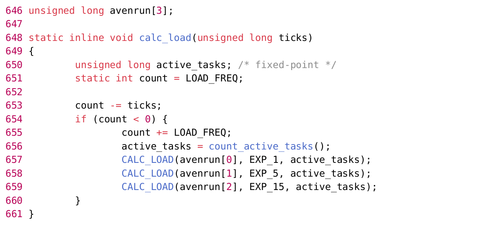
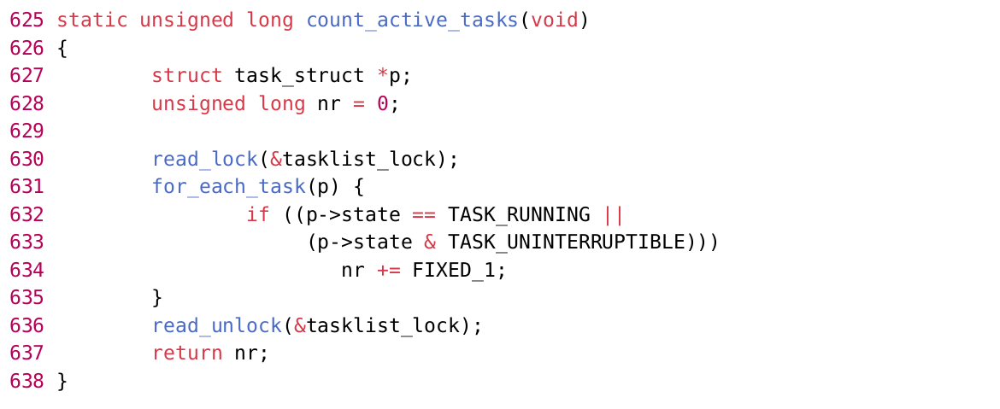
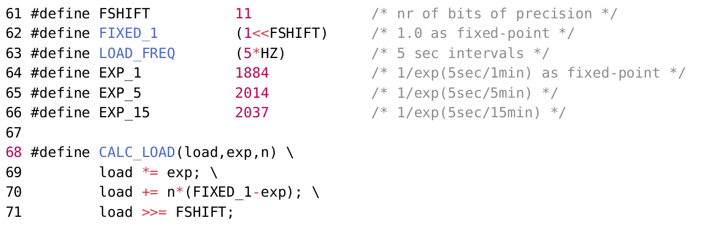
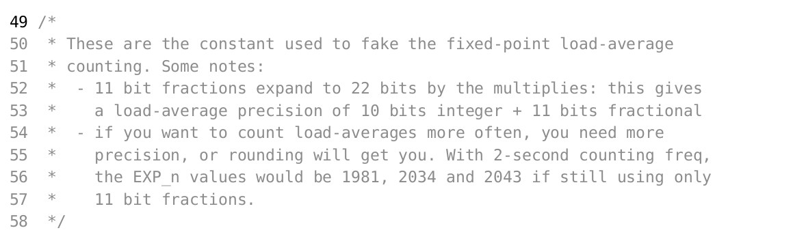
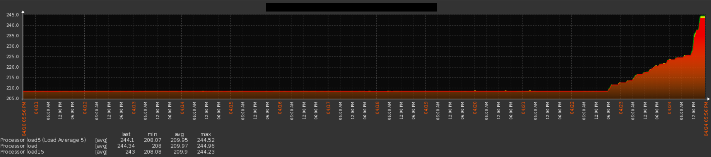

**Постановка вопроса**

Недавно, во время собеседования в одну крупную компанию мне задали простой вопрос, что такое Load Average. Не знаю, на сколько правильно я ответил, но лично для себя пришло осознание, что точного ответа я на самом деле и не знаю. Большинство людей наверняка знают, что Load Average — это среднее значение [загрузки системы за некоторый период времени (1, 5 и 15 минут).](https://ru.wikipedia.org/wiki/%D0%A1%D1%80%D0%B5%D0%B4%D0%BD%D1%8F%D1%8F_%D0%B7%D0%B0%D0%B3%D1%80%D1%83%D0%B7%D0%BA%D0%B0) Так же можно узнать некоторые подробности из данной

статьи, про то, как этим пользоваться. В большинстве случаев этих знаний достаточно для того, что бы по значению LA оценивать загрузку системы, но я по специальности физик, и когда я вижу [«среднее за промежуток времени»](https://ru.wikipedia.org/wiki/%D0%A1%D1%80%D0%B5%D0%B4%D0%BD%D1%8F%D1%8F_%D0%B7%D0%B0%D0%B3%D1%80%D1%83%D0%B7%D0%BA%D0%B0) мне сразу становится интересна частота дискретизации на данном промежутке. А когда я вижу термин «ожидающие ресурсов», становится интересно, каких именно и сколько времени надо ждать, а так же сколько тривиальных [процессов надо](https://habr.com/ru/articles/216827/) запустить, что бы получить за короткий промежуток времени  высокий LA. И главное, почему ответы на эти вопросы не дает 5 минут работы с гуглом? Если вам данные тонкости так же интересны, добро пожаловать под кат.

**Что-то здесь не так…**

Для начала определимся с тем, что мы знаем. В общем виде Load Average это среднее количество ожидающих ресурсов ЦПУ процессов за один из трех промежутков времени. Так же нам известно, что это значение в нормальном состоянии находится в диапазоне от 0 до 1, и единица соответствует

100% загрузке одноядерной системы без перегруза. В дальнейшем я буду рассматривать систему как одноядерную, поскольку это проще и показательней. Что здесь не так?

Во первых, все мы знаем, что среднее арифметическое нескольких величин равно сумме этих величин, деленной на их количество. Из той информации, что у нас есть абсолютно непонятно это самое количество. Если мы считаем ожидающие процессы в течении всей минуты, то среднее значение будет равно количеству процессов за минуту, деленному на единицу. Если будем считать каждую секунду — то и количество процессов в каждом подсчете уменьшится с диапазоном, и делить будем на 60. Таким образом чем выше частота дискретизации при наборе данных, тем меньшее среднее значение мы получим.

Во вторых что значит «ожидающий ресурсов процесс»? Если мы запустим большое количество быстрых процессов разом, то все они встанут в очередь, и по логике на короткий промежуток времени LA должен вырасти до совершенно неприемлемых величин, и при продолжительном мониторинге должны наблюдаться постоянные скачки, чего, в нормальной ситуации, нет.

В третьих, одноядерная система при 100% загрузке должна давать Load Average равный 1. Но здесь нет никакой зависимости от параметров этого ядра, хотя количество процессов может отличаться в разы.

Данный вопрос может быть снят либо корректным определением «ожидающего ресурсов процесса», либо наличием какой-то нормировки на параметры ядра.

Литература

Найти ответы на поставленные вопросы оказалось не так уж и сложно. Правда только на английском языке, и не все так сходу стало понятно. Конкретно были найдены две статьи:

**Examining Load Average**

**UNIX Load Average**

Пользователь Rondo так же предложил вторую часть статьи с более подробным рассмотрением математического аппарата: «UNIX Load Average. Part 2». А так же небольшой тест для тех, кто и так все понимает, указанный во второй статье. Интересующимся я бы советовал прочитать обе статьи, хотя в них описаны очень близкие вещи. В первой описывается в общем виде много разных интересных подробностей работы системы, а во второй более подробно разбирается непосредственно расчет LA, приводятся примеры с нагрузкой и комментарии специалистов.

**Немного ядерной магии**

Из данных материалов можно узнать, что каждому вызываемому процессу дается ограниченный промежуток времени на использование CPU, в стандартной архитектуре intel этот промежуток равен 10мс. Это целая сотая доля секунды и в большинстве случаев процессу столько времени не нужно.

Однако, если какой-то процесс использовал все отведенное ему время, то вызывается аппаратное прерывание и система возвращает себе управление процессором. Помимо этого каждые 10мс увеличивая счетчик тиков (jiffies counter). Данные тики считаются с момента запуска системы и каждые 500 тиков (раз в 5 секунд) рассчитывается Load Average. Код непосредственно расчета находится в ядре в файле timer.c (код приведен для версии 2.4, в версии 2.6 все это несколько рассредоточено, но логика не изменилась, дальше, надеюсь, тоже существенных изменений нет, но, честно говоря, последние релизы не проверял):

Как видно, рассчитываются по очереди те самые три значения LA, однако не указано, что именно считается, и как именно считается. Это тоже не проблема, код функции count_active_tasks() находится в том же файле, чуть выше:

А CALC_LOAD лежит в sched.h вместе с несколькими интересными константами:

Из всего вышеперечисленного можно сказать, что раз в 5 секунд ядро смотрит, сколько всего процессов находится в состоянии RUNNING и UNINTERRUPTIBLE кстати в других UNIX системах это не так) и

для каждого такого процесса увеличивает счетчик на FIXED_1, что равняется 1 FSHIFT, или 1 11, что равносильно 2^11. Сделано это для симуляции расчета с плавающей точкой при использовании стандартных int переменных длинной 32 бита. Смещая после расчетов результат на 11 бит вправо мы

отбросим лишние порядки. Из того же sched.h:

**Немного ядерного распада**

Нет, тут не распадается ядро системы, просто формула CALC_LOAD, по которой считается Load Average основана на законе радиоактивного распада, или просто экспоненциального затухания. Данный закон есть не что иное, как решение дифференциального уравнения

, то-есть каждое новое значение рассчитывается из предыдущего и скорость уменьшения количества элементов напрямую зависит от количества элементов. Решением данного дифференциального уравнения является экспоненциальный закон:

Фактически Load Average не является средним значением в обычном понимании среднего арифметического. Это дискретная функция, периодически рассчитываемая с момента запуска системы. При этом значение функции есть количество отрабатывающих в системе процессов в условиях экспоненциального затухания.

Такую конструкцию мы наблюдаем, переписав расчетную часть CALC_LOAD математическим языком:

2^11 для нас в данному случае равносильно единице, мы ее зафиксировали изначально и добавляли везде, количество новых процессов так же рассчитывается в этих величинах. А

где T интервал измерения 1, 5 или 15 минут).

Стоит заметить, что при фиксированном временном интервале и фиксированном времени между измерениями значения экспоненты вполне могут быть посчитаны заранее и использоваться как константа, что в коде и делается. Последняя операция — смещение вправо на 11 бит дает нам искомое значение Load Average с отбрасыванием нижних порядков.

**Выводы**

Теперь, понимая, как расчитывается LA можно попробовать ответить на вопросы, поставленные в начале статьи:

1. Среднее значение не является средним арифметическим, а есть среднее значение функции, которая рассчитывается каждые 5 секунд с момента старта системы.

2. «Ожидающими ресурсов CPU» считаются все процессы, находящиеся в состоянии RUNNING и UNINTERRUPTIBLE. А существенных скачков Load Average при продолжительном мониторинге мыне наблюдаем, поскольку затухающая экспонента играет роль сглаживающей функции (хотя при рассмотрении периода в 1 минуту их можно заметить).

3. А вот тут один из самых интересных выводов. Дело в том, что указанная выше функция Load Average при любых значениях n монотонно возрастает к этому значению, если же n<L экспоненциально затухает к нему же. Таким образом LA 1 говорит о том, что в любой момент времени CPU занят одним единственным процессом и очереди никакой нет, что в целом можно считать 100% загрузкой, не больше, не меньше. В то же время LA 1 говорит о том, что CPU простаивает, а если у вас есть множество процессов, которые стучатся на нерабочий nfs то можно увидеть и

вот такое:

Однако помимо ответов на имевшиеся изначально вопросы разбор кода ставит и новые. Например, применима ли затухающая экспонента к сокращению числа ожидающих процессов? Если мы рассматриваем радиоактивный распад, то его скорость ограничена лишь количеством ядер, в нашем же случае, при большом количестве процессов все все упрется в пропускную способность CPU. Так же, если сравнить полученную формулу с экспоненциальным законом, становится видно, что

, где T продолжительность интервала набора данных 1, 5 или 15 минут). Таким образом разработчики ядра считают, что скорость уменьшения Load Average обратно пропорциональна продолжительности измерений, что несколько неочевидно, по крайней мере для меня. Ну и не сложно смоделировать

ситуации, когда огромные значения LA не будут реально отображать загрузку системы, или наоборот. В конечном счете складывается впечатление, что для расчета Load Average была выбрана сглаживающая функция, максимально быстро уменьшающая свое значение, что в целом логично для

получения конечно числа, но не отображает реально происходящего процесса. И если кто-нибудь мне объяснит в комментариях, почему именно экспонента и почему именно в таком виде, буду весьма признателен.
