Прежде чем OSPF-маршрутизаторы установят между собой OSPF-соседство в состояние Full, они обменяются следующими типами сообщений:

-   Hello
    
-   Database Description
    
-   Link-state Request
    
-   Link-state Update
    
-   Link-state Acknowledgment
    

Основная информация о сетях, находящихся в OSPF-домене, рассылается при помощи сообщения Link-state Update, которые содержат в себе LSA, называемые Link-State Advertisements. Всего выделяют 11 видов LSA:

-   LSA 1 — Router LSA
    
-   LSA 2 — Network LSA
    
-   LSA 3 — Summary LSA
    
-   LSA 4 — ASBR Summary LSA
    
-   LSA 5 — External LSA
    
-   LSA 6 — Group membership LSA (Multicast OSPF LSA)
    
-   LSA 7 — NSSA External LSA
    
-   LSA 8 — External attributes LSA (OSPFv2) / Link-Local LSA (OSPFv3)
    
-   LSA 9 — Opaque LSA (link scope)
    
-   LSA 10 — Opaque LSA (area scope-used for traffic engineering)
    
-   LSA 11 — Opaque LSA (AS scope)
    

Прежде чем перейдем к детальному разбору LSA, посмотрим на общим вид пакета:

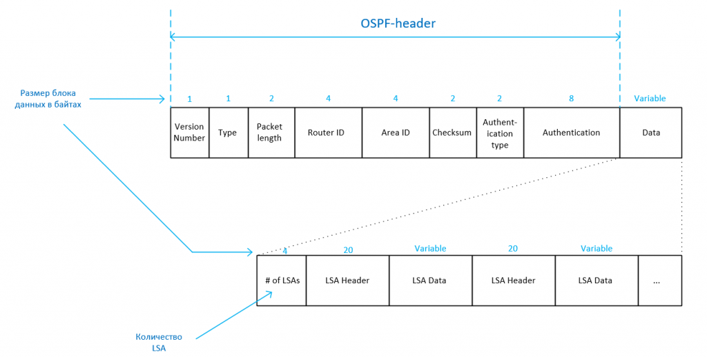

Version number — версия протокола OSPF (1 байт) Type — тип OSPF-пакета (1 байт) Packet length — размер пакета в байтах (2 байта) Router ID — идентификатор OSPF-маршрутизатора (4 байта) Area ID — идентификатор OSPF-области (4 байта) Checksum — контрольная сумма (2 байта) Authentication type — тип аутентификации (2 байта) Authentication — пароль (8 байт) Data — блок данных (переменная длина)

В случае с LSU нас интересует блок данных Data. Первым полем размеров в 4 байта идет количество LSA, находящихся в этом блоке. Далее идут эти самые LSA-данные. В одном блоке данных можешь быть как один LSA, так и несколько LSA разных типов.

### LSA 1 — Router LSA.

Маршрутизаторы рассылают LSA первого типа в каждую область, к которой роутер непосредственно подключен, за пределы области Router LSA не выходят. Эти пакеты описывают сети, подключенные к конкретному роутеру, тип сетей и стоимость маршрута до них.

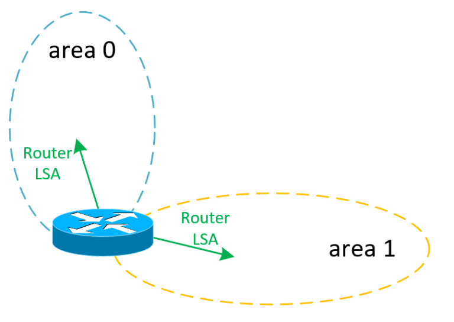

Рассмотрим вот такую схему:

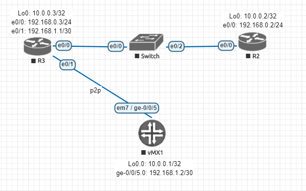

Простой вариант: R2 и R3, подключенные через коммутатор, и vMX1, подключенный через p2p-линк к R3. Помимо IP-адресов на физических интерфейсах, анонсируются Loopback-адреса. Глянем более детально структуру Router LSA, отправляемого R3 в сторону R2:

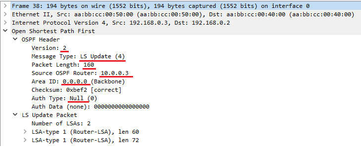

Из содержимого OSPF-заголовка видно, что используется OSPF версии 2, тип пакета — Link-state Update. Аутентификация отсутствует, ospf area 0 и router ID = 10.0.0.3 Размер пакета равен 160 байт и вычисляется следующим образом:

Packet lentgh = размер OSPF-заголовка + размер LSU-блока

В нашем случае это будет:

Packet length = 24 (размер OSPF-header) + 4 (блок # of LSAs) + 60 (размер первого LSA1) + 72 (размер второго LSA1) = 160

Что сходится с тем, что указано в OSPF-заголовке. Поле Number of LSAs в нашем случае равно двум, что говорит о том, что у нас пакет содержит 2 разных LSA. Заглянем внутрь первого LSA-type 1:

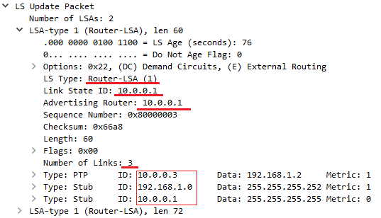

Интересующие нас поля:

-   LS Type: Router-LSA (тип LSA)
    
-   Link State ID: 10.0.0.1 (идентификатор LSA, в случае с LSA1 Link State ID равен ID роутера, рассылающего LSA )
    
-   Advertising Router: 10.0.0.1 (ID роутера, анонсировавшего данные сети)
    
-   Number of Links: 3 (количество описанных сетей в данном LSA)
    

После этого, собственно, идет описание сетей. Стоит обратить внимание, что сети отличаются полем Type. От его значения зависят поля ID и Data:

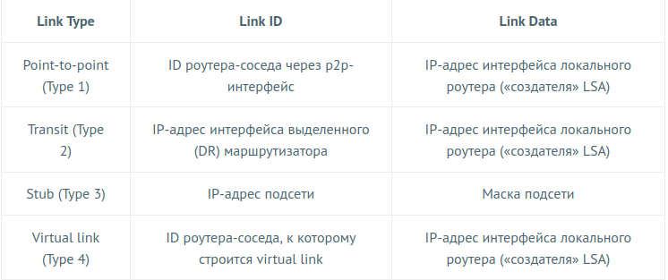

Если заглянем во второй LSA1, увидим аналогичную информацию:

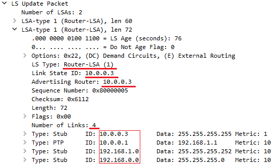

Помимо вышеперечисленных полей, есть поле Metric, которое описывает стоимость маршрута до указанной сети (ospf cost). Значение поля зависит от расстояния до сети назначения и пропускной способности интерфейсов.

Чтобы просмотреть информацию в базе данных состояния каналов на оборудовании Cisco и Juniper, нужно выполнить следующие команды (в примерах использованы абсолютно одинаковые сети, чтобы можно было визуально сравнить данные):

Аналогичные команды на Juniper:

### LSA 2 — Network LSA

LSA второго типа генерируются для широковещательного и NBMA сегментов сети (тип ospf-интерфейсов выставлен как broadcast или nbma/non-broadcast). Чаще на практике встречается broadcast-сети. Распространяются Network LSA2 также в пределах одной OSPF-области.

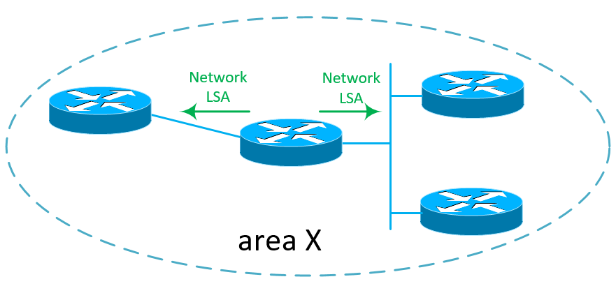

Рассмотрим схему:

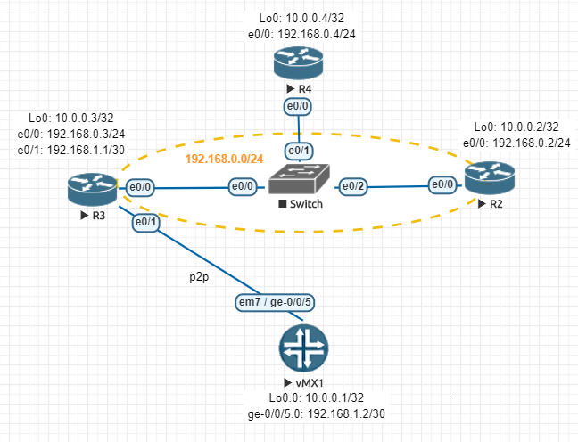

В данном случае широковещательным сегментом сети будет сеть между роутерами R2, R3 и R4, подключенных через коммутатор. Интерфейсы роутеров находятся в одной сети 192.168.0.0/24.

Заглянем внутрь LSU, приходящего от R3 к vMX1:

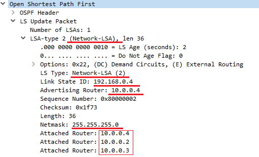

LSA-type 2 содержит в себе следующие интересующие нас поля:

-   LS Type: Network-LSA (тип LSA)
    
-   Link State ID: 192.168.0.4 ( идентификатор LSA, в случае с LSA2 Link State ID равен IP-адресу широковещательного интерфейса выделенного роутера DR)
    
-   Advertising Router: 10.0.0.4 (Router ID DR)
    
-   Netmask: 255.255.255.0 (маска подсети)
    
-   Attached Router: 10.0.0.4, 10.0.0.3, 10.0.0.2 (роутеры, находящиеся в данном широковещательном сегмент)
    

Таким образом, заглянув внутрь LSA2-пакета, можно узнать адрес Designated Router, а также маршрутизаторов, находящемся в том же широковещательном сегменте, что и DR.

Увидеть LSA2 на оборудовании можно с помощью команд:

### LSA 3 — Summary LSA

LSA третьего типа генерируются и отправляются только ABR (Area Border Router) маршрутизаторами. Используется для передачи информации о сетях из одной OSPF-области в другую. LSA распространяется только в пределах области, в которую он был анонсирован.

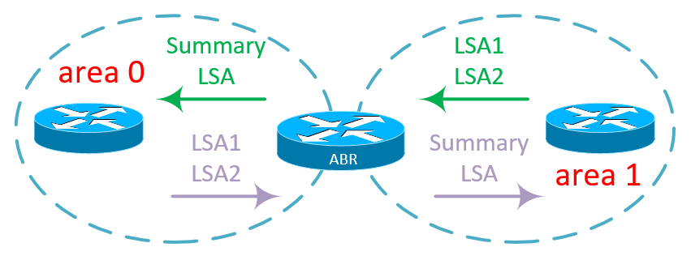

Рассмотрим следующую схему:

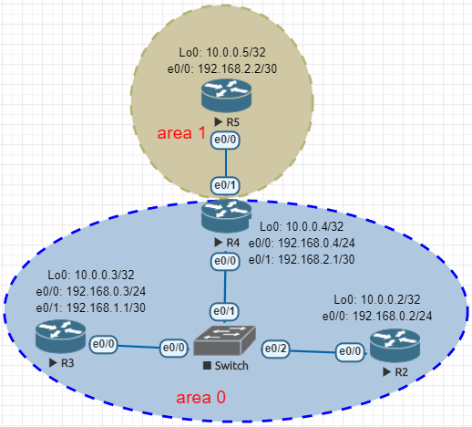

В данном случае в качестве ABR выступает R4, поскольку он принадлежит area 0 и area 1 одновременно. Посмотрим Summary LSA, отправляемые R4 к R5:

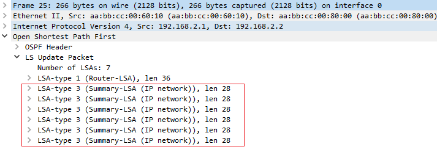

Рассмотрим более детально первый и последний LSA3:

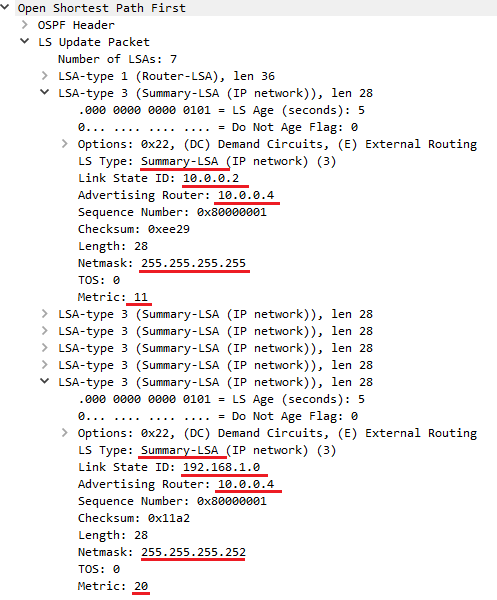

Нас интересуют следующие поля:

-   LS Type: Summary-LSA (тип LSA)
    
-   Link State ID: 192.168.1.0 (идентификатор LSA, в случае с LSA3 равен адресу анонсируемой сети)
    
-   Advertising Router: 10.0.0.4 (Router ID ABR)
    
-   Netmask: 255.255.255.252 (маска анонсируемой сети)
    
-   Metric: 20 (стоимость ospf-маршрута)
    

Рассмотрев более детально вышеуказанные LSU видно, что в первом LSA3 анонсируется loopback-адрес роутера R2 (10.0.0.2/32), а в последнем IP-адрес интерфейса e0/1 (192.168.1.0/30). В обоих случаях Advertising Router 10.0.0.4, поскольку он является ABR.

### LSA 4 — ASBR Summary LSA

LSA четвертого типа описывают местонахождение ASBR-маршрутизатора (маршрутизатора, который импортирует в OSPF внешние маршруты). LSA4 генерируются ABR-роутерами и распространяются по всему OSPF-домену.

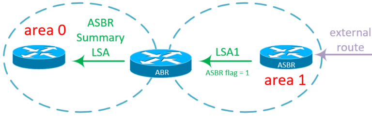

Рассмотрим такую схему:

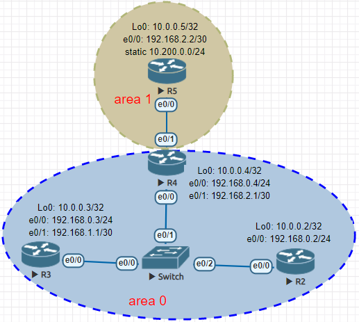

От предыдущего примера она отличается только тем, что на R5 у нас теперь будет прописан статический маршрут, а затем импортирован в OSPF-процесс.

Посмотрим, как R4 получает информацию от R5 о внешнем маршруте:

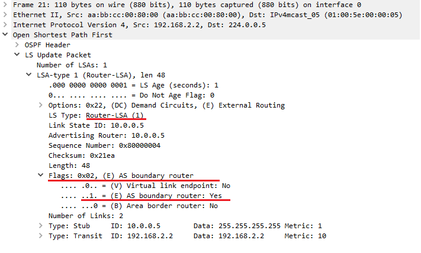

Из содержимого OSPF-пакета видно, что на ABR прилетел все тот-же LSA 1 типа, но в нем выставлен в значение «1» флаг AS boundary router, что говорит о том, что роутер 10.0.0.5 является ASBR.

Теперь посмотрим, как получает информацию об этом роутер R3:

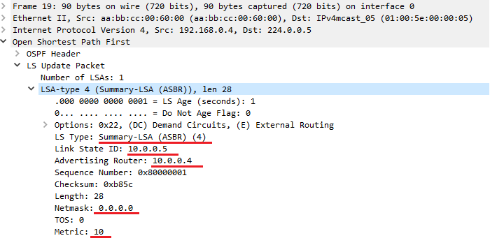

Поля, на которые стоит обратить внимание:

-   LS Type: Summary-LSA (ASBR)
    
-   Link State ID: 10.0.0.5 (идентификатор LSA, в случае с LSA4 равен Router ID ASBR)
    
-   Advertising Router: 10.0.0.4 (ID маршрутизатора, который анонсирует данный LSA)
    
-   Netmask: 0.0.0.0 (маска сети, в случае с LSA4 не играет роли и всегда равна 0.0.0.0)
    
-   Metric: 10 (стоимость маршрута до сети)
    

### LSA 5 — AS External LSA

LSA пятого типа описывают сети, импортированные в OSPF-процесс ASBR-маршрутизатором. Генерируются им же и распространяются по всему OSPF-домену.

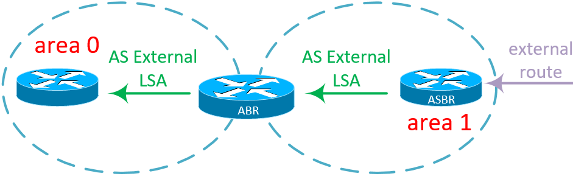

Схему сети возьмем из предыдущего примера:

Сейчас R5 анонсирует в OSPF-процесс статический маршрут 10.200.0.0/24. Посмотрим, что прилетает внутри Link State Update на R4:

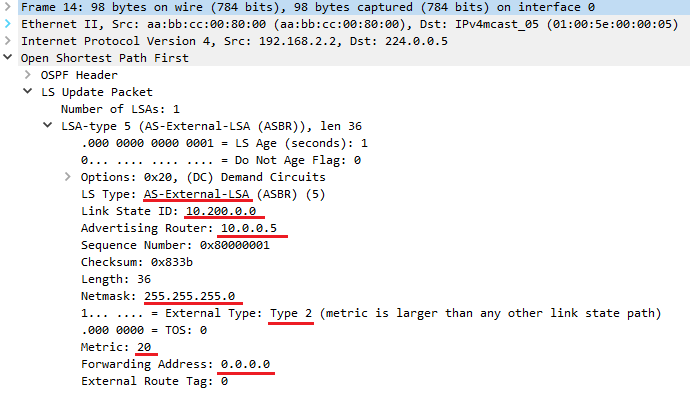

Интересующие нас поля:

-   LS Type: AS-External-LSA (тип LSA)
    
-   Link State ID: 10.200.0.0 (адрес анонсируемой сети)
    
-   Advertising Router: 10.0.0.5 (Router ID ASBR)
    
-   Netmask: 255.255.255.0 (маска анонсируемой сети)
    
-   External Type: Type 2 (равен 0 или 1, 0 — дефолтное значение, означает что маршрут является Type 2 external metric, если 1 — маршрут Type 1 external metric)
    
-   Metric: 20 (стоимость маршрута до сети)
    
-   Forwarding Address: 0.0.0.0 (адрес, через который можно добраться до анонсируемой сети. Значение 0.0.0.0 говорит о том, что сеть находится на самом ASBR)
    
-   External Route Tag: 0 (32-битное поле, которое может быть назначено внешнему маршруту. OSPF не использует это поле, но оно может быть обработано и использовано другими протоколами маршрутизации)
    

И в таком виде LSA5 распространяется по всему OSPF-домену.

### LSA 6 — Group Membership LSA

LSA шестого типа используются для рассылки мультикастового трафика через OSPF, если быть точнее — MOSPF (Multicast OSPF). LSA6 распространяются по OSPF-домену, который представляет из себя одну OSPF область. Каждый LSA6 описывает маршрут только до одной мультикастовой группы. За пределы области LSA6 не выходят.

В качестве Link State ID используется адрес мультикастовой группы, а в качестве Advertising Router, который, собственно, этот LSA6 и генерирует.

Широко MOSPF не используется и мало каким вендором поддерживается. Например, Cisco, Juniper и Huawei MOSPF не могут, да и зачем, когда есть PIM и MSDP?

### LSA 7 — NSSA External LSA

Как и LSA5, LSA седьмого типа описывают сети, импортированные в OSPF-процесс ASBR-маршрутизатором. Отличие лишь в том, что ASBR находится внутри NSSA-области. Распространяется LSA7 в пределах области NSSA, затем на ABR преобразуется в LSA5 и дальше по всему OSPF-домену

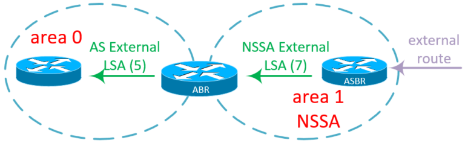

Для примера возьмем сеть из LSA5, но area 1 в этом случае будет NSSA:

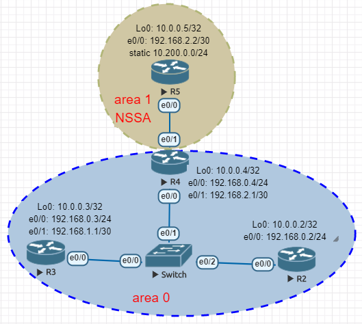

Заглянем внутрь LSU, прилетающего на R4 с R5.

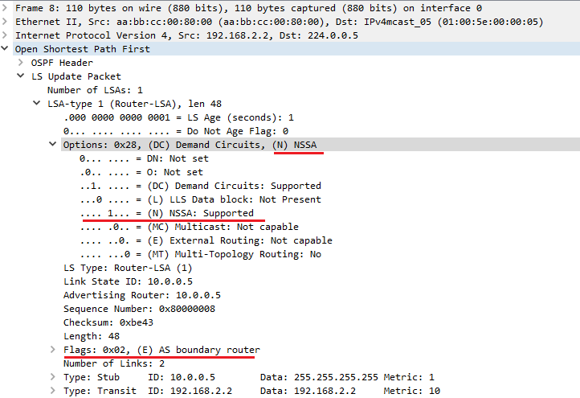

Как и в случае с LSA5, сначала на роутер приходит LSA1 с выставленным флагом ASBR и NSSA (NSSA был выставлен на этапе установления соседства).

После анонсирования LSA1 роутер R5 следом отправляет LSA7:

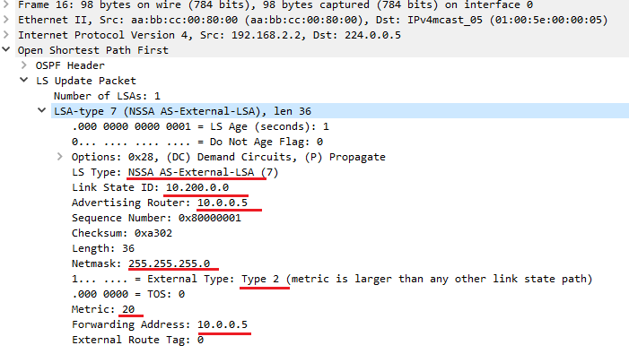

Как видим, поля аналогичны тем, что были в LSA 5 типа, за исключением того, что в поле Forwarding Address появился IP-адрес ASBR-маршрутизатора. Ну и, конечно же, сам LS Type стал AS-External-LSA.

После попадания на ABR пакет LSA7 преобразуется в LSA5 и распространяется по оставшейся части OSPF-домена. Вот в таком виде он доходит до R3:

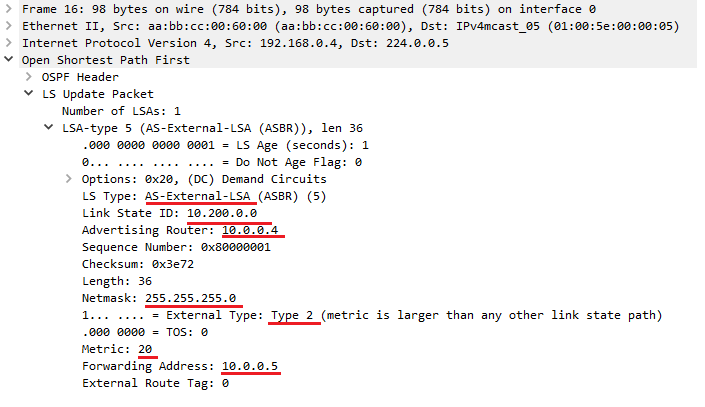

Это все тот же типичный LSA5, говорящий о том, что сеть 10.200.0.0/24 находится на роутере 10.0.0.5 (R5). Сам же пакет анонсирован роутером 10.0.0.4 (R4).

### LSA 8 — External attributes LSA (OSPFv2)

LSA восьмого типа используются для транспортировки по OSPF-домену атрибутов BGP-маршрутов, импортированных в OSPF с помощью ASBR.

### LSA 9, 10, 11 — OSPF opaque LSA

Как правило, opaque LSA используются для расширения функционала OSPF, позволяя ему передавать информацию, о которой OSPF изначально не заботится. Самое основное практическое применение Opaque LSA заключается в использовании MPLS Traffing Engineering.

