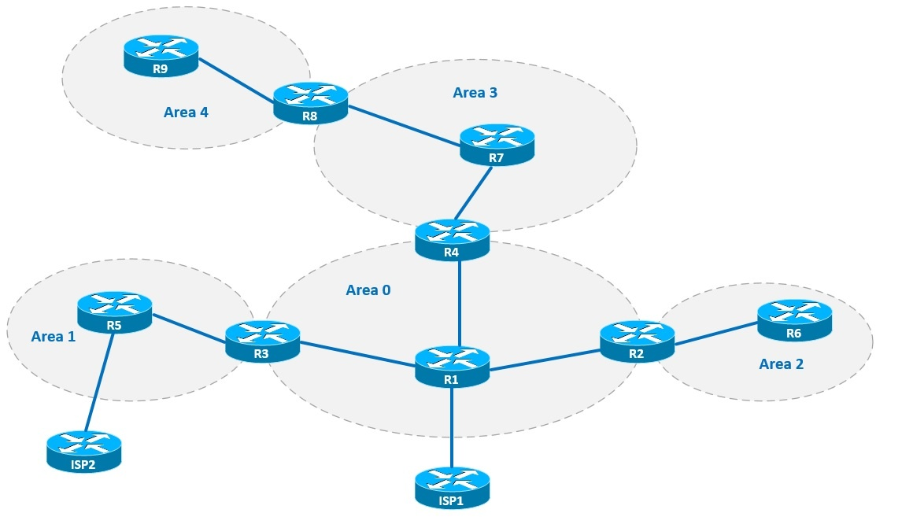
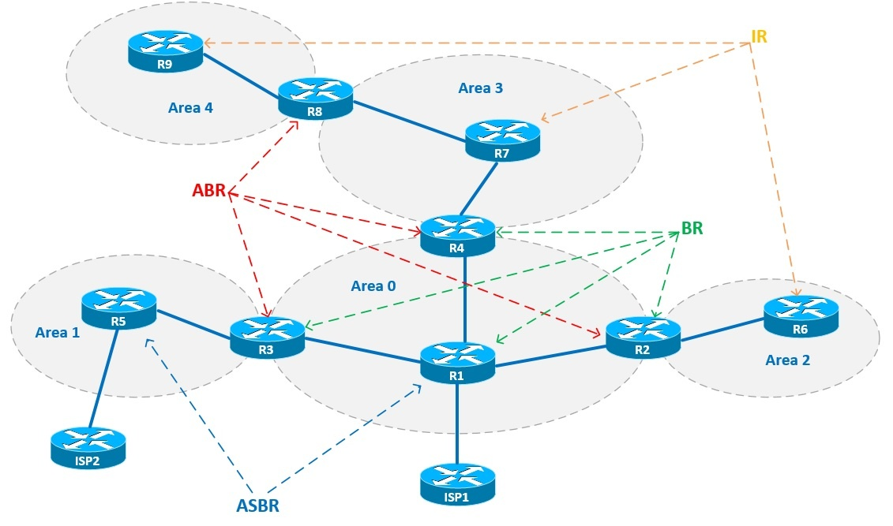
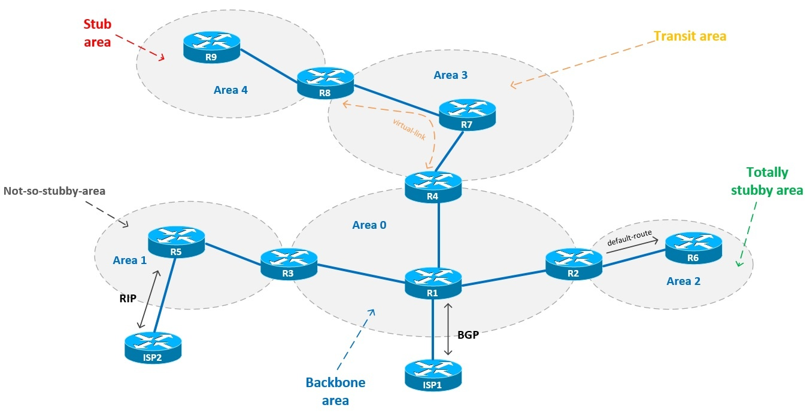

Разбираться в типах областей будем на примере схемы, указанной выше. У нас есть 5 OSPF-областей и 11 маршрутизаторов. Все маршрутизаторы соединены между собой по протоколу OSPF, за исключением роутеров ISP1 и ISP2. Их мы будем подключать по протоколу BGP и RIP соответственно.

Для начала необходимо разобраться с ролями маршрутизаторов на сети, нам известно, что бывают роутеры четырех видов:

**Internal Router** (внутренний маршрутизатор, IR) — роутер, находящийся внутри какой-либо OSPF-области и имеющим связь только с роутерами этой же области

**Backbone Router** (магистральный маршрутизатор, BR) — роутер, в котором как минимум один интерфейс принадлежит нулевой OSPF-области

**Area Border Router** (граничный маршрутизатор области, ABR) — роутер, находящийся на границе OSPF-области и соединяющий между собой две OSPF-области и более

**Autonomous System Boundary Router** (граничный маршрутизатор автономной системы, ASBR) — роутер, на котором помимо OSPF имеется связь с другими автономными системами (другие протоколы маршрутизации или другой OSPF-процесс)

Основываясь на вышесказанном, можно сделать выводы о ролях маршрутизаторов на данной схеме:

С видами роутеров разобрались, рассмотрим типы OSPF-областей:

**Stub areas** (тупиковая область)

— не переносит внешние маршруты

— не соединяет между собой нулевую и ненулевую область (через него не настраивается virtual-link)

— не содержит ASBR

**Totally stubby areas** (полностью тупиковая область)

— имеет те же свойства, что и stub areas и вдобавок получает от нулевой области только маршрут по умолчанию

**Not-so-stubby-areas** (не такая уж и тупиковая область, NSSA)

— тупиковая область, содержащая в себе ASBR

**Backbone area** (магистральная область)

— нулевая область, связывает между собой все остальные области

Также стоит выделить такой тип области, как транзитная область (**Transit area**) — ненулевая область, соединяющая между собой магистральную область и другую ненулевую область.

Учитывая вышеописанное, распишем типы областей на нашей схеме:

В данном случае area 3 выступает в качестве транзитной, поскольку area 4 будет строить соседство с магистральной (area 0) областью посредством виртуального канала связи через area 3 (virtual-link).

Таким образом получается, что посредством virtual-link R8 и R4 устанавливают соседство между собой напрямую. Более подробно этот способ связи, а также настройку сети на примере этой схемы мы рассмотрим в следующей статье.
