### Немного теории

Итак, настало время поговорить о DR (Designated Router) и BDR (Backup Designated Router) в протоколе OSPF. Возьмем простенькую сеть из четырех маршрутизаторов, подключенных друг с другом через широковещательную сеть 192.168.1.0/24:

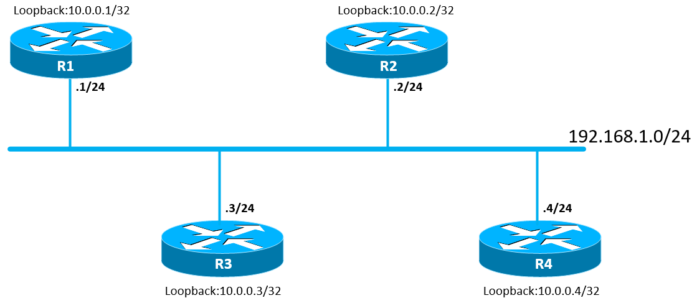

Интерфейсы роутеров, подключенных к данному сегменту сети, находятся в общем адресном пространстве 192.168.1.0/24 (последняя цифра соответствует номеру маршрутизатора).

Теперь представим, что у нас установлена full-mesh (каждый с каждым) связность по протоколу OSPF между роутерами:

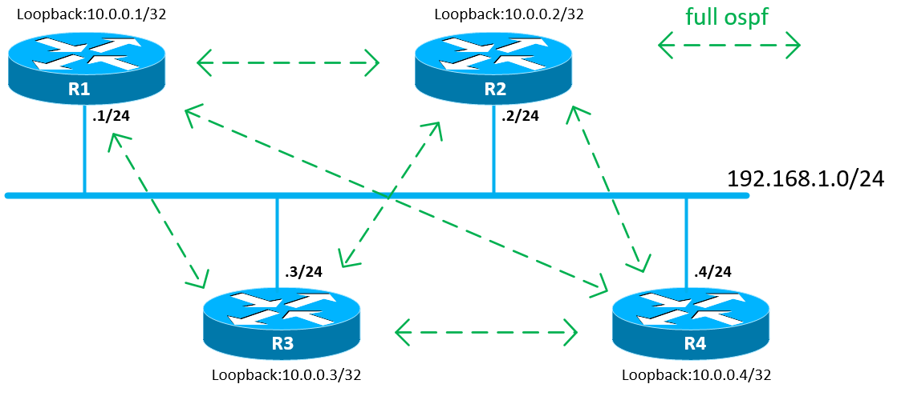

Таким образом, при количестве маршрутизаторов = 4 у нас получается 6 OSPF-соседств. А если количество маршрутизаторов будет больше, то вырастет количество OSPF-связей между роутерами. Общая формула зависимости OSPF-соседств X от количества роутеров N выглядит так:

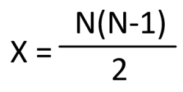

То есть, при наличии 10 роутеров в сети, у нас будет 45 OSPF-соседств. Что даст ощутимую нагрузку на процессоры и на сеть в целом в момент установления соседства или пересчета топологии. Например, на R1 у нас появилась еще одна сеть 10.0.255.0/24, которую необходимо проанонсировать своим соседям:

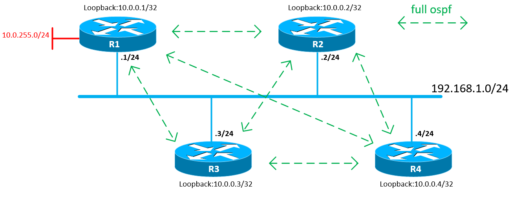

R1 сгенерирует LSA1, упакует его в Link-State Update пакет и разошлет его всем своим OSPF-соседям, указав в качестве IP-адреса назначения мультикастовый адрес OSPF-роутеров 224.0.0.5:

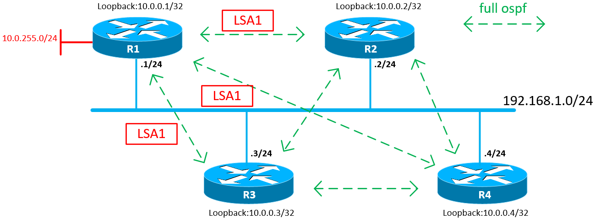

После получения LSA маршрутизаторы

-   отправляют в ответ Link-State Acknowledgment
    
-   пересылают Link-State Update другим своим OSPF-соседям в пределах области
    
-   запускает пересчет топологии сети с целью поиска кратчайшего маршрута
    

В случае с большим количеством роутеров или появлением большого количества анонсов в сети есть шанс подгрузить сеть и процессоры маршрутизаторов, что несколько негативно скажется на работоспособности сетевого сегмента.

Данную проблему можно решить при помощи добавления в сеть Designated Router (DR) и Backup Designated Router (BDR). Смысл данных ролей в том, что выделенные роутеры аккумулируют на себе все соединения и являются ведущими маршрутизаторами в данном сетевом сегменте. Маршрутизаторы устанавливают full ospf-соседства с DR и BDR, а с остальными — 2WAY.

На примере рассматриваемой сети, пусть R1 будет DR, а R2 — BDR:

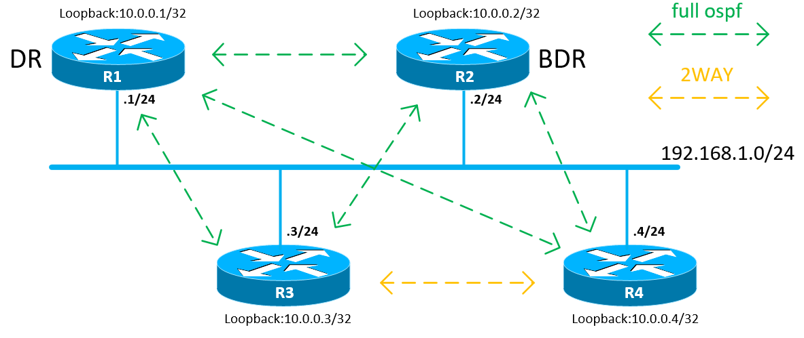

На вышеуказанном примере между R3 и R4 будет установлено 2WAY-соседство, остальные связи будут в состоянии FULL. Даже в случае из 4 роутеров видно, что количество связей между роутерами меньше, чем в full-mesh топологии. В общем же случае, при присутствии DR и BDR в сегменте сети количество OSPF-соседств X определяется по формуле:

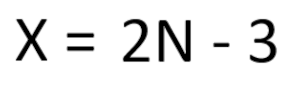

Рассмотрим случай, когда на R3 появилась новая сеть и ее нужно проанонсировать в данный участок сети:

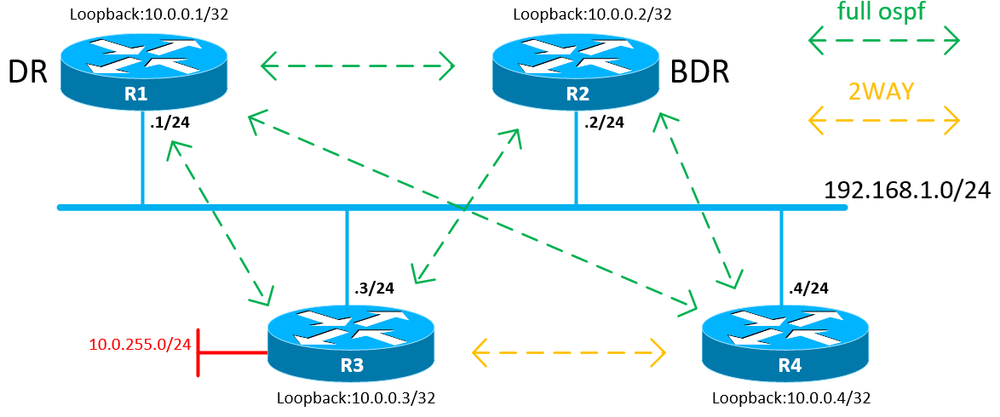

В данном примере R3 сгенерирует LSA1, который упакует в Link-State Update пакет и отправит на мультикастовый адрес 224.0.0.6 (данный пакет получат только DR и BDR):

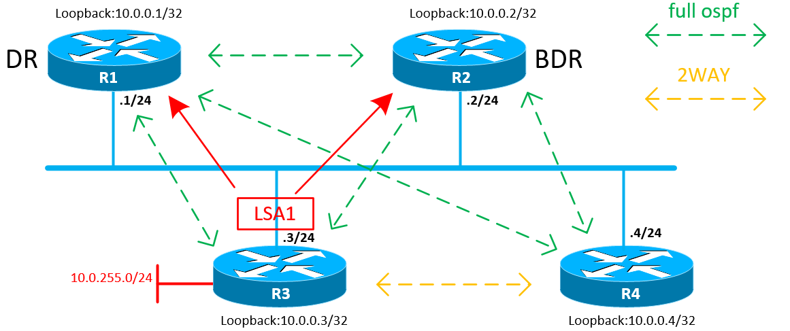

Получив Update, BDR просто обработает его и отправит Link-State Acknowledgment в сторону R3 (на адрес 224.0.0.5), подтверждающий получение обновления:

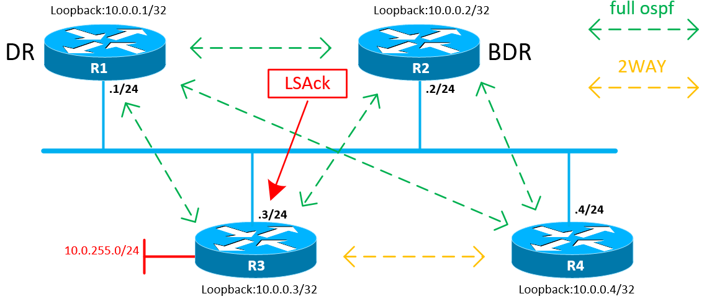

DR выполняет следующие действия:

-   отправляет Link-State Acknowledgment в сторону R3 на адрес 224.0.0.5
    
-   перенаправляет данный Link-State Update в в широковещательный сегмент сети, указав в качестве адреса назначения IP 224.0.0.5
    

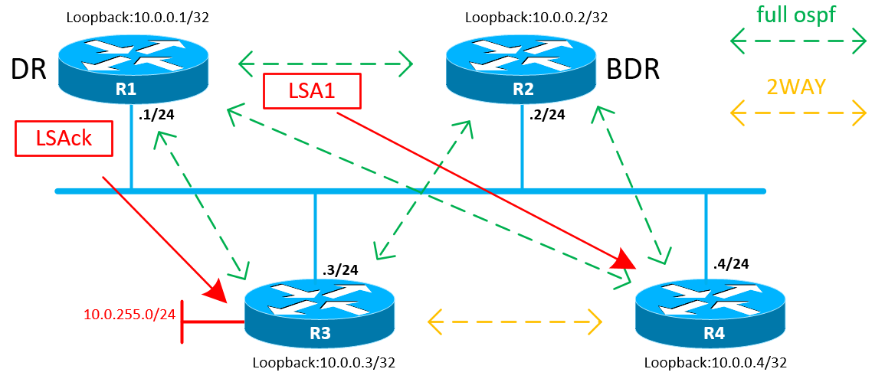

В данном случае отправленный пакет будет обработан только R4, поскольку R3 был инициатором обновления, а R2 получил данный Update ранее.

После получения обновления R4 отправляет Link-State Acknowledgment на адрес 224.0.0.6 (для DR и BDR), тем самым подтверждая получение пакета.

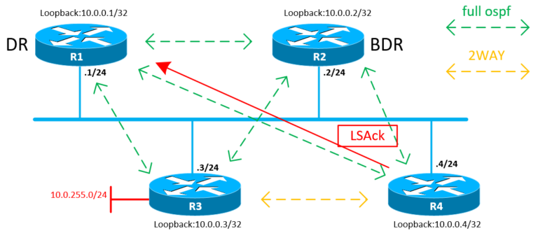

Ниже представлена сравнительная таблица, в которой отражено количество OSFP-соседств для FULL-MESH топологии и при выборе DR и BDR роутеров:

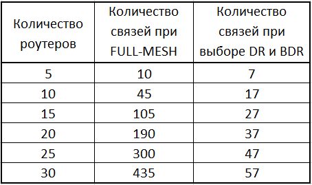

Как видно, при росте количество маршрутизаторов в сети резко возрастает количество связей между роутерами и потенциальная нагрузка на сеть в случае full-mesh топологии.

С ролью DR разобрались, теперь о BDR — он пассивно «слушает» изменения на сети и, в случае выхода из строя Designated Router’а, оперативно принимает его роль на себя и сам становится DR. После этого оставшиеся роутеры принимают решение о том, кто же будет BDR.

Выборы DR/BDR делаются по следующему принципу (в порядке убывания значимости):

1.  DR становится роутер с наивысшим приоритетом (число от 0 до 255)
    
2.  Если приоритеты равны, DR становится роутер с бОльшим значением Router-ID
    
3.  Роутер со вторым по старшинству значением приоритета или Router-ID становится BDR.
    

У маршрутизаторов Cisco и Huawei по-умолчанию значение приоритета интерфейса равно единице, у Juniper равно 128. Если приоритет равен нулю, то данный роутер не участвует в выборах DR и BDR, и, соответственно, никогда не может стать одним из них. Значение приоритета настраивается на самом интерфейсе, то есть он может отличаться для различных сегментов сети.

### Немного практики

Перейдем к практике. Возьмем топологию, которую мы рассматривали ранее. Из вендоров у нас будет 2 роутера Cisco и 2 Juniper:

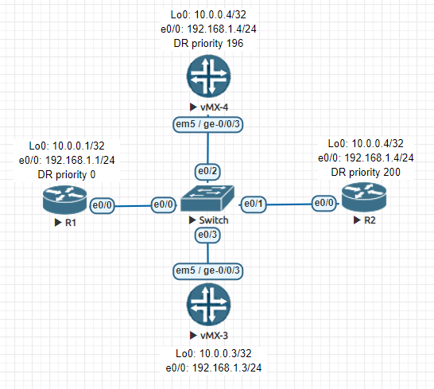

На роутерах настроена IP-адресация, Router-ID и базовый OSPF. То есть, зная, что дефолтные значения приоритета у маршрутизаторов Juniper равны 128, а Cisco = 1, можно предположить, что DR и BDR роли заберут себе именно vMX. А поскольку у обоих роутеров одинаковые приоритеты, DR будет именно тот, у которого больше Router-ID, в данном случае это R4 (10.0.0.4 > 10.0.0.3). Проверим догадку на практике. Посмотрим OSPF-соседей на R1 и R2:

Как видно выше, у Cisco приоритет соседа и его роль можно увидеть прям из вывода команды show ip ospf neighbor (столбцы Pri и State). Как и ожидалось, роль DR взял на себя R4, а BDR — R3. Между R1 и R2 установилось отношение 2WAY.

На Juniper же видно, что в столбце Pri указан приоритет, но вот роль узла не до конца ясна. Увидеть ее можно с помощью команды show ospf interface или show ospf interface detail

Из вывода ясно, что интерфейс vMX-4 ge-0/0/3.0 является DR, здесь же видно, что DR является роутер 10.0.0.4, а BDR — 10.0.0.3

В более детальном выводе интерфейса ge-0/0/3.0 можно увидеть значение приоритета, выставленного на интерфейсе: 128. Помимо прочего, здесь можно увидеть значения таймеров, MTU и IP-адресацию и прочее.

На Cisco также можно увидеть более детальную информацию по OSPF-интерфейсам. Делается это с помощью команд show ip ospf interface brief или show ip ospf interface

Теперь попробуем выставить значения приоритетов в соответствии с теми, что указаны в топологии: R1 — 0, R2 — 200, vMX-4 — 196.

На Cisco приоритеты настраиваются в режиме конфигурации интерфейса:

На Juniper приоритет выставляется также в настройках интерфейса, но в контексте OSPF:

После внесения правок из выводов R1 видно, что значения приоритетов поменялись, но вот DR и BDR остались прежними.

На vMX-4 абсолютно аналогичная ситуация: приоритеты изменились, но вот роли маршрутизаторов остались прежними. Это связано с тем, что на момент смены приоритетов DR и BDR уже были выбраны. Для обновления ролей необходимо заново инициировать выборы. Можно либо спросить OSPF-процессы на маршрутизаторах, или же просто разорвать связности.

На Cisco OSPF можно сбросить с помощью команды clear ip ospf process, на Juniper — clear ospf neighbor interface ge-0/0/3.0

После сброса OSPF видно, что произошли перевыборы и на данный момент R2 является DR, а R4 — BDR.

В завершении давайте потушим интерфейс e0/0 на R2 и посмотрим, кто займет роль BDR. Из вывода R1 видно, что связь с R2 полностью прервалась, R4 стал DR, а R3 взял на себя роль BDR.
