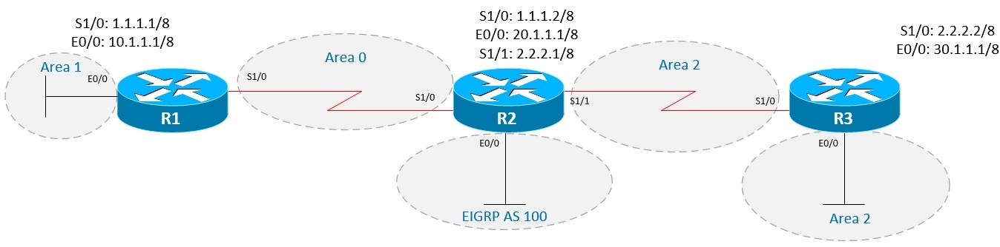

Топология сети:

Схема данной статьи аналогична предыдущей, за исключением интерфейса E0/0 на R2. Он участвует в процессе маршрутизации EIGRP 100.

Итак, интерфейсы на маршрутизаторах настроены в соответствии с топологией, теперь поднимем OSPF на роутерах (в качестве Router-id используем ip-адрес с порядковым номером роутера)

**R1:**

R1#conf t

Enter configuration commands, one per line. End with CNTL/Z.

R1(config)#router ospf 1

R1(config-router)#router-id 1.1.1.1

R1(config-router)#network 1.0.0.0 0.255.255.255 area 0

R1(config-router)#network 10.0.0.0 0.255.255.255 area 1

R1(config-router)#end

**R2:**

R2#conf t

Enter configuration commands, one per line. End with CNTL/Z.

R2(config)#router ospf 1

R2(config-router)#router-id 2.2.2.2

R2(config-router)#network 2.0.0.0 0.255.255.255 area 2

R2(config-router)#network 1.0.0.0 0.255.255.255 area 0

R2(config-router)#end

**R3:**

R3#conf t

Enter configuration commands, one per line. End with CNTL/Z.

R3(config)#router ospf 1

R3(config-router)#router-id 3.3.3.3

R3(config-router)#network 30.0.0.0 0.255.255.255 area 2

R3(config-router)#network 2.0.0.0 0.255.255.255 area 2

R3(config-router)#end

Теперь пропишем EIGRP на R2:

**R2**
#conf t

Enter configuration commands, one per line. End with CNTL/Z.

R2(config)#router eigrp 100

R2(config-router)#no auto-summary

R2(config-router)#network 20.0.0.0 255.0.0.0

R2(config-router)#end

Проверим установившиеся соседства и таблицы маршрутизации:

**R1:**

R1#sh ip ospf neighbor

Neighbor ID Pri State Dead Time Address Interface

2.2.2.2 0 FULL/ - 00:00:34 1.1.1.2 Serial1/0

R1#

R1#sh ip route ospf | begin Gateway

Gateway of last resort is not set

O IA 2.0.0.0/8 [110/128] via 1.1.1.2, 00:15:14, Serial1/0

O IA 30.0.0.0/8 [110/138] via 1.1.1.2, 00:14:36, Serial1/0

**R2:**

R2#sh ip ospf neighbor

  

Neighbor ID Pri State Dead Time Address Interface

1.1.1.1 0 FULL/ - 00:00:35 1.1.1.1 Serial1/0

3.3.3.3 0 FULL/ - 00:00:31 2.2.2.2 Serial1/1

R2#

R2#sh ip route | begin Gateway

Gateway of last resort is not set

  

1.0.0.0/8 is variably subnetted, 2 subnets, 2 masks

C 1.0.0.0/8 is directly connected, Serial1/0

L 1.1.1.2/32 is directly connected, Serial1/0

2.0.0.0/8 is variably subnetted, 2 subnets, 2 masks

C 2.0.0.0/8 is directly connected, Serial1/1

L 2.2.2.1/32 is directly connected, Serial1/1

O IA 10.0.0.0/8 [110/74] via 1.1.1.1, 00:15:45, Serial1/0

20.0.0.0/8 is variably subnetted, 2 subnets, 2 masks

C 20.0.0.0/8 is directly connected, Ethernet0/0

L 20.1.1.1/32 is directly connected, Ethernet0/0

O 30.0.0.0/8 [110/74] via 2.2.2.2, 00:15:08, Serial1/1

**R3:**

R3#sh ip ospf neighbor

Neighbor ID Pri State Dead Time Address Interface

2.2.2.2 0 FULL/ - 00:00:30 2.2.2.1 Serial1/0

R3#sh ip route ospf | begin Gateway

Gateway of last resort is not set

  

O IA 1.0.0.0/8 [110/128] via 2.2.2.1, 00:15:21, Serial1/0

O IA 10.0.0.0/8 [110/138] via 2.2.2.1, 00:15:21, Serial1/0

OSPF успешно поднялся, а на R2 интерфейс E0/0 отображается как локальный, поскольку административная дистанция у него меньше, чем у EIGRP. Проверим запущенные процессы маршрутизации:

**R2**
#show ip protocols

  

Routing Protocol is "ospf 1" Outgoing update filter list for all interfaces is not set

Incoming update filter list for all interfaces is not set

Router ID 2.2.2.2

It is an area border router

Number of areas in this router is 2. 2 normal 0 stub 0 nssa

Maximum path: 4

Routing for Networks:

1.0.0.0 0.255.255.255 area 0

2.0.0.0 0.255.255.255 area 2

Routing Information Sources:

Gateway Distance Last Update

3.3.3.3 110 00:18:07

1.1.1.1 110 00:18:44

Distance: (default is 110)

  

Routing Protocol is "eigrp 100" Outgoing update filter list for all interfaces is not set

Incoming update filter list for all interfaces is not set

Default networks flagged in outgoing updates

Default networks accepted from incoming updates

EIGRP-IPv4 Protocol for AS(100)

Metric weight K1=1, K2=0, K3=1, K4=0, K5=0

NSF-aware route hold timer is 240

Router-ID: 20.1.1.1

Topology : 0 (base)

Active Timer: 3 min

Distance: internal 90 external 170

Maximum path: 4

Maximum hopcount 100

Maximum metric variance 1

  

Automatic Summarization: disabled

Maximum path: 4

Routing for Networks:

20.0.0.0

Routing Information Sources:

Gateway Distance Last Update

Distance: internal 90 external 170

В описании EIGRP 100 видно, что выполняется маршрутизация сети 2.0.0.0, настроим редистрибьюцию EIGRP в OSPF. Делается это следующей командой в режиме настройке OSPF:

R2(config-router)#redistribute ?

application Application

bgp Border Gateway Protocol (BGP)

connected Connected

eigrp Enhanced Interior Gateway Routing Protocol (EIGRP)

isis ISO IS-IS

iso-igrp IGRP for OSI networks

lisp Locator ID Separation Protocol (LISP)

maximum-prefix Maximum number of prefixes redistributed to protocol

mobile Mobile routes

odr On Demand stub Routes

ospf Open Shortest Path First (OSPF)

ospfv3 OSPFv3

rip Routing Information Protocol (RIP)

static Static routes

vrf Specify a source VRF

Как видно выше, можно перераспределить множество протоколов. Но нас интересует именно EIGRP:

R2(config-router)#redistribute eigrp 100 metric 100 subnets

Разберем чуть более подробно команду выше:

-   eigrp 100: идентифицирует процесс EIGRP
    
-   metric 100: указывает метрику маршрута
    
-   параметр subnets указывает на то, что нужно перераспределять бесклассовые сети
    

После этого проверим выводы таблицы маршрутизации на R1 и R3:

**R1:**

R1#show ip route ospf

Codes: L - local, C - connected, S - static, R - RIP, M - mobile, B - BGP

D - EIGRP, EX - EIGRP external, O - OSPF, IA - OSPF inter area

N1 - OSPF NSSA external type 1, N2 - OSPF NSSA external type 2

E1 - OSPF external type 1, E2 - OSPF external type 2

i - IS-IS, su - IS-IS summary, L1 - IS-IS level-1, L2 - IS-IS level-2

ia - IS-IS inter area, * - candidate default, U - per-user static route

o - ODR, P - periodic downloaded static route, H - NHRP, l - LISP

a - application route

+ - replicated route, % - next hop override

  

Gateway of last resort is not set

  

O IA 2.0.0.0/8 [110/128] via 1.1.1.2, 00:17:09, Serial1/0

O E2 20.0.0.0/8 [110/100] via 1.1.1.2, 00:12:37, Serial1/0

O IA 30.0.0.0/8 [110/138] via 1.1.1.2, 00:17:09, Serial1/0

**R3:**

R3#show ip route ospf

Codes: L - local, C - connected, S - static, R - RIP, M - mobile, B - BGP

D - EIGRP, EX - EIGRP external, O - OSPF, IA - OSPF inter area

N1 - OSPF NSSA external type 1, N2 - OSPF NSSA external type 2

E1 - OSPF external type 1, E2 - OSPF external type 2

i - IS-IS, su - IS-IS summary, L1 - IS-IS level-1, L2 - IS-IS level-2

ia - IS-IS inter area, * - candidate default, U - per-user static route

o - ODR, P - periodic downloaded static route, H - NHRP, l - LISP

a - application route

+ - replicated route, % - next hop override
 

Gateway of last resort is not set
  

O IA 1.0.0.0/8 [110/128] via 2.2.2.1, 00:15:18, Serial1/0

O IA 10.0.0.0/8 [110/138] via 2.2.2.1, 00:15:18, Serial1/0

O E2 20.0.0.0/8 [110/100] via 2.2.2.1, 00:10:41, Serial1/0

У нас появился маршрут до сети 20.0.0.0/8 с указанной административной дистанцией 100. Сам же маршрут помечен символами O E2, что говорит о том, что маршрут получен из внешнего источника путем редистрибьюции. Сам же маршрутизатор, выполняющий перераспределение является пограничным маршрутизатором автономной системы (ASBR).

Autonomus System Boundary Router (ASBR, пограничный маршрутизатор автономной системы) — обменивается сетями с роутерами, принадлежащим другим автономным системам (процессам маршрутизации, например EIGRP, BGP, Static route, другой процесс OSPF). ASBR может быть внутренним, граничным или магистральным роутером.

Проверим, кто из роутеров является ABR/ASBR:

**R1:**

R1#show ip ospf border-routers

  OSPF Router with ID (1.1.1.1) (Process ID 1)

  Base Topology (MTID 0)
 

Internal Router Routing Table

Codes: i - Intra-area route, I - Inter-area route

  i 2.2.2.2 [64] via 1.1.1.2, Serial1/0, ABR/ASBR, Area 0, SPF 7

**R3:**

R3#sh ip ospf border-routers

  OSPF Router with ID (3.3.3.3) (Process ID 1)

  
Base Topology (MTID 0)

  Internal Router Routing Table

Codes: i - Intra-area route, I - Inter-area route

  i 2.2.2.2 [64] via 2.2.2.1, Serial1/0, ABR/ASBR, Area 2, SPF 7

Как для R1, так и для R3 маршрутизатор R2 является как ABR (в ospf-областях 0 и 2 соответственно), так и ASBR.

