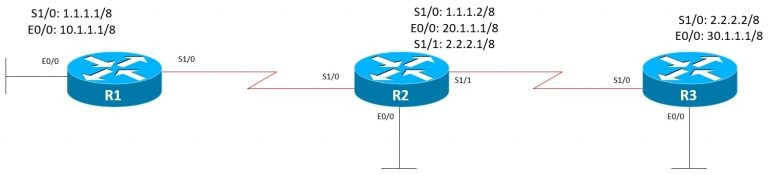

Топология сети:

Для того, чтобы настроить процесс маршрутизации OSPF на узлах, необходимо сначала создать процесс OSFP и указать его номер:

Router(config)#router ospf process_ID

Параметр _process_ID_ может принимать значения от 1 до 65535.  
Итак, интерфейсы маршрутизаторов настроены в соответствии с приведенной топологией, теперь надо настроить OSPF. Возьмем номер процесса равным 1.  
Для того, чтобы объявить подключенные сети, необходимо в режиме настройки OSPF указать объявляемую сеть при помощи команды network:

Router(config-router)network A.B.C.D W.X.Y.Z area area_id

разберем более подробно надпись выше:

-   A.B.C.D — маска анонсируемой сети
    
-   W.X.Y.Z — обратная маска сети
    
-   area_id — номер OSPF области
    

Объявим на R1 сети, подключенные к нему. Начнем с интерфейса E0/0:

R1#sh run int e0/0 | i ip addr  
ip address 10.1.1.1 255.0.0.0

В данном случае в качестве A.B.C.D будет использоваться адрес сети, полученный путем применения операции «логическое И» между IP-адресом и маски сети: 10.0.0.0 (сеть необязательно вычислять, можно указать адрес, указанный на интерфейсе, а роутер сам заменит его на адрес сети).  
Для расчета обратной маски вычтем из 255.255.255.255 текущую маску подсети 255.0.0.0, получим 0.255.255.255  
Параметр area_ID в случае OSPF для одной области будет равен 0, поскольку в OSPF нулевая область является дефолтной и используется в качестве магистральной области.

R1#conf t  
Enter configuration commands, one per line. End with CNTL/Z.  
R1(config)#router ospf 1  
R1(config-router)#network 10.0.0.0 0.255.255.255 area 0

Объявим оставшиеся сети на R1,R2 и R3:

R1(config-router)#network 1.0.0.0 0.255.255.255 area 0

**R2:**

R2#conf t  
Enter configuration commands, one per line. End with CNTL/Z.  
R2(config)#router ospf 1  
R2(config-router)#network 20.0.0.0 0.255.255.255 area 0  
R2(config-router)#network 1.0.0.0 0.255.255.255 area 0  
R2(config-router)#network 1.0.0.0 0.255.255.255 area 0  
*Dec 6 16:12:44.709: %OSPF-5-ADJCHG: Process 1, Nbr 1.1.1.1 on Serial1/0 from LOADING to FULL, Loading Done  
R2(config-router)#network 2.0.0.0 0.255.255.255 area 0  
R2(config-router)#end

**R3:**

R3#conf t  
Enter configuration commands, one per line. End with CNTL/Z.  
R3(config)#router ospf 1  
R3(config-router)#network 30.0.0.0 0.255.255.255 area 0  
R3(config-router)#network 2.0.0.0 0.255.255.255 area 0  
R3(config-router)#end

**Посмотрим список маршрутов на R1:**

R1#sh ip route | begin Gateway  
Gateway of last resort is not set  
  
1.0.0.0/8 is variably subnetted, 2 subnets, 2 masks  
C 1.0.0.0/8 is directly connected, Serial1/0  
L 1.1.1.1/32 is directly connected, Serial1/0  
O 2.0.0.0/8 [110/128] via 1.1.1.2, 00:02:01, Serial1/0  
10.0.0.0/8 is variably subnetted, 2 subnets, 2 masks  
C 10.0.0.0/8 is directly connected, Ethernet0/0  
L 10.1.1.1/32 is directly connected, Ethernet0/0  
O 20.0.0.0/8 [110/74] via 1.1.1.2, 00:02:11, Serial1/0  
O 30.0.0.0/8 [110/138] via 1.1.1.2, 00:01:26, Serial1/0

Как видим выше, в таблице маршрутизации появились маршруты, помеченные буквой «O», это и есть сети, «прилетевшие» по OSPF.  
Теперь глянем список OSPF-соседей на R2:

R2#sh ip ospf neighbor  
  
Neighbor ID Pri State Dead Time Address Interface  
10.1.1.1 0 FULL/ - 00:00:39 1.1.1.1 Serial1/0  
30.1.1.1 0 FULL/ - 00:00:37 2.2.2.2 Serial1/1

Отлично, есть два ospf-соседа. Нас в данном случае интересует столбец Neighbor ID, говорящий о том, какие уникальные идентификаторы есть у смежных роутеров.

Для того, чтобы посмотреть свой идентификатор, необходимо выполнить:

R2#sh ip ospf | i ID  
Routing Process "ospf 1" with ID 20.1.1.1

По умолчанию, если принудительно не настроен Router ID или Loopback-интерфейс, в качестве идентификатора маршрутизатора выбирается наибольший IP-адрес, что в нашем случае и подтверждается.

### Использование Loopback-интерфейсов в качестве Router-ID

Теперь давайте на каждом роутере создадим Loopback-интерфейс и объявим его всем соседям:  
R1: Loopback0: 6.6.6.6/32  
R2: Loopback0: 7.7.7.7/32  
R3: Loopback0: 8.8.8.8/32

**R1:**

R1#conf t  
Enter configuration commands, one per line. End with CNTL/Z.  
R1(config)#int lo0  
R1(config-if)#ip addr 6.6.6.6 255.255.255.255  
R1(config-if)#router ospf 1  
R1(config-router)#network 6.6.6.6 0.0.0.0 area 0  
R1(config-router)#end

**R2:**

R2#conf t  
Enter configuration commands, one per line. End with CNTL/Z.  
R2(config)#int lo0  
R2(config-if)#ip addr 7.7.7.7 255.255.255.255  
R2(config-if)#router ospf 1  
R2(config-router)#network 7.7.7.7 0.0.0.0 area 0  
R2(config-router)#end

**R3:**

R3#conf t  
Enter configuration commands, one per line. End with CNTL/Z.  
R3(config)#int lo0  
R3(config-if)#ip addr 8.8.8.8 255.255.255.255  
R3(config-if)#router ospf 1  
R3(config-router)#network 8.8.8.8 0.0.0.0 area 0  
R3(config-router)#end

Проверим изменения:  
**R2:**

R2#sh ip ospf | i ID  
Routing Process "ospf 1" with ID 20.1.1.1  
R2#  
R2#sh ip ospf neighbor  
  
Neighbor ID Pri State Dead Time Address Interface  
10.1.1.1 0 FULL/ - 00:00:35 1.1.1.1 Serial1/0  
30.1.1.1 0 FULL/ - 00:00:30 2.2.2.2 Serial1/1

Хм, не помогло. А что там в таблице маршрутизации?

R2#sh ip route ospf | begin Gateway  
Gateway of last resort is not set  
  
6.0.0.0/32 is subnetted, 1 subnets  
O 6.6.6.6 [110/65] via 1.1.1.1, 00:03:48, Serial1/0  
8.0.0.0/32 is subnetted, 1 subnets  
O 8.8.8.8 [110/65] via 2.2.2.2, 00:02:38, Serial1/1  
O 10.0.0.0/8 [110/74] via 1.1.1.1, 00:13:32, Serial1/0  
O 30.0.0.0/8 [110/74] via 2.2.2.2, 00:22:16, Serial1/1

Здесь все в порядке. Дело в том, что Router ID вычисляется на этапе запуска OSPF-процесса. Для того, чтобы перезапустить процесс OSPF нужно в привилегированном режиме ввести команду **clear ip ospf process**.

**Сбросим OSPF на всех маршрутизаторах и снова проверим Router ID**

R2#sh ip ospf neighbor  
  
Neighbor ID Pri State Dead Time Address Interface  
8.8.8.8 0 FULL/ - 00:00:36 2.2.2.2 Serial1/1  
6.6.6.6 0 FULL/ - 00:00:39 1.1.1.1 Serial1/0  
R2#  
R2#sh ip ospf | i ID  
Routing Process "ospf 1" with ID 7.7.7.7

Вот, теперь работает так, как предполагалось.

### Принудительная настройка Router-ID

Теперь давайте принудительно установим Router-id на каждом роутере:  
R1: 3.3.3.3  
R2: 4.4.4.4  
R3: 5.5.5.5

**R1:**

R1#conf t  
Enter configuration commands, one per line. End with CNTL/Z.  
R1(config)#router ospf 1  
R1(config-router)#router-id 3.3.3.3  
% OSPF: Reload or use "clear ip ospf process" command, for this to take effect  
R1(config-router)#end

Как видим выше, маршрутизатор предупреждает, что для применения эффекта нужно ввести команду **clear ip ospf process**  
**Выполним ее на R1 и на всех следующих роутерах**

R1#  
*Dec 6 16:49:40.613: %SYS-5-CONFIG_I: Configured from console by console  
R1#clear ip ospf process  
Reset ALL OSPF processes? [no]: yes  
R1#  
*Dec 6 16:51:10.873: %OSPF-5-ADJCHG: Process 1, Nbr 7.7.7.7 on Serial1/0 from FULL to DOWN, Neighbor Down: Interface down or detached  
*Dec 6 16:51:10.912: %OSPF-5-ADJCHG: Process 1, Nbr 7.7.7.7 on Serial1/0 from LOADING to FULL, Loading Done

**R2:**

R2#conf t  
Enter configuration commands, one per line. End with CNTL/Z.  
R2(config)#router ospf 1  
R2(config-router)#router-id 4.4.4.4  
% OSPF: Reload or use "clear ip ospf process" command, for this to take effect  
R2(config-router)#end  
R2#  
R2#clear ip ospf process  
Reset ALL OSPF processes? [no]: yes  
R2#  
*Dec 6 16:52:08.991: %OSPF-5-ADJCHG: Process 1, Nbr 8.8.8.8 on Serial1/1 from FULL to DOWN, Neighbor Down: Interface down or detached  
*Dec 6 16:52:08.991: %OSPF-5-ADJCHG: Process 1, Nbr 3.3.3.3 on Serial1/0 from FULL to DOWN, Neighbor Down: Interface down or detached  
*Dec 6 16:52:09.030: %OSPF-5-ADJCHG: Process 1, Nbr 8.8.8.8 on Serial1/1 from LOADING to FULL, Loading Done  
*Dec 6 16:52:09.030: %OSPF-5-ADJCHG: Process 1, Nbr 3.3.3.3 on Serial1/0 from LOADING to FULL, Loading Done

**R3:**

R3#conf t  
Enter configuration commands, one per line. End with CNTL/Z.  
R3(config)#router ospf 1  
R3(config-router)#router-id 5.5.5.5  
% OSPF: Reload or use "clear ip ospf process" command, for this to take effect  
R3(config-router)#end  
R3#  
R3#clear ip ospf process  
Reset ALL OSPF processes? [no]: yes  
R3#  
*Dec 6 16:52:19.158: %OSPF-5-ADJCHG: Process 1, Nbr 4.4.4.4 on Serial1/0 from FULL to DOWN, Neighbor Down: Interface down or detached  
*Dec 6 16:52:19.196: %OSPF-5-ADJCHG: Process 1, Nbr 4.4.4.4 on Serial1/0 from LOADING to FULL, Loading Done

**Снова проверим идентификаторы на R2:**

R2#show ip ospf neighbor  
  
Neighbor ID Pri State Dead Time Address Interface  
5.5.5.5 0 FULL/ - 00:00:33 2.2.2.2 Serial1/1  
3.3.3.3 0 FULL/ - 00:00:38 1.1.1.1 Serial1/0  
R2#  
R2#show ip ospf | i ID  
Routing Process "ospf 1" with ID 4.4.4.4

Теперь в качестве идентификаторов используются значения, которые мы указали принудительно. Отсюда можно сделать вывод, что Router-ID выбирается так:  
1) принудительно настроенный Router-id в режиме конфигурации OSPF  
2) если Router-id не указан, в качестве идентификатора выбирается активный Loopback-интерфейс  
3) если Loopback-интерфейс не задан, в качестве Router-id выступает наибольший IP-адрес на роутере.

### Альтернативное объявление сетей в OSPF

В OSPF можно объявлять сети несколько иначе, не используя команду **network** в режиме конфигурации OSPF. Для этого в режиме настройки интерфейса необходимо ввести команду:

Router(config-if)#ip ospf _process-id_ area _area-id_

**Уберем из анонсирования сети Loopback-интерфейса и S1/0 на R1:**

R1#conf t  
Enter configuration commands, one per line. End with CNTL/Z.  
R1(config)#router ospf 1  
R1(config-router)#no network 6.6.6.6 0.0.0.0 area 0  
R1(config-router)#no network 1.0.0.0 0.255.255.255 area 0  
R1(config-router)#end  
R1#  
*Dec 6 16:59:58.111: %OSPF-5-ADJCHG: Process 1, Nbr 4.4.4.4 on Serial1/0 from FULL to DOWN, Neighbor Down: Interface down or detached

**Отлично, OSPF-соседство развалилось. Теперь настроим интерфейсы S1/0 и Lo0:**

R1#R1#conf t  
Enter configuration commands, one per line. End with CNTL/Z.  
R1(config)#interface loopback0  
R1(config-if)#ip ospf 1 area 0  
R1(config-if)#interface s1/0  
R1(config-if)#ip ospf 1 area 0  
R1(config-if)#end  
R1#  
*Dec 6 17:02:45.083: %OSPF-5-ADJCHG: Process 1, Nbr 4.4.4.4 on Serial1/0 from LOADING to FULL, Loading Done  
*Dec 6 17:02:45.711: %SYS-5-CONFIG_I: Configured from console by console

**OSPF поднялся, проверим соседства и полученные сети на R2:**

R2#sh ip ospf neighbor  
  
Neighbor ID Pri State Dead Time Address Interface  
5.5.5.5 0 FULL/ - 00:00:38 2.2.2.2 Serial1/1  
3.3.3.3 0 FULL/ - 00:00:36 1.1.1.1 Serial1/0  
R2#  
R2#show ip route ospf | begin Gateway  
Gateway of last resort is not set  
  
6.0.0.0/32 is subnetted, 1 subnets  
O 6.6.6.6 [110/65] via 1.1.1.1, 00:01:34, Serial1/0  
8.0.0.0/32 is subnetted, 1 subnets  
O 8.8.8.8 [110/65] via 2.2.2.2, 00:12:00, Serial1/1  
O 10.0.0.0/8 [110/74] via 1.1.1.1, 00:12:10, Serial1/0  
O 30.0.0.0/8 [110/74] via 2.2.2.2, 00:12:00, Serial1/1

Выше видно, что соседство с R1 успешно установлено, а сеть 6.6.6.6/32 успешно получена.  
На этом базовую настройку OSPF для одной области можно считать завершенной.
