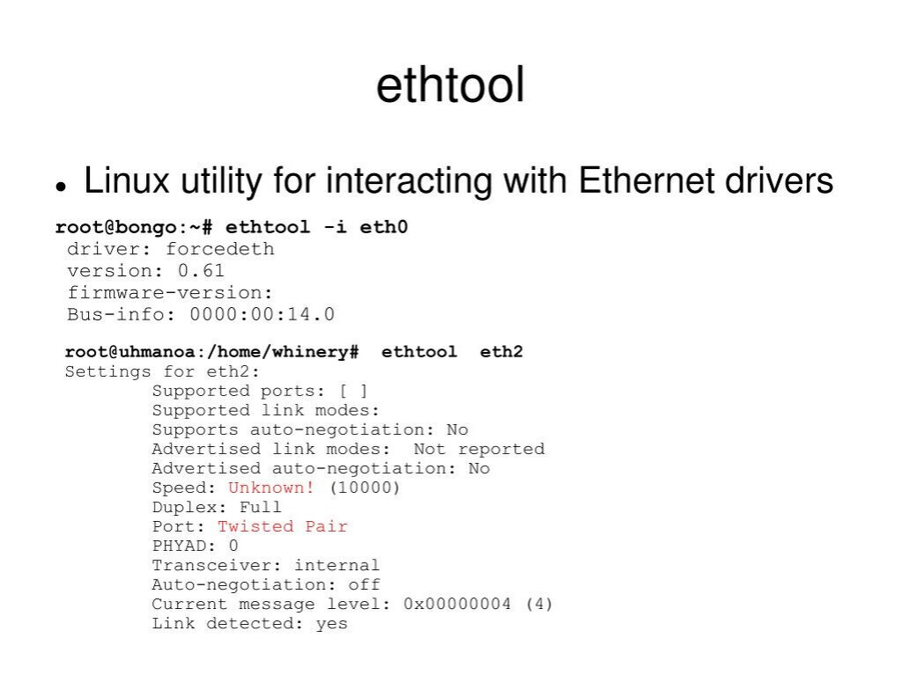

[Команда ethtool в Linux](1.jpeg) позволяет изменять параметры сетевого интерфейса, такие как скорость передачи данных, режим дуплекса и автоопределение.

Пример команды:

**sudo ethtool -s eth0 speed 1000 duplex full autoneg on**

Эта команда устанавливает скорость 1 Гбит/с, полный дуплекс и активирует автоопределение.

