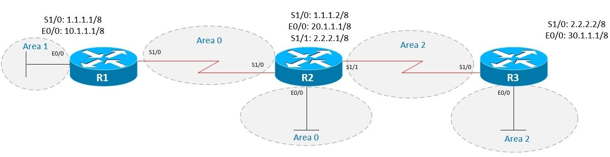

Топология сети:

В данной работе займемся настройкой нескольких областей в OSPF (мультизоновый OSPF). Router-ID настроим в соответствии с номерами маршрутизаторов.

Изначально интерфейсы маршрутизаторов настроены в соответствии с топологией, объявим сети роутеров в нужные области. Делается это аналогично тому, как добавляются сети в area 0, только area_id указывается иной:

**R1:**

R1# conf t

Enter configuration commands, one per line. End with CNTL/Z.

R1(config)#router ospf 1

R1(config-router)#router-id 1.1.1.1

R1(config-router)#network 1.0.0.0 0.255.255.255 area 0

R1(config-router)#network 10.0.0.0 0.255.255.255 area 1

R1(config-router)#end

**R2:**

R2#conf t

Enter configuration commands, one per line. End with CNTL/Z.

R2(config)#router ospf 1

R2(config-router)#router-id 2.2.2.2

R2(config-router)#network 1.0.0.0 0.255.255.255 area 0

R2(config-router)#network 1.0.0.0 0.255.255.255 area 0

R2(config-router)#network 20.0.0.0 0.255.255.255 area 0

R2(config-router)#network 2.0.0.0 0.255.255.255 area 2

R2(config-router)#end

**R3:**

R3#conf t

Enter configuration commands, one per line. End with CNTL/Z.

R3(config)#router ospf 1

R3(config-router)#router-id 3.3.3.3

R3(config-router)#network 2.0.0.0 0.255.255.255 area 2

R3(config-router)#network 2.0.0.0 0.255.255.255 area 2

R3(config-router)#network 30.0.0.0 0.255.255.255 area 2

R3(config-router)#end

**Проверим корректность настроек, просмотрев в таблице маршрутизации сети, полученные по протоколу OSPF:**

**R1**

R1#sh ip route ospf | begin Gateway

Gateway of last resort is not set

  

O IA 2.0.0.0/8 [110/128] via 1.1.1.2, 00:03:09, Serial1/0

O 20.0.0.0/8 [110/74] via 1.1.1.2, 00:03:19, Serial1/0

O IA 30.0.0.0/8 [110/138] via 1.1.1.2, 00:02:11, Serial1/0

Итак, в таблице есть всего 3 сети, две из которых помечены буквами IA, что означает Inter-Area, то есть, сеть, полученная из внешней OSPF-области. Если взглянуть на схему, видно, что интерфейс E0/0 с адресом 10.1.1.1/8 мы объявляли в area 1, но ее в таблице маршрутизации OSPF не видно. Дело в том, что данная сеть является непосредственно подключенной к роутеру, что дает ей право быть в таблице маршрутизации помеченной как Connected (административная дистанция connected-сетей равна 0, в то время как у OSPF: 110):

 R1#sh ip route connected | begin Gateway

 Gateway of last resort is not set
  
 1.0.0.0/8 is variably subnetted, 2 subnets, 2 masks
 C 1.0.0.0/8 is directly connected, Serial1/0
 L 1.1.1.1/32 is directly connected, Serial1/0
 10.0.0.0/8 is variably subnetted, 2 subnets, 2 masks
C 10.0.0.0/8 is directly connected, Ethernet0/0
 L 10.1.1.1/32 is directly connected, Ethernet0/0

**Посмотрим сети на R2 и R3:**

**R2:**

R2#sh ip route ospf | begin Gateway

Gateway of last resort is not set

  

O IA 10.0.0.0/8 [110/74] via 1.1.1.1, 00:05:05, Serial1/0

O 30.0.0.0/8 [110/74] via 2.2.2.2, 00:03:57, Serial1/1

**R3:**

R3#sh ip route ospf | begin Gateway

Gateway of last resort is not set

  

O IA 1.0.0.0/8 [110/128] via 2.2.2.1, 00:04:30, Serial1/0

O IA 10.0.0.0/8 [110/138] via 2.2.2.1, 00:04:30, Serial1/0

O IA 20.0.0.0/8 [110/74] via 2.2.2.1, 00:04:30, Serial1/0

Здесь все аналогично.

### Верификация пограничных маршрутизаторов

В OSPF присутствует такой термин, как ABR (Area Border Router — пограничный маршрутизатор области) — роутер, соединяющий одну или несколько OSPF-областей с магистральной зоной. У ABR всегда хотя бы один интерфейс принадлежит нулевой области.

Для того, чтобы получить список ABR, необходимо выполнить команду

Router#show ip ospf border-routers

Проверим список ABR на R1:

R1#sh ip ospf border-routers

 OSPF Router with ID (1.1.1.1) (Process ID 1)

Base Topology (MTID 0)

 Internal Router Routing Table

Codes: i - Intra-area route, I - Inter-area route

 i 2.2.2.2 [64] via 1.1.1.2, Serial1/0, ABR, Area 0, SPF 6

Выше видно, что OSPF-сосед с Router-ID 2.2.2.2 является ABR, и доступен он через интерфейс S1/0

Выполним аналогичные действия на R2 и R3

**R2:**

R2#sh ip ospf border-routers
 

 OSPF Router with ID (2.2.2.2) (Process ID 1)

 Base Topology (MTID 0)

 Internal Router Routing Table

Codes: i - Intra-area route, I - Inter-area route

 i 1.1.1.1 [64] via 1.1.1.1, Serial1/0, ABR, Area 0, SPF 4

**R3:**

 R3#sh ip ospf border-routers

 OSPF Router with ID (3.3.3.3) (Process ID 1)

 Base Topology (MTID 0)

 Internal Router Routing Table

 Codes: i - Intra-area route, I - Inter-area route

 i 2.2.2.2 [64] via 2.2.2.1, Serial1/0, ABR, Area 2, SPF 2

Для R2 все аналогично с R1 — поскольку R1 принадлежит как первой, так и нулевой области, он является ABR.

В случае с R3 тоже все просто: роутер 2.2.2.2, находящийся в Area 2, является ABR, поскольку стыкуется с нулевой областью, а сам маршрутизатор R2 доступен через интерфейс S1/0.
