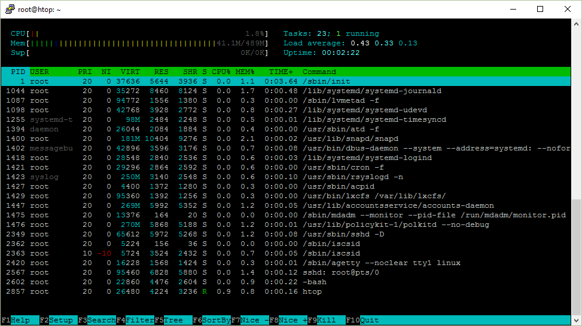

На протяжении долгого времени я не до конца понимал htop. Я думал, что средняя загрузка [load average] в 1.0 означает, что процессор загружен на 50%, но это не совсем так. Да и потом, почему именно 1.0?

Затем я решил во всём разобраться и написать об этом. Говорят, что лучший способ научиться новому — попытаться это объяснить.

htop на Ubuntu Server

Ниже скриншот htop, который я буду рассматривать в статье.


**Uptime**

Uptime показывает время непрерывной работы системы. Это можно узнать и командой uptime.

```bash
 $ uptime
 12:17:58 up 111 days, 31 min,  1 user,  load average: 0.00, 0.01, 0.05
 ```

Где же программа uptime это берёт? Она считывает информацию из файла /proc/uptime.
