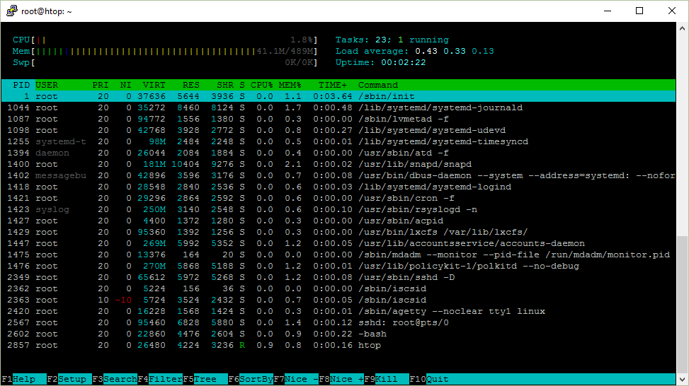
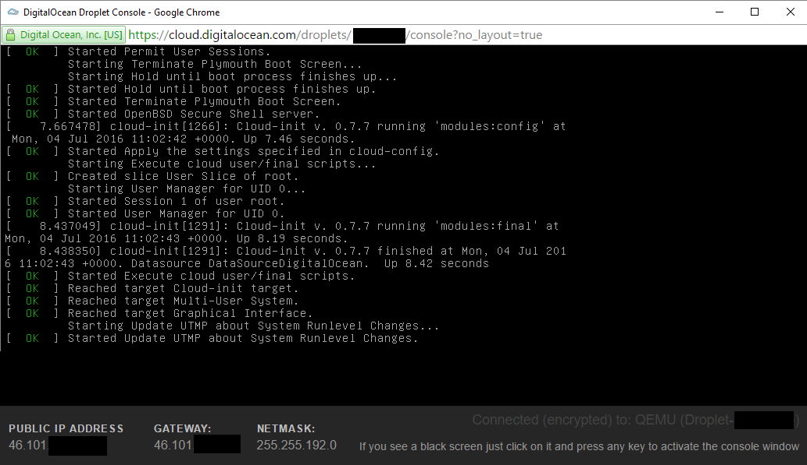
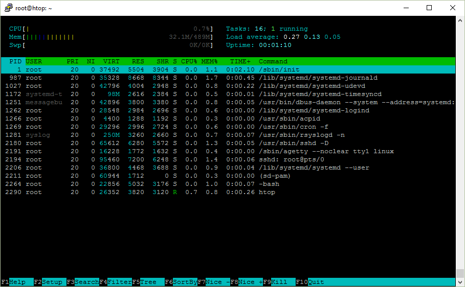
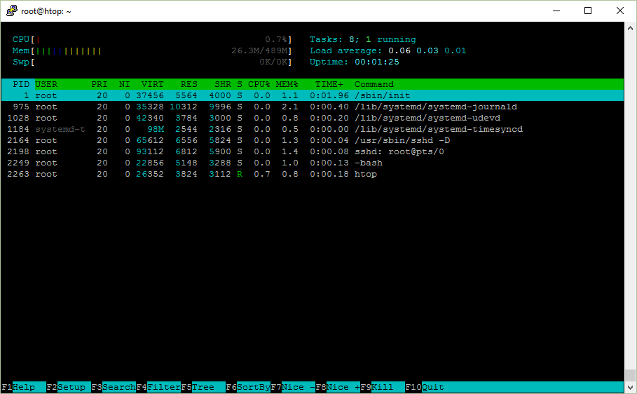
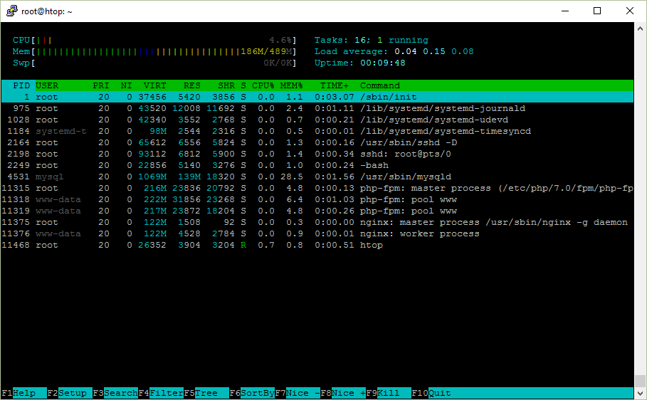

На протяжении долгого времени я не до конца понимал htop. Я думал, что средняя загрузка [load average] в 1.0 означает, что процессор загружен на 50%, но это не совсем так. Да и потом, почему именно 1.0?

Затем я решил во всём разобраться и написать об этом. Говорят, что лучший способ научиться новому — попытаться это объяснить.

## htop на Ubuntu Server

Ниже скриншот htop, который я буду рассматривать в статье.


## Uptime

Uptime показывает время непрерывной работы системы. Это можно узнать и командой uptime.

```bash
 $ uptime
 12:17:58 up 111 days, 31 min,  1 user,  load average: 0.00, 0.01, 0.05
 ```

Где же программа uptime это берёт? Она считывает информацию из файла /proc/uptime.
```bash
9592411.58 9566042.33
```
Первое число — количество секунд работы системы. Второе же показывает сколько секунд система находилась в бездействии. Стоит отметить, что на системах с несколькими процессорами, второй показатель может оказаться больше, чем первый, так как это сумма по процессорам.

Как я об этом узнал? Я посмотрел какие файлы открывает **uptime** при запуске. Для этого, можно воспользоваться утилитой **strace**.

```bash
strace uptime
```

Будет много вывода, лучше сделать **grep** для поиска системного вызова open. Но это не совсем сработает, т.к. по умолчанию он выводит в стандартный поток ошибок (stderr). Можно перенаправить stderr в стандартный поток с помощью **2>&1**.

Результат таков:
```bash
$ strace uptime 2>&1 | grep open
...
open("/proc/uptime", O_RDONLY)          = 3
open("/var/run/utmp", O_RDONLY|O_CLOEXEC) = 4
open("/proc/loadavg", O_RDONLY)         = 4
```
Тут содержится упомянутый файл **/proc/uptime**. Оказалось, что достаточно запустить **strace -e open uptime** и не мучиться с grepом.

Если можно взять это прямо из файла, то зачем нужна утилита uptime? Дело в том, что uptime форматирует вывод в читаемом виде, тогда как секунды в файле удобно использовать при написании собственных скриптов и программ. 


## Load average

Помимо времени непрерывной работы, uptime показывает и среднюю загрузку системы, они отображены как 3 числа. 
```bash
$ uptime

` `12:59:09 up 32 min,  1 user,  load average: 0.00, 0.01, 0.03
```

А взяты они из файла **/proc/loadavg**. Если еще раз посмотреть на вывод **strace**, то можно заметить, что этот файл тоже был открыт.
```bash
$ cat /proc/loadavg

0\.00 0.01 0.03 1/120 1500
```
Первые 3 числа измеряют среднюю загрузку системы за последние 1, 5 и 15 минут. 4-ый параметр это количество активных процессов и их общее число. Последнее число это ID последнего использованного процесса. 

Начнём с конца. 

Когда запускается процесс, ему присваивается ID. Как правило, они идут в возрастающем порядке, за исключением случаев, когда число исчерпалось и системе приходится начинать отсчёт заново. ID 1 присваивается процессу **/sbin/init**, который запускается при старте.

Взглянем ещё раз на **/proc/loadavg** и попробуем запустить команду **sleep** в фоновом режиме. При запуске в фоновом режиме, можно увидеть ID процесса.
```bash
$ cat /proc/loadavg

0\.00 0.01 0.03 1/123 1566

$ sleep 10 &

[1] 1567
```

Таким образом, **1/123** означает, что 1 процесс выполняется или готов к выполнению, а всего их 123. 

Когда при запуске **htop**, вы видите, что выполняется только один процесс, это сам процесс htop. 

Если запустить **sleep 30** и открыть **htop**, то число выполняющихся процессов всё равно будет 1. Это потому, что процесс **sleep** не выполняется, а «спит», т.е. находится в состоянии покоя, иными словами ждёт определённого события. Выполняющийся или активный процесс, это процесс который на данный момент обрабатывается в процессоре (CPU), либо ждёт своей очереди в процессоре.

Попробуйте запустить **cat /dev/urandom > /dev/null**, где генерируемые случайные байты записываются в особый файл, считывание из которого невозможно. Тогда вы увидите, что выполняющихся процессов теперь уже 2.
```
$ cat /dev/urandom > /dev/null &

[1] 1639

$ cat /proc/loadavg

1\.00 0.69 0.35 2/124 1679
```

Так, активных процессов ровно 2 (генератор случайных чисел и утилита **cat**, которая читает файл **/proc/loadavg**), еще можно заметить что средняя загрузка возросла. 

**load average** это средняя загрузка системы на протяжении определённого периода времени.

Число загрузки считается как сумма количества процессов, которые запущены (выполняются или находятся в ожидании запуска) и непрерываемых процессов (о видах процессов будет рассказано ниже). Т.е. это просто число процессов. 

А средняя загрузка получается просто усреднённое значение за 1, 5 и 15 минут, так? 

Оказывается, не всё так просто.

Говоря математическим языком, все три значения усредняют среднюю загрузку за всё время работы системы. Они устаревают экспоненциально, но с разной скоростью. Таким образом, средняя загрузка за 1 минуту это сумма 63% загрузки за последнюю минуту + 37% загрузки с момента запуска без учёта последней минуты. То же соотношение верно и для 5, 15 минут. Поэтому не совсем верно, что средняя загрузка за последнюю минуту включает активность только за последнюю минуту, но бОльшей частью за последнюю минуту. 

Вы это знали?

Вернёмся к генератору случайных чисел.
```bash
$ cat /proc/loadavg

1\.00 0.69 0.35 2/124 1679
```

Хотя это не совсем правильно, но вот как я упростил для понимания показатель средней загрузки.

В данном случае генератор использует процессор, средняя загрузка за последнюю минуту **1.00**, другими словами в среднем 1 выполняющийся процесс. 

В моей системе это означает что процессор загружен на 100%, т.к. процессор один, а выполнять он может только один процесс за раз.

Если бы процессоров было 2, то загрузка соответственно была бы 50%, т.к. можно было бы одновременно выполнять 2 процесса. Максимальная средняя загрузка (100% использования CPU) системы с двумя процессорами составляет **2.00**.

Количество процессоров в системе можно узнать в левом верхнем углу **htop** или при помощи **nproc**.
## Процессы

В правом верхнем углу, **htop** показывает общее количество процессов и сколько из них активны. Но почему там написано задания [Tasks], а не процессы?

Задание это синоним процесса. В ядре Linux процессы это и есть задания. **htop** использует термин задания, возможно, потому, что это название короче и экономит немного места.  
В **htop** можно увидеть и потоки [threads]. Для переключения этой опции нужно использовать комбинацию *Shift+H*. Если отображается что то вроде **Tasks: 23, 10 thr**, то это значит они видимы. 

Отображение потоков выполнения ядра [kernel threads] можно включить комбинацией *Shift+K*, и тогда задания будут выглядеть как **Tasks: 23, 40 kthr**.
## ID процесса / PID

При каждом запуске процесса, ему присваивается идентификатор (ID), сокращенно PID.

Если запускать программу в фоновом режиме (**&**) из **bash**, то номер задачи[job] выводится в квадратных скобках, а рядом с ним PID процесса.
```bash
$ sleep 1000 &

[1] 12503
```

Ещё один способ, это использовать переменную **$!** в **bash**, которая хранит PID последнего процесса, запущенного в фоне. 
```bash
$ echo $!

12503
```

ID процесса очень полезна. С помощью него можно узнать подробности процесса и управлять им. 

Существует псевдо файловая система **procfs**, с помощью которой программы могут получить информацию от ядра системы путём чтения файлов. Чаще всего она монтируется в **/proc/** и для пользователя выглядит как обычный каталог, который можно смотреть командами, такими как **ls** и **cd**.

Вся информация о процессе находится в **/proc/<рid>/**.
```bash
$ ls /proc/12503

attr        coredump\_filter  fdinfo     maps        ns             personality  smaps    task

auxv        cpuset           gid\_map    mem         numa\_maps      projid\_map   stack    uid\_map

cgroup      cwd              io         mountinfo   oom\_adj        root         stat     wchan

clear\_refs  environ          limits     mounts      oom\_score      schedstat    statm

cmdline     exe              loginuid   mountstats  oom\_score\_adj  sessionid    status

comm        fd               map\_files  net         pagemap        setgroups    syscall
```

Например в **/proc/<рid>/cmdline** содержится команда при помощи которой процесс запустился.
```bash
$ cat /proc/12503/cmdline

sleep1000$
```

Эмм..., не совсем так. Разделителем тут служит байт **\0**, 
```bash
$ od -c /proc/12503/cmdline

0000000   s   l   e   e   p  \0   1   0   0   0  \0

0000013
```

который можно заменить пробелом, либо переводом строки
```bash
$ tr '\0' '\n' < /proc/12503/cmdline

sleep

1000

$ strings /proc/12503/cmdline

sleep

1000
```

В каталоге процесса могут быть и ссылки! Для примера, **cwd** ссылается на текущий рабочий каталог, а **exe** на запущенный исполняемый файл.
```bash
$ ls -l /proc/12503/{cwd,exe}

lrwxrwxrwx 1 ubuntu ubuntu 0 Jul  6 10:10 /proc/12503/cwd -> /home/ubuntu

lrwxrwxrwx 1 ubuntu ubuntu 0 Jul  6 10:10 /proc/12503/exe -> /bin/sleep
```

Таким образом утилиты **htop**, **top**, **ps** и другие показывают информацию о процессе, они просто читают **/proc/<рid>/<файл>**.
## Дерево процессов

Когда запускается новый процесс, процесс который его запускает принято называть родительским или просто родителем. Таким образом новый процесс это дочерний процесс родительского. Эти отношения образуют структуру в виде дерева. 

Если нажать *F5* в **htop**, то можно увидеть иерархию процессов. 

Тот же эффект и от флага **f** команды **ps**.
```bash
$ ps f

`  `PID TTY      STAT   TIME COMMAND

12472 pts/0    Ss     0:00 -bash

12684 pts/0    R+     0:00  \\_ ps f
```

Либо **pstree**.
```bash
$ pstree -a

init

`  `├─atd

`  `├─cron

`  `├─sshd -D

`  `│   └─sshd

`  `│       └─sshd

`  `│           └─bash

`  `│               └─pstree -a

…
```

Если вы когда нибудь задумывались, почему **bash** или **sshd** являются родительскими для некоторых процессов, то вот почему.

Ниже я написал, что происходит, если вы, к примеру, вызовите **date** из консоли **bash**.

- **bash** создаст новую копию своего процесса (используя системный вызов **fork**)
- Затем он переместит исполняемый файл **/bin/date** в память (при помощи системного вызова **exec**).
- **bash**, как родительский процесс будет ожидать окончания работы дочернего. 


Таким образом, **/sbin/init**, у которого ID 1, начал выполняться при старте системы и породил демона SSH **sshd**. После подключения к системе, **sshd** породит процесс для текущей сессии, который в свою очередь запустит консоль **bash**. \

Я предпочитаю использовать древовидную структуру в **htop** когда хочется увидеть все потоки.
## Владелец процесса

У каждого процесса есть владелец — пользователь. У пользователей, в свою очередь, существуют численные ID.
```bash
$ sleep 1000 &

[1] 2045

$  grep Uid /proc/2045/status

Uid:    1000    1000    1000    1000
```

Можно воспользоваться командой **id**, чтобы узнать имя этого пользователя.
```bash
$ id 1000

uid=1000(ubuntu) gid=1000(ubuntu) groups=1000(ubuntu),4(adm)
```

Как выяснилось, **id** берёт эту информацию из файлов **/etc/passwd** и **/etc/group**.
```bash
$ strace -e open id 1000

open("/etc/passwd", O\_RDONLY|O\_CLOEXEC) = 3

open("/etc/group", O\_RDONLY|O\_CLOEXEC)  = 3
```

Это обычные текстовые файлы, в которых ID привязаны к именам пользователей. 
```bash
$ cat /etc/passwd

root:x:0:0:root:/root:/bin/bash

daemon:x:1:1:daemon:/usr/sbin:/usr/sbin/nologin

ubuntu:x:1000:1000:Ubuntu:/home/ubuntu:/bin/bash

$ cat /etc/group

root:x:0:

adm:x:4:syslog,ubuntu

ubuntu:x:1000:
```

**passwd**? Но где пароли? А они на самом деле в **/etc/shadow**.
```bash
$ sudo cat /etc/shadow

root:$6$mS9o0QBw$P1ojPSTexV2PQ.Z./rqzYex.k7TJE2nVeIVL0dql/:17126:0:99999:7:::

daemon:\*:17109:0:99999:7:::

ubuntu:$6$GIfdqlb/$ms9ZoxfrUq455K6UbmHyOfz7DVf7TWaveyHcp.:17126:0:99999:7:::
```

Если вы запустите программу, то она запустится от вашего имени, даже если вы не являетесь её владельцем. Если же вам нужно запустить её как **root**, то нужно использовать **sudo**.
```bash
$ id

uid=1000(ubuntu) gid=1000(ubuntu) groups=1000(ubuntu),4(adm)

$ sudo id

uid=0(root) gid=0(root) groups=0(root)

$ sudo -u ubuntu id

uid=1000(ubuntu) gid=1000(ubuntu) groups=1000(ubuntu),4(adm)

$ sudo -u daemon id

uid=1(daemon) gid=1(daemon) groups=1(daemon)
```

Но что, если нужно запустить несколько программ от имени других пользователей? Можно запустить консоль от их имени, если воспользоваться командами **sudo bash** или **sudo -u user bash**.

Если не хочется каждый раз вводить пароль администратора при запуске программ, то можно отключить эту функцию, добавив своё имя пользователя в файл **/etc/sudoers**. 

Давайте попробуем. 
```bash
$ echo "$USER ALL=(ALL) NOPASSWD: ALL" >> /etc/sudoers

-bash: /etc/sudoers: Permission denied
```

Да, точно, это можно сделать только с привилегиями **root**.
```bash
$ sudo echo "$USER ALL=(ALL) NOPASSWD: ALL" >> /etc/sudoers

-bash: /etc/sudoers: Permission denied
```

Что за…? 

Тут мы пытаемся вызвать **echo** от имени администратора, но при этом пишем в файл **/etc/sudoers** всё так же от нашего имени. 

Как правило, есть 2 выхода из данной ситуации:

- echo "$USER ALL=(ALL) NOPASSWD: ALL" | sudo tee -a /etc/sudoers
- sudo bash -c «echo '$USER ALL=(ALL) NOPASSWD: ALL' >> /etc/sudoers»


В первом случае, **tee -a** запишет из стандартного потока ввода в файл от имени администратора.

Во втором случае, мы запускаем консоль от имени администратора и просим выполнить команды (**-c**) и все команды выполнятся от имени root. Обратите внимание на расстановку кавычек **"**/’, при помощи которых переменная $USER разыменуется правильно.

Допустим, вы захотели поменять свой пароль. Команда **passwd** вам в помощь. Она сохранит пароль в файле **/etc/shadow**, который мы видели выше. 

Этот файл доступен для записи только для root:
```bash
$ ls -l /etc/shadow

-rw-r----- 1 root shadow 1122 Nov 27 18:52 /etc/shadow
```

Как же это возможно, что программа запускаемая от имени пользователя может записывать в защищённый файл? 

Я уже говорил, что при вызове, программа запускается от имени пользователя, запускающего её, даже если она принадлежит другому пользователю. 

Оказывается, это поведение можно изменить правками разрешения файла. Давайте посмотрим.
```bash
$ ls -l /usr/bin/passwd

-rwsr-xr-x 1 root root 54256 Mar 29  2016 /usr/bin/passwd
```
Обратите внимание на символ **s**. Она была добавлена при помощи **sudo chmod u+s /usr/bin/passwd**. И означает, что исполняемый файл будет всегда запускаться от имени владельца, в данном случае это root.

Так называемые исполняемые файлы **setuid** можно искать при помощи **find /bin -user root -perm -u+s**.

Так же это можно осуществить и для групп (**g+s**).
## Состояния процесса

Дальше, мы будем разбираться со столбцом состояния процессов в **htop**, в котором, на примере, находятся символы **S**.

Возможные значения состояния:

- R — [running or runnable] запущенные или находятся в очереди на запуск
- S — [interruptible sleep] прерываемый сон
- D — [uninterruptible sleep] непрерываемый сон (в основном IO)
- Z — [zombie] процесс зомби, прекращенный, но не забранный родителем
- T — Остановленный сигналом управления заданиями
- t — Остановленный отладчиком
- X — Мёртвый (не должен показываться)


Они отсортированы по тому, как часто я их обычно вижу. 

Заметьте, что при запуске **ps**, он может ещё показывать подсостояния как **Ss**, **R+**, **Ss+** и т.д.
```bash
$ ps x

`  `PID TTY      STAT   TIME COMMAND

` `1688 ?        Ss     0:00 /lib/systemd/systemd --user

` `1689 ?        S      0:00 (sd-pam)

` `1724 ?        S      0:01 sshd: vagrant@pts/0

` `1725 pts/0    Ss     0:00 -bash

` `2628 pts/0    R+     0:00 ps x
```
### R — Запущенные или в очереди

Процессы в этом состоянии либо запущены, либо находятся в очереди для запуска.\

Что это значит?

Когда вы компилируете код, то на выходе получаете исполняемый файл в виде инструкций для процессора. При запуске, этот файл помещается в память, где процессор выполняет эти инструкции, проще говоря занимается вычислениями. 
### S — Прерываемый сон

При этом состоянии инструкции программы не исполняются в процессоре, проще говоря спят. Процесс ждёт события или какого нибудь условия для продолжения. После того, как событие произошло, состояние меняется на запущенное. 

Для примера можно взять утилиту **sleep** из coreutils. Он будет находится в состоянии сна определенное количество секунд.
```bash
$ sleep 1000 &

[1] 10089

$ ps f

`  `PID TTY      STAT   TIME COMMAND

` `3514 pts/1    Ss     0:00 -bash

10089 pts/1    S      0:00  \\_ sleep 1000

10094 pts/1    R+     0:00  \\_ ps f
```

Так это *прерываемый* сон, как же его можно прервать? С помощью сигнала. 

Послать сигнал с помощью **htop** можно нажав клавишу *F9* и выбрав нужный вид сигнала в меню.

Передача сигнала, так же известна как команда **kill**, потому что это на самом деле системный вызов, который может послать сигнал процессу. Существует одноимённая программа **/bin/kill**, которая может исполнить системномный вызов из пользовательского окружения и по умолчанию посылает сигнал **TERM**, который уничтожает процесс, убивает его.

Сигнал это всего лишь число. Числа сложно запомнить, поэтому их назвали именами. Их имена обычно пишут заглавными буквами и могут быть с префиксом **SIG**.

Часто используемые сигналы, это: **INT**, **KILL**, **STOP**, **CONT**, **HUP**.

Попробуем прервать спящий процесс, послав ему сигнал **INT**, он же **SIGINT**, просто **2**, или **сигнал прерывания с терминала**.
```bash
$ kill -INT 10089

[1]+  Interrupt               sleep 1000
```

Этот же сигнал посылается, если нажать комбинацию *CTRL+C*. **bash** пошлёт сигнал **SIGINT** процессу на переднем плане, точно так же, как мы это сделали вручную.\

Кстати, в **bash** команда **kill** встроена, хотя во многих системах есть программа **/bin/kill**. Почему? Чтобы можно было «убить» процесс даже если превышен лимит на количество создаваемых процессов. \

Следующие команды идентичны:

- kill -INT 10089
- kill -2 10089
- /bin/kill -2 10089

Другой полезный сигнал это **SIGKILL** или **9**. Вы, возможно, использовали его, когда не могли завершить процесс безудержным кликаньем *CTRL+C*.

При написании программы, можно эти сигналы ловить и создавать функции, которые будут запускаться когда соответствующий сигнал получен. Например, можно очищать память или же аккуратно завершить работу. Поэтому отправка сигнала, такого как сигнал прерывания с терминала, не означает что процесс будет прекращён. 

Возможно, вы встречали такое исключение при запуске скриптов на Python:
```python
$ python -c 'import sys; sys.stdin.read()'

^C

Traceback (most recent call last):

`  `File "<string>", line 1, in <module>

KeyboardInterrupt
```

Но существует сигнал способный остановить процесс, не дав ему возможности на него ответить. Это сигнал **KILL**.
```bash
$ sleep 1000 &

[1] 2658

$ kill -9 2658

[1]+  Killed                  sleep 1000
```
### D — непрерываемый сон

В отличии от прерываемого сна, процессы в таком состоянии невозможно остановить с помощью сигналов. Поэтому многие не любят это состояние.

При этом состоянии процесс ожидает и не может быть прерван, например, если событие продолжения вот вот наступит, такое как чтение/запись на диск. Как правило, это происходит за доли секунды. 

[На StackOverflow](http://stackoverflow.com/questions/223644/what-is-an-uninterruptable-process) есть хороший ответ:

Непрерываемые процессы обычно находятся в ожидании IO после page fault. Процесс не может быть прерван в это время сигналом, потому что не сможет их обработать. Если бы он мог, то снова возник бы page fault и всё бы осталось как есть.


Другими словами, это может случиться, если, например, использовать протокол сетевого доступа NFS и требуется время для чтения/записи с/на него.

По своему опыту могу сказать, что такое случается когда процесс часто подкачивается, т.е. для него недостаточно свободной памяти.

Попробуем вызвать это состояние. 

**8.8.8.8** это публичный DNS от Google. Там нет NFS, но это нас не остановит.
```bash
$ sudo mount 8.8.8.8:/tmp /tmp &

[1] 12646

$ sudo ps x | grep mount.nfs

12648 pts/1    D      0:00 /sbin/mount.nfs 8.8.8.8:/tmp /tmp -o rw
```

Как же узнать, что заставляет процесс оказаться в таком состоянии? **strace**!

Вызовим **strace** для команды **ps** выше.
```bash
$ sudo strace /sbin/mount.nfs 8.8.8.8:/tmp /tmp -o rw

...

mount("8.8.8.8:/tmp", "/tmp", "nfs", 0, ...
```

И тут мы увидим, что системный вызов **mount** блокирует процесс.

А **mount**, кстати можно вызвать с опцией **intr**, чтобы его можно было прерывать: **sudo mount 8.8.8.8:/tmp /tmp -o intr**.
### Z — Зомби процесс

Когда процесс заканчивает свою работу с помощью **exit** и у неё остаются дочерние процессы, дочерние процессы становятся в состоянии зомби.

- Абсолютно нормально, если зомби процесс существует недолго
- Зомби процессы которые существуют долгое время, могут говорить о баге в программе
- Зомби процессы не используют память, только лишь ID процесса
- Зомби процесс нельзя «убить»
- Можно вежливо попросить родительский процесс избавиться от зомби (послав **SIGCHLD**)
- Можно завершить родительский процесс, чтобы избавиться от обоих


Я продемонстрирую это, написав небольшой код на С.
```C
#include <stdio.h>
#include <stdlib.h>
#include <unistd.h>

int main() {
  printf("Running\n");

  int pid = fork();

  if (pid == 0) {
    printf("Я родительский процесс\n");
    printf("Родительский процесс завершает работу\n");
    exit(0);
  } else {
    printf("Я дочерний процесс\n");
    printf("Дочерний процесс спит\n");
    sleep(20);
    printf("Дочерний процесс завершён\n");
  }

  return 0;
}
```

Устанавливаем компилятор С, GNU C Compiler (GCC).
```bash
sudo apt install -y gcc
```

Скомпилируем и запустим программу
```bash
gcc zombie.c -o zombie

./zombie
```

Посмотрим на иерархию процессов
```bash
$ ps f
  PID TTY      STAT   TIME COMMAND
 3514 pts/1    Ss     0:00 -bash
 7911 pts/1    S+     0:00  \_ ./zombie
 7912 pts/1    Z+     0:00      \_ [zombie] <defunct>
 1317 pts/0    Ss     0:00 -bash
 7913 pts/0    R+     0:00  \_ ps f
```

У нас есть зомби! Когда родительский процесс завершается, зомби исчезает.
```bash
$ ps f
  PID TTY      STAT   TIME COMMAND
 3514 pts/1    Ss+    0:00 -bash
 1317 pts/0    Ss     0:00 -bash
 7914 pts/0    R+     0:00  \_ ps f
```

Если заменить **sleep(20)** инструкцией **while (true)**, зомби исчезнет сразу.

При вызове **exit**, освобождается вся занимаемая память и ресурсы, чтобы они были доступны другим. Почему же нужны тогда процессы зомби?

У родительских процессов есть возможность узнать код завершения работы дочерних процессов (в обработчике сигналов) с помощью системного вызова **wait**. Если дочерний процесс спит, то родительский сперва подождёт.

Почему же тогда принудительно не разбудить процесс и завершить его? По той же причине, по которой вы не избавитесь от своего ребёнка, если он вас не слушается. Всё может закончится плохо.
### T — Остановлен сигналом управления заданиями

Я открыл два терминала и могу посмотреть на свои процессы командой **ps u**.
```bash
$ ps u

USER       PID %CPU %MEM    VSZ   RSS TTY      STAT START   TIME COMMAND

ubuntu    1317  0.0  0.9  21420  4992 pts/0    Ss+  Jun07   0:00 -bash

ubuntu    3514  1.5  1.0  21420  5196 pts/1    Ss   07:28   0:00 -bash

ubuntu    3528  0.0  0.6  36084  3316 pts/1    R+   07:28   0:00 ps u
```

Ниже я опущу упоминание процессов **-bash** и **ps**.

Теперь в одном из терминалов запустим **cat /dev/urandom > /dev/nul**. Его состояние будет **R+**, из чего следует что он активен.
```bash
$ ps u

USER       PID %CPU %MEM    VSZ   RSS TTY      STAT START   TIME COMMAND

ubuntu    3540  103  0.1   6168   688 pts/1    R+   07:29   0:04 cat /dev/urandom
```

Нажмём *CTRL+Z*, чтобы остановить процесс.
```bash
$ # CTRL+Z

[1]+  Stopped                 cat /dev/urandom > /dev/null

$ ps aux

USER       PID %CPU %MEM    VSZ   RSS TTY      STAT START   TIME COMMAND

ubuntu    3540 86.8  0.1   6168   688 pts/1    T    07:29   0:15 cat /dev/urandom
```

Сейчас, он в состоянии **T**. Если нужно продолжить процесс, то можно вызвать **fg** в первом терминале.

Есть и другой способ останова процессов, для этого нужно послать им сигнал **STOP** с помощью **kill**, а для продолжения, соответственно, сигнал **CONT**.
### t — Остановлен отладчиком

Для начала установим отладчик GNU Debugger (gdb)
```bash
sudo apt install -y gdb
```

Запустим программу для прослушивания порта 1234.
```bash
$ nc -l 1234 &

[1] 3905
```

Он находится в состоянии сна, потому как ждёт входящих сообщений.
```bash
$ ps u

USER       PID %CPU %MEM    VSZ   RSS TTY      STAT START   TIME COMMAND

ubuntu    3905  0.0  0.1   9184   896 pts/0    S    07:41   0:00 nc -l 1234
```

Запустим отладчик и привяжем его к процессу с PID 3905.
```bash
sudo gdb -p 3905
```

Теперь процесс будет прослеживаться [trace] в отладчике и его состояние изменится на **t**.
```bash
$ ps u

USER       PID %CPU %MEM    VSZ   RSS TTY      STAT START   TIME COMMAND

ubuntu    3905  0.0  0.1   9184   896 pts/0    t    07:41   0:00 nc -l 1234
```
## Время обработки процесса

Linux — многозадачная операционная система, это означает что даже если процессор один, то можно одновременно запускать на нём  несколько заданий. Например, можно подключиться к удалённому серверу через SSH и посмотреть на вывод **htop**, а при этом сам сервер будет показывать ваш блог читателям в интернете. 

Как же возможно, что единственный процессор может одновременно выполнять несколько заданий?

Разделением времени.

Каждый процесс выполняется определённый интервал времени, при котором другие приостановлены, затем выполняется следующий процесс и т.д. 

Как правило, интервал времени выполнения составляет миллисекунды, поэтому пользователь этого и не заметит, если, конечно же, система не нагружена. 
## Любезность и приоритет процессов

Когда количество заданий превышает количество процессоров, но выполнить их все необходимо, нужно каким то образом определить порядок их выполнения. За это отвечает планировщик заданий. 

Планировщик в ядре Linux решает какой процесс выбрать из очереди на запуск и это зависит от результата алгоритма, заложенного в ядре.

Пользователь, как правило, не может прямо влиять на планирование, но может подсказать какой из процессов ему особо важен и планировщик, возможно, прислушается к нему.

Любезность или приоритет nice (**NI**) это приоритет процесса в пространстве пользователя, варьирующаяся от -20, что есть самый высокий приоритет, до 19, соответственно наименьший приоритет. Это может запутать, но представьте это именно как любезность, т.е. чем процесс любезнее, тем он уступчивее другим процессам. 

Из того, что я прочёл на StackOverflow и других сайтах, следует что увеличение любезности процесса на 1 ведёт к уступке 10% времени работы процессора. 

Приоритет (**PRI**) же в свою очередь это параметр приоритета в пространстве ядра. Приоритет варьируется от 0 до 139. Приоритеты от 0 до 99 зарезервированы для процессов реального времени, а выше, т.е от 100 до 139, для пользовательских. 

Можно изменить любезность процесса, и тогда, возможно, ядро примет это к сведению, но сам приоритет менять нельзя.

Соотношение любезности и приоритета следующее: **PR = 20 + NI.**
Таким образом область определения **PR = 20 + (-20 to +19)** лежит в отрезке от 100 до 139.

Можно установить любезность процесса непосредственно перед запуском.
```bash
nice -n любезность program
```

А менять любезность во время выполнения можно с помощью **renice**.
```bash
renice -n niceness -p PID
```

<http://askubuntu.com/questions/656771/process-niceness-vs-priority>
## Память — VIRT/RES/SHR/MEM

У процессов создаётся иллюзия, что память кроме них никто не использует. Такая иллюзия — результат работы виртуальной памяти.

Процессы не имеют прямого доступа к физической памяти. Для них выделяется участок виртуальной памяти, адреса в которой, проецируются ядром уже на адреса в физической памяти, либо на диск. Поэтому, иногда кажется, что процессы используют больше памяти, чем установлено в системе.

Я хочу сказать, что из-за этого не совсем легко понять сколько же именно памяти использует процесс. А что насчёт общих [shared] библиотек и памяти, выгруженной на диск? Но, к счастью, ядро и, в частности, **htop** позволяют извлечь некоторую информацию чтобы понять аппетит процесса по отношению к памяти. 
### VIRT/VSZ — Виртуальный образ

Общее количество памяти, занимаемая процессом. Оно включает в себя весь код, данные, общие библиотеки, страницы которые были перемещены на диск, а также страницы, которые проецировались ядром, но не были использованы.

Таким образом **VIRT** это всё, что используется процессом.

Если приложение запрашивает 1 Гб памяти, но использует при этом только 1 Мб, то память **VIRT** будет отображаться всё равно как 1 Гб. Даже если оно вызовет mmap для файла весом в 1 Гб и никогда им не воспользуется, то **VIRT** всё равно останется 1 Гб.

В большинстве случаев этот показатель бесполезен. 
### RES/RSS — Резидентная память

Память **RSS** [resident set size] это область, которая не выгружена на диск и находится в оперативной памяти.

**RES**, возможно, лучше отображает реальное использование памяти процессора чем  **VIRT**, но нужно иметь ввиду:

- Туда не включена память, выгруженная на диск
- Некоторая память может быть совместно используемой несколькими процессами


Если процесс использует 1 Гб памяти и вызывает **fork()**, то в результате у обоих процессов значение **RES** будет 1 Гб, в то время как в оперативной памяти будет занято только 1 Гб, потому что в Linux есть механизм копирования при записи [copy-on-write]. 
### SHR — Разделяемая память

Объём памяти, который может быть совместно использован другими процессами.
```bash
#include <stdio.h>
#include <stdlib.h>
#include <unistd.h>

int main() {
  printf("Запуск\n");
  sleep(10);

  size_t memory = 10 * 1024 * 1024; // 10 MB
  char* buffer = malloc(memory);
  printf("Выделено 10M\n");
  sleep(10);

  for (size_t i = 0; i < memory/2; i++)
    buffer[i] = 42;
  printf("Использовано 5M\n");
  sleep(10);

  int pid = fork();
  printf("Новый поток\n");
  sleep(10);

  if (pid != 0) {
    for (size_t i = memory/2; i < memory/2 + memory/5; i++)
      buffer[i] = 42;
    printf("доп. 2M потомку\n");
  }
  sleep(10);

  return 0;
}
```

Затем
```bash
fallocate -l 10G

gcc -std=c99 mem.c -o mem

./mem
```
И
```bash
Процесс  Сообщение             VIRT  RES SHR

главный  Запуск                4200  680 604

главный  Выделено 10M         14444  680 604

главный  Использовано 5M      14444 6168 1116

главный  Новый поток          14444 6168 1116

потомок  Новый поток          14444 5216 0

главный  доп. 2M потомку            8252 1116

потомок  доп. 2M потомку            5216 0
```

*(прим. Этот раздел не дописан до конца, как только статья обновится, я опубликую обновления)*
### MEM% — Использование памяти
Процент использования физической памяти. Это **RES**, делённый на общий объём оперативной памяти.

Если, например, **RES** составляет 200М и в системе установлено 8 Гб памяти, то **MEM%** будет 200/8192*100 = **2.4%**

## Процессы

Я запустил виртуальную машину с Ubuntu Server в Digital Ocean. Какие же процессы запускаются при старте системы? Необходимы ли они?

Ниже приведён анализ процессов, которые запускаются на чистой версии машины с Ubuntu Server 16.04.1 LTS x64 в Digital Ocean.

### До


### /sbin/init

Эта программа координирует все остальные приложения при запуске и конфигурирует окружение пользователя. После запуска, она становится родителем или прародителем всех автоматически запускающихся процессов.

Это же systemd?
```bash
$ dpkg -S /sbin/init
systemd-sysv: /sbin/init
```

Да, он самый. Что произойдёт, если его остановить? Ничего.

### /lib/systemd/systemd-journald

**systemd-journald** это системная служба, которая собирает и сохраняет логи. Она создаёт структурированные, проиндексированный журналы на основе информации, полученной с разных источников и управляет ими.

Другими словами,

Одним из основных преимуществ **journald** является замена обычных текстовых файлов логов специально отформатированными структурированными сообщениями. Это позволяет администраторам эффективнее работать с журналами событий.

Если нужно найти событие, лучше использовать **journalctl**.

- **journalctl _COMM=sshd** поиск по sshd
- **journalctl _COMM=sshd -o json-pretty** поиск по sshd в JSON
- **journalctl --since «2015-01-10» --until «2015-01-11 03:00»**
- **journalctl --since 09:00 --until «1 hour ago»**
- **journalctl --since yesterday**
- **journalctl -b** история с момента запуска системы
- **journalctl -f** чтобы следить за логами
- **journalctl --disk-usage**
- **journalctl --vacuum-size=1G**

Впечатляюще. Этот процесс, кажется, нельзя остановить или убрать, можно лишь отключить ведение истории.

### /sbin/lvmetad -f

Демон lvmetad кэширует метаданные LVM, чтобы команды LVM получали доступ к метаданным без сканирования диска. Кэширование помогает избежать возможного вмешивания в работу других приложений и сэкономить время сканирования диска.

Но что такое LVM [Logical Volume Management] (Менеджер логических томов)? Можно считать, что LVM это динамические разделы, что подразумевает создание/изменение/удаление разделов, так называемых «логических томов» из командной строки на лету, без надобности перезагрузки системы.

 Звучит так, что нужен он только если пользоваться LVM.
```bash
$ lvscan
$ sudo apt remove lvm2 -y --purge
```
### /lib/systemd/udevd

systemd-udevd следит за событиями uevents ядра. Для каждого события, systemd-udevd запускает соответствующую инструкцию на основе правил в udev.

udev это диспетчер устройств ядра Linux. Как преемник devfsd и hotplug, udev в основном работает с устройствами в каталоге /dev.

Я не уверен о его необходимости в виртуальной среде. 

### /lib/systemd/timesyncd

systemd-timesyncd это системная служба которая синхронизирует локальное время с удалённым сервером NTP.

Он заменил **ntpd**.
```bash
$ timedatectl status
      Local time: Fri 2016-08-26 11:38:21 UTC
  Universal time: Fri 2016-08-26 11:38:21 UTC
        RTC time: Fri 2016-08-26 11:38:20
       Time zone: Etc/UTC (UTC, +0000)
 Network time on: yes
NTP synchronized: yes
 RTC in local TZ: no
```
 Посмотрим на открытые порты системы:
```bash
 $ sudo netstat -nlput
Active Internet connections (only servers)
Proto Recv-Q Send-Q Local Address           Foreign Address         State       PID/Program name
tcp        0      0 0.0.0.0:22              0.0.0.0:*               LISTEN      2178/sshd
tcp6       0      0 :::22                   :::*                    LISTEN      2178/sshd
```


Красота! В Ubuntu 14.04 это выглядело так:
```bash
$ sudo apt-get install ntp -y
$ sudo netstat -nlput
Active Internet connections (only servers)
Proto Recv-Q Send-Q Local Address           Foreign Address         State       PID/Program name
tcp        0      0 0.0.0.0:22              0.0.0.0:*               LISTEN      1380/sshd
tcp6       0      0 :::22                   :::*                    LISTEN      1380/sshd
udp        0      0 10.19.0.6:123           0.0.0.0:*                           2377/ntpd
udp        0      0 139.59.256.256:123      0.0.0.0:*                           2377/ntpd
udp        0      0 127.0.0.1:123           0.0.0.0:*                           2377/ntpd
udp        0      0 0.0.0.0:123             0.0.0.0:*                           2377/ntpd
udp6       0      0 fe80::601:6aff:fxxx:123 :::*                                2377/ntpd
udp6       0      0 ::1:123                 :::*                                2377/ntpd
udp6       0      0 :::123                  :::*                                2377/ntpd
```

**/usr/sbin/atd -f**

atd запускает задания, назначенные в определённое время с помощью at.

В отличии от cron, который исполняет задания с периодичностью, at единовременно выполняет задание в определённое время.
```bash
$ echo "touch /tmp/yolo.txt" | at now + 1 minute
job 1 at Fri Aug 26 10:44:00 2016
$ atq
1       Fri Aug 26 10:44:00 2016 a root
$ sleep 60 && ls /tmp/yolo.txt
/tmp/yolo.txt
```
 Кстати, я ни разу не использовал его до этого момента. 
 ```bash
 sudo apt remove at -y --purge
```
### /usr/lib/snapd/snapd

Snappy Ubuntu Core это новое исполнение Ubuntu с обновлёнными решениями — минимальный образ сервера с теми же библиотеками что и Ubuntu, но приложения предоставляются через более простой механизм.

Что?

Разработчики нескольких дистрибутивов Linux и компании призвали к сотрудничеству для создания универсального формата «snap» для пакетов Linux, чтобы один и тот же бинарный пакет успешно и безопасно работал на любом компьютере, сервере, облаке и устройстве с Linux.

Оказывается, это упрощенный пакет deb, где нужно прикреплять все зависимости. Я никогда не пользовался snappy для установки или создания приложений на серверах.
```bash
sudo apt remove snapd -y --purge
```

### /usr/bin/dbus-daemon

D-Bus — система межпроцессного взаимодействия, которая позволяет приложениям в операционной системе общаться друг с другом.

Я так понимаю, что это нужно только для домашнего окружения, но зачем это серверу веб приложений?
```bash
sudo apt remove dbus -y --purge
```

Интересно, который сейчас час и синхронизируется ли время с NTP?
```bash
$ timedatectl status
Failed to create bus connection: No such file or directory
```

Упс, возможно, это стоило оставить.

### /lib/systemd/systemd-logind

systemd-logind это системная служба, управляющая авторизациями в систему.

### /usr/sbin/cron -f

cron — демон для запуска заданий по расписанию (Vixie Cron)
-f — не демонизировать процесс.

С помощью cron можно запускать задания с периодичностью.

Чтобы редактировать расписание, можно использовать crontab -e, я предпочитаю каталоги /etc/cron.hourly, /etc/cron.daily, и т.д.

А историю запуска можно найти так:
- **grep cron /var/log/syslog** или
- **journalctl _COMM=cron** или даже так
- **journalctl _COMM=cron --since=«date» --until=«date»**

Наверняка, cron вам понадобится. 

Но если нет, то перед удалением, его нужно остановить и отключить
```bash
sudo systemctl stop cron
sudo systemctl disable cron
```

Иначе при попытке удаления командой apt remove cron, он попытается установить postfix!
```bash
$ sudo apt remove cron
The following packages will be REMOVED:
  cron
The following NEW packages will be installed:
  anacron bcron bcron-run fgetty libbg1 libbg1-doc postfix runit ssl-cert ucspi-unix
```

 Похоже, что cron нужен сервер почты для рассылки.
```bash
 $ apt show cron
Package: cron
Version: 3.0pl1-128ubuntu2
...
Suggests: anacron (>= 2.0-1), logrotate, checksecurity, exim4 | postfix | mail-transport-agent

$ apt depends cron
cron
  ...
  Suggests: anacron (>= 2.0-1)
  Suggests: logrotate
  Suggests: checksecurity
 |Suggests: exim4
 |Suggests: postfix
  Suggests: <mail-transport-agent>
    ...
    exim4-daemon-heavy
    postfix
```

### /usr/sbin/rsyslogd -n

Rsyslogd — утилита помогающая вести логи.

Другими словами, это то, что создаёт файлы в **/var/log/**, такие как **/var/log/auth.log** для сообщений о попытках аутентификации пользователя через SSH.

Файлы конфигурации тут **/etc/rsyslog.d**.

Можно настроить **rsyslogd** таким образом, что он будет отправлять файлы на удалённый сервер, создав тем самым централизованную систему логирования.

Командой **logger** можно сохранить сообщение в **/var/log/syslog** в фоновых скриптах, таких как автозагрузчики.
```bash
#!/bin/bash

logger Starting doing something
# NFS, get IPs, etc.
logger Done doing something
```

Да, но у нас уже есть **systemd-journald**. Нужен ли ещё и **rsyslogd?**

**Rsyslog и Journal**, это два приложения протоколирования в системе. У них есть несколько различающихся функций, которые более предпочтительны в той или иной ситуации. В большинстве случаев лучше сочетать возможности обоих, например, для создания структурированных сообщений и сохранения их в файлах. Интерфейс связи для кооперирования предоставляется модулями ввода и вывода **Rsyslog** и сокетом **Journal**.

И всё же? На всякий случай, я его оставлю.

### /usr/sbin/acpid

**acpid** — демон для усовершенствованного интерфейса управления конфигурацией и питанием.

acpid нужен чтобы уведомлять пользовательские программы о событиях ACPI. По умолчанию, он запускается при старте системы в фоновом режиме.

ACPI это интерфейс с открытым стандартом, который используют операционные системы чтобы управлять аппаратными средствами, чтобы, например, отключать неиспользуемые девайсы для экономии энергии.

Но у меня виртуальная машина и я не собираюсь отключать устройства. Ради эксперимента я попробую удалить его.
```bash
sudo apt remove acpid -y --purge
```

Мне удалось успешно перезагрузить машину при помощи **reboot**, но после halt, Digital Ocean всё ещё думал, что машина включена и мне пришлось выключить её через веб интерфейс провайдера.
Поэтому, я бы оставил эту службу. 

### /usr/bin/lxcfs /var/lib/lxcfs/

Lxcfs это своего рода предохраняющая файловая система. В Ubuntu 15.04 она используется по двум причинам: первое, визуализировать некоторые файлы в /proc и второе, ограничить доступ к файловой системе cgroup хоста.

В итоге, можно создавать контейнеры привычным образом с lxc-create и у контейнера будут правильные значения uptime, top, и т.д. Файловая система позволяет контейнеру больше вести себя как отдельная система, нежели без данной файловой системы.

Если не используете контейнеры LXC, то можно удалить с помощью
```bash
sudo apt remove lxcfs -y --purge
```

### /usr/lib/accountservice/accounts-daemon
  
**AccountsService** предоставляет интерфейсы D-Bus для манипуляций с учётными данными пользователей. Использование интерфейсов реализовано в командах **usermod(8)**, **useradd(8)** и **userdel(8)**.  
  
Когда я удалил D-Bus, это сломало **timedatectl**. Мне интересно, что сломается, когда я удалю эту службу.  
  
```bash
sudo apt remove accountsservice -y --purge
```
  
Время покажет.


### /sbin/mdadm

**mdadm** это утилита Linux для администрирования и мониторинга программных **RAID** устройств.  
  
RAID — технология виртуализации данных, которая объединяет несколько дисков в один логический элемент. У RAID есть 2 основные задачи: 1) увеличения объёма логического диска: RAID 0. Если объединить 2 диска по 500 Гб, то получится 1 Тб. 2) Избежать потерю данных если один из дисков откажет: например, RAID 1, RAID 5, RAID 6, и RAID 10.  
 
 Можно удалить с помощью:  
```bash
sudo apt remove mdadm -y --purge
```

### /usr/lib/policykit-1/polkitd --no-debug

**polkit** это фреймворк авторизации. Я так понимаю, что это своего рода **sudo** и он позволяет непривилегированным пользователям выполнять определённые команды от имени администратора, например, перезагружать систему.  
  
Но у меня сервер. Можно удалить с помощью  
```bash
sudo apt remove policykit-1 -y --purge
```
Мне до сих пор интересно, что из-за него сломается.  
  
### /usr/sbin/sshd -D
  
**sshd** (OpenSSH Daemon) демон для ssh. С **-D** он не будет переведен в режим работы демона. Это позволит легче осуществлять мониторинг **sshd**.  
 
### /sbin/iscsid
  
**iscsid** это системная служба, запускаемая в фоновом режиме, работающая с конфигурацией iSCSI и управляющая подключениями.  
  
Я никогда не слышал о iSCSI:


iSCSI — протокол, который базируется на TCP/IP и разработан для установления взаимодействия и управления системами хранения данных, серверами и клиентами.  
Можно удалить с  
```bash
sudo apt remove open-iscsi -y --purge
```
  
### /sbin/agetty --noclear tty1 linux

**agetty** — Linux альтернатива **getty**.


**getty** это Unix программа, работающая на системах с физическими или виртуальными терминалами. При подключении, она запрашивает имя пользователя и запускает программу **login** для аутентификации.  
  
Это позволяет войти в систему при физическом доступе к нему. В Digital Ocean, например, можно открыть консоль из браузера и подключиться к этому терминалу (кажется через VNC).  
  
Раньше, можно было наблюдать как несколько терминалов стартовали систему (настроенных в **/etc/inittab**), но сейчас всё делает **systemd**.


Ради эксперимента, я удалил файл конфигурации, который запускает и создаёт **agetty**:  

```bash
sudo rm /etc/systemd/system/getty.target.wants/getty@tty1.servicesudo rm /lib/systemd/system/getty@.service
```

При перезагрузке сервера, я по прежнему мог аутентифицироваться через SSH, но не через веб консоль провайдера. 



### sshd: root@pts/0, -bash и htop

  
**sshd: root@pts/0** означает, что была установлена SSH сессия для пользователя **root** в псевдотерминале (**pts**) №**0**.  
  
**bash** это командная оболочка, которую я использую. Но почему перед **bash** стоит дефис? Пользователь Reddit под ником hirnbrot объяснил:  
  
Там стоит дефис, потому что запуск его как "-bash", активирует login-оболочку. Login-оболочка это такая оболочка, у которой первый символ аргумента под номером 0 дефис, либо он запущен с параметром --login. В результате используются разные файлы настроек.  
  
**htop** — интерактивная программа для просмотра процессов, которая изображена на скриншоте.

### После
 

```bash
sudo apt remove lvm2 -y --purge
sudo apt remove at -y --purge
sudo apt remove snapd -y --purge
sudo apt remove lxcfs -y --purge
sudo apt remove mdadm -y --purge
sudo apt remove open-iscsi -y --purge
sudo apt remove accountsservice -y --purge
sudo apt remove policykit-1 -y --purge
```


Крайняя степень:
```bash
sudo apt remove dbus -y --purge
sudo apt remove rsyslog -y --purge
sudo apt remove acpid -y --purge
sudo systemctl stop cron && sudo systemctl disable cron
sudo rm /etc/systemd/system/getty.target.wants/getty@tty1.service
sudo rm /lib/systemd/system/getty@.service
```



Я так же попробовал установить программное обеспечение по своей инструкции [об автоматической установке WordPress на Ubuntu Server](https://peteris.rocks/blog/unattended-installation-of-wordpress-on-ubuntu-server/) и всё работало.

Тут nginx, PHP7 и MySQL.



 
