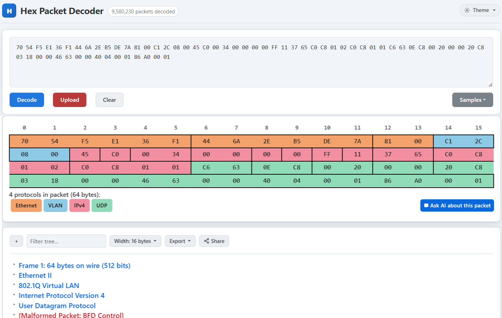
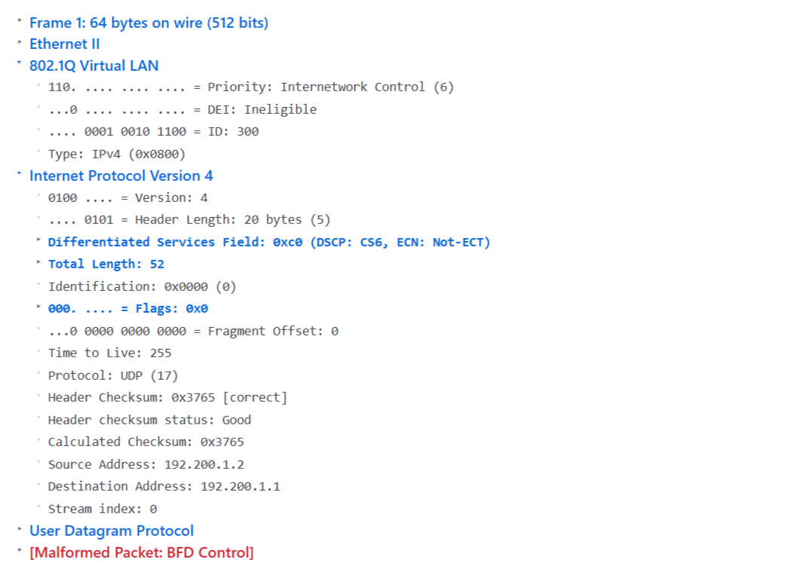
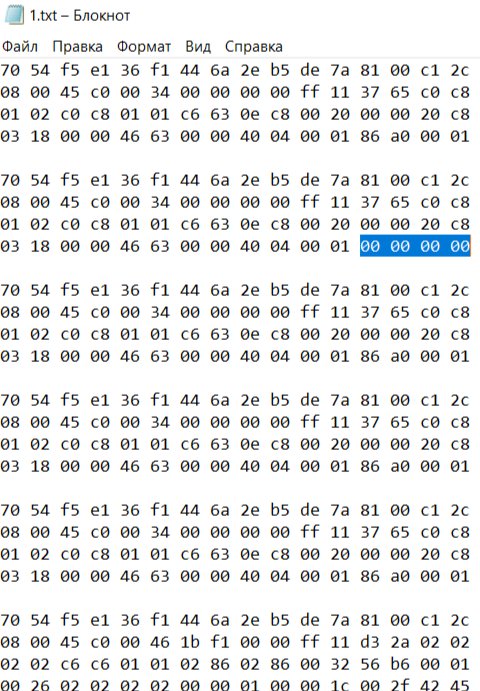
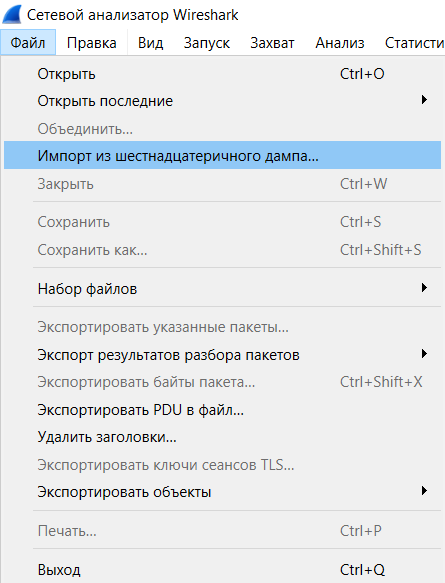
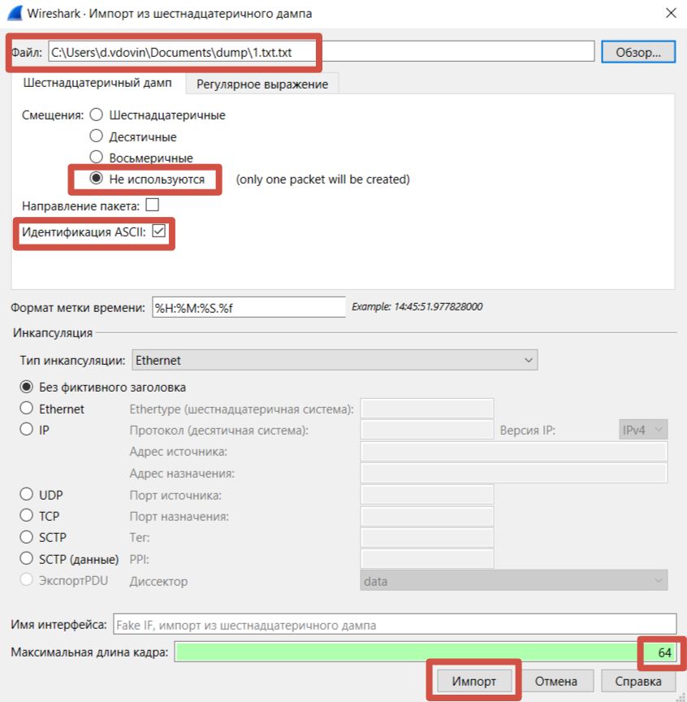
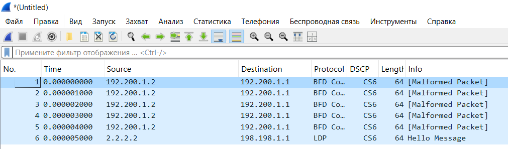
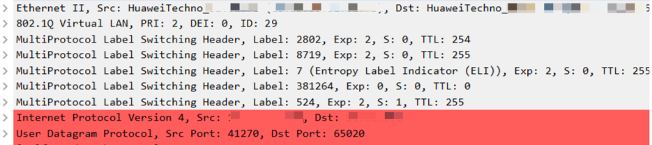
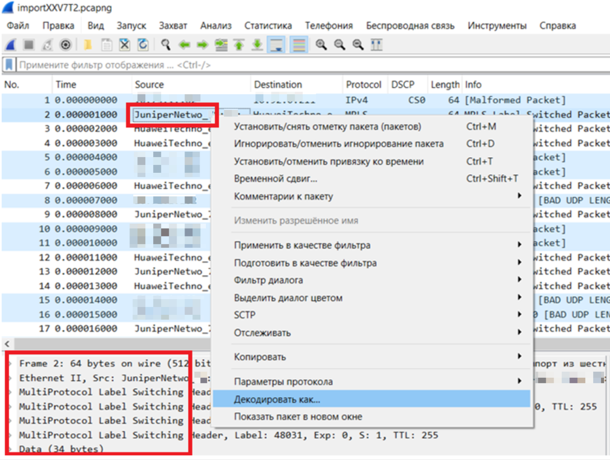
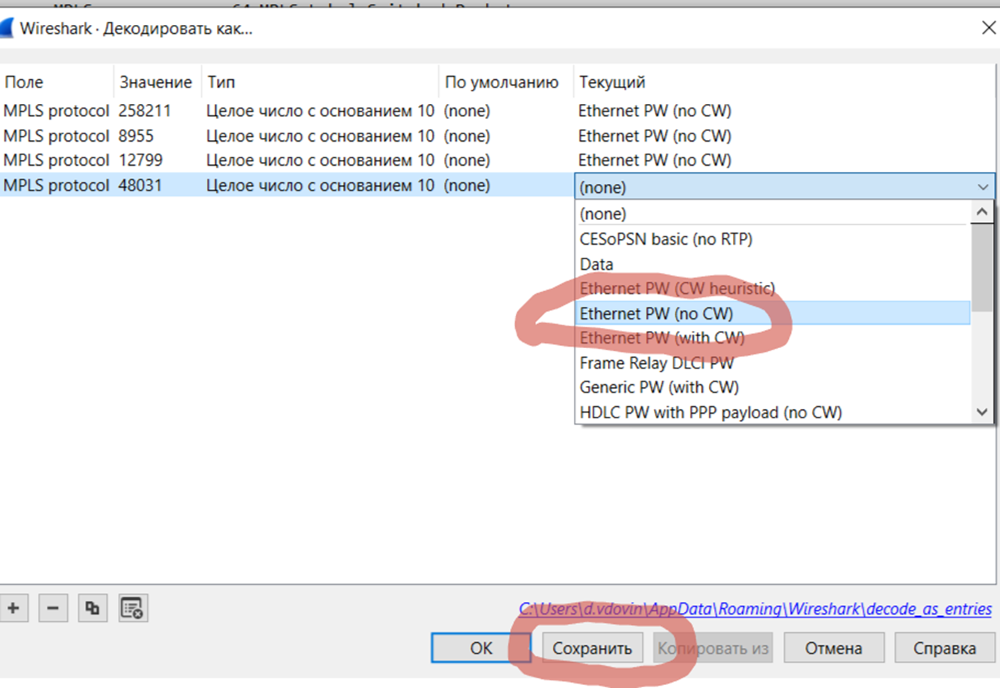
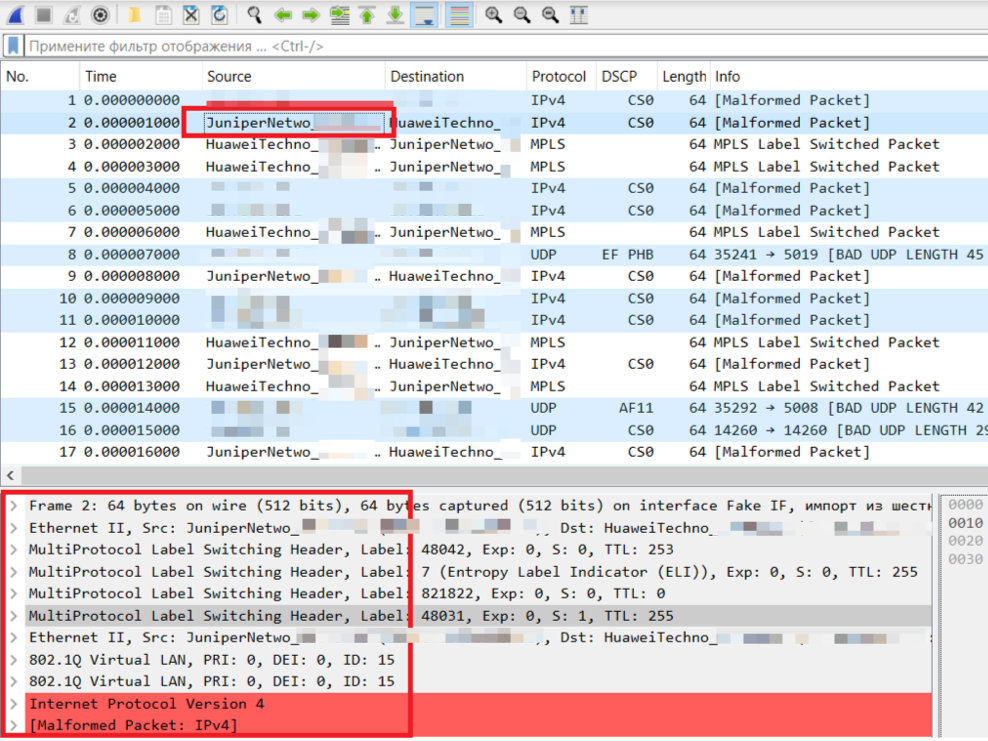

Возможно приходилось сталкиваться с ситуацией, когда срочно нужен дамп транзитного трафика. Некоторые вендоры позволяют через cli снифануть и записать результат в файлик *.cap прям на флешку маршрутизатора. А вот дальше проблема: доступа по FTP/SFTP/SCP к файловой системе нет, а счастье-то вот оно лежит, руку протяни, но достать не получается. На этот случай небольшая инструкция.

## Шаг 1. Делай dump

В маршрутизаторах Huawei есть великолепная возможность снять дамп трафика с любого интерфейса. Туда попадет как часть сигнального трафика, так и часть клиентского. Естественно, все от души прорежено в плане количества, чтобы не убить CPU. На Huawei это элементарно делается безопасной (в отличии от Nokia 7750 SR7) командой из просмотрового режима

```
<Huawei-VRP8>capture-packet forwarding interface Gi1/0/1.300 packet-num 10 packet-len 64Info: Capture-packet data will be saved to cfcard:/logfile/capture_fwd_GE1.0.1.300_both_2026-04-20-11-50-08.cap.
```

В параметрах я указал, что хочу снять весь (вх/исх) трафик на порту Gi1/0/1.300, записать 10 пакетов и максимальную длину каждого 64 байта. В ответ мне показало куда сложился файлик.

Кстати, про длину. Максимальное ограничение 64Б. К сожалению, ее не всегда хватает для анализа всех желаемых заголовков или содержимого сигнальных пакетов, но как уж есть. На китайцев это, конечно, не очень похоже, но сделано явно с целью сохранения тайны личной переписки. Оно и понятно, при бОльшей длине захвата условный пакет SIP/RTP прекрасно влезет целиком и можно подсматривать разговорчики.

## Шаг 2. Выводи на экран

Теперь самое приятное. Можно посмотреть содержимое файла прям в cli. На софтах VRP8 так

display capture-packet file <путь> original-packet

```
<Huawei-VRP8>dis capture-packet file cfcard:/logfile/capture_fwd_GE1.0.1.300_both_2026-04-20-11-50-08.cap original-packet 70 54 f5 e1 36 f1 44 6a 2e b5 de 7a 81 00 c1 2c 08 00 45 c0 00 34 00 00 00 00 ff 11 37 65 c0 c8 01 02 c0 c8 01 01 c6 63 0e c8 00 20 00 00 20 c8 03 18 00 00 46 63 00 00 40 04 00 01 86 a0 00 01 70 54 f5 e1 36 f1 44 6a 2e b5 de 7a 81 00 c1 2c 08 00 45 c0 00 34 00 00 00 00 ff 11 37 65 c0 c8 01 02 c0 c8 01 01 c6 63 0e c8 00 20 00 00 20 c8 03 18 00 00 46 63 00 00 40 04 00 01  70 54 f5 e1 36 f1 44 6a 2e b5 de 7a 81 00 c1 2c 08 00 45 c0 00 34 00 00 00 00 ff 11 37 65 c0 c8 01 02 c0 c8 01 01 c6 63 0e c8 00 20 00 00 20 c8 03 18 00 00 46 63 00 00 40 04 00 01 86 a0 00 01 70 54 f5 e1 36 f1 44 6a 2e b5 de 7a 81 00 c1 2c 08 00 45 c0 00 34 00 00 00 00 ff 11 37 65 c0 c8 01 02 c0 c8 01 01 c6 63 0e c8 00 20 00 00 20 c8 03 18 00 00 46 63 00 00 40 04 00 01 86 a0 00 01 70 54 f5 e1 36 f1 44 6a 2e b5 de 7a 81 00 c1 2c 08 00 45 c0 00 34 00 00 00 00 ff 11 37 65 c0 c8 01 02 c0 c8 01 01 c6 63 0e c8 00 20 00 00 20 c8 03 18 00 00 46 63 00 00 40 04 00 01 86 a0 00 01 70 54 f5 e1 36 f1 44 6a 2e b5 de 7a 81 00 c1 2c 08 00 45 c0 00 46 1b f1 00 00 ff 11 d3 2a 02 02 02 02 c6 c6 01 01 02 86 02 86 00 32 56 b6 00 01 00 26 02 02 02 02 00 00 01 00 00 1c 00 2f 42 45 
```

На старых софтах VRP5 немного сложнее. Также сымаем дамп (как правило, можно сделать в одном направлении: inbound или outbound)

```
<Huawei-VRP5>capture-packet forwarding interface Gi1/0/1.300 inbound packet-num 10 packet-len 64
```

Потом специальной командой выуживаем номер некоего инстанса

```
<Huawei-VRP5>display capture-packet information verbose...instance-id                                   :  1...
```

И дальше уже выводим дамп непосредственно на экран. Например, без временных отметок

```
<Huawei-VRP5>display capture-packet information instance-id 1 format-cap...0000 70 54 f5 e1 36 f1 44 6a 2e b5 de 7a 81 00 c1 2c 0010 08 00 45 c0 00 34 00 00 00 00 ff 11 37 65 c0 c8 0020 01 02 c0 c8 01 01 c6 63 0e c8 00 20 00 00 20 c8 0030 03 18 00 00 46 63 00 00 40 04 00 01 86 a0 00 01 0000 70 54 f5 e1 36 f1 44 6a 2e b5 de 7a 81 00 c1 2c 0010 08 00 45 c0 00 34 00 00 00 00 ff 11 37 65 c0 c8 0020 01 02 c0 c8 01 01 c6 63 0e c8 00 20 00 00 20 c8 0030 03 18 00 00 46 63 00 00 40 04 00 01 00 00 00 00 0000 70 54 f5 e1 36 f1 44 6a 2e b5 de 7a 81 00 c1 2c 0010 08 00 45 c0 00 34 00 00 00 00 ff 11 37 65 c0 c8 0020 01 02 c0 c8 01 01 c6 63 0e c8 00 20 00 00 20 c8 0030 03 18 00 00 46 63 00 00 40 04 00 01 86 a0 00 01 
```

## Шаг 3. Декодируй

Дальше есть два пути. Первый - избитый. Берем кусочек дампа размером с один пакет

```
70 54 f5 e1 36 f1 44 6a 2e b5 de 7a 81 00 c1 2c 
08 00 45 c0 00 34 00 00 00 00 ff 11 37 65 c0 c8 
01 02 c0 c8 01 01 c6 63 0e c8 00 20 00 00 20 c8 
03 18 00 00 46 63 00 00 40 04 00 01 86 a0 00 01 
```

и несем его на сайт [https://hpd.gasmi.net/](https://hpd.gasmi.net/), вставляем, жмем Decode, любуемся на пестрые заголовки



Можно развернуть поля и что-нибудь с умным видом поанализировать



Метод всем хорош, кроме того, что пакеты можно смотреть только по одному. Когда нужно найти один единственный из тысячи становится не так весело. В этом случае на помощь приходит Wireshark.

Ранее выведенный на экран дамп сохраняем в файлике *.txt.



Обратите внимание, что один из пакетов не дотянул до полной длины в 64Б. Такое случается или из-за того, что кадр сам по себе короткий (напомню, что в Ethernet минимальный размер кадра 64Б с учетом FCS, который в дампы не попадает), или бывают какие-то нюансы при сэмплировании на старых железках (софты VRP5). Чтобы исправить я просто добил его нулями. Это критически важно для декодирования.

Далее открываем дамп в Wireshark через Импорт



Указываем путь к файлу. Для первого раза необходимо сделать аналогичные настройки



На этом моменте важно, что бы "Максимальная длина кадра" совпадала с тем, что в дампе. У меня по 64 байта. Иначе возникнут сдвиги по фазе и декодирование пойдет по. В общем вы поняли.

Эти настройки сохранятся на будущее и заботиться о них больше не придется.

Жмякаем на Импорт, получаем желанный результат



Несколько лет назад приходилось барахтаться в этих шестнадцатиричных импортах самому, а сегодня обнаружил, что появилась совершенно чумовая русскоязычная [WIKI](https://wireshark.wiki/wiki/%D0%93%D0%BB%D0%B0%D0%B2%D0%B0_6._%D0%98%D0%BC%D0%BF%D0%BE%D1%80%D1%82_%D0%B8_%D1%8D%D0%BA%D1%81%D0%BF%D0%BE%D1%80%D1%82_%D0%B4%D0%B0%D0%BD%D0%BD%D1%8B%D1%85#6.5._%D0%98%D0%BC%D0%BF%D0%BE%D1%80%D1%82_%D1%88%D0%B5%D1%81%D1%82%D0%BD%D0%B0%D0%B4%D1%86%D0%B0%D1%82%D0%B5%D1%80%D0%B8%D1%87%D0%BD%D0%BE%D0%B3%D0%BE_%D0%B4%D0%B0%D0%BC%D0%BF%D0%B0) , где можно поднабраться всяких рюшечек и бантиков.

## Для гурманов

Бывает надампишь такой себе полную панамку mpls'а, сидишь весь в предвкушении, щас на энтропию посмотрю, на FRR какой-нибудь, что там у меня в l2- и l3vpn летает.



А оно берет и отказывается декодироваться. Это не повод не унывать. Точно не знаю как это устроено, но пакеты mpls время от времени требуют уточнения условий декодирования для l2vpn. Вопрос не изучал, видимо, Wireshark запинается о какие-то значения бит вложенной нагрузки. Требуется-то всего-навсего указать с Control Word или без – как правило без. Ниже видно, что в выбранном пакете 4 mpls заголовка и нерасшифрованное поле Data



Указываем, что в пакете нет Control Word и нажимаем кнопку сохранить. Упражнение придется проделать для каждой mpls label в дампе, которая идет на дне стека.



Теперь пакет расшифрован полностью, можно наслаждаться


