[Автор оригинала: Phuong Le](https://victoriametrics.com/blog/victorialogs-internals-columnar-storage-on-disk/)

Если вы эксплуатируете VictoriaLogs, повседневная работа сводится к трём вещам: отправке логов, выполнению запросов и настройке срока хранения, чтобы не переполнить диск. Всё остальное незаметно происходит на диске.

В этой статье мы проследим путь одной записи лога — от поступления в VictoriaLogs до окончательного размещения на диске. Это поможет представить, что происходит внутри системы, и понять наблюдаемое поведение: почему запросы выполняются быстро, почему на диске иногда появляется множество файлов и какие флаги и метрики важны при поиске неполадок. Статья рассчитана на широкую аудиторию: не требуется ни опыт программирования, ни знание Go. Тем, кто захочет разобраться глубже, первоисточником послужит [исходный код VictoriaLogs](https://github.com/VictoriaMetrics/VictoriaLogs/).

### 1. В VictoriaLogs поступает запись лога

VictoriaLogs принимает логи по множеству протоколов: JSON Lines, Elasticsearch bulk, Loki push, OpenTelemetry, syslog и другим (полный перечень приведён в [документации по приёму данных](https://docs.victoriametrics.com/victorialogs/data-ingestion/)).

Независимо от протокола VictoriaLogs сначала приводит запись к единому внутреннему представлению, понятному остальной системе: метка времени, набор именованных полей и «идентификатор потока».

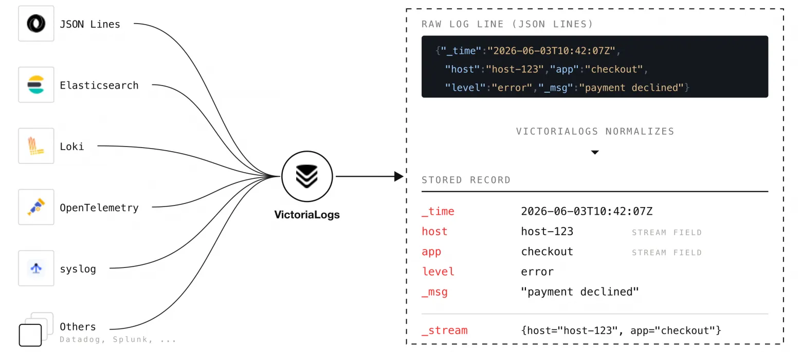

Каждый протокол преобразуется к единой внутренней форме.

Для каждого протокола есть небольшой обработчик, выполняющий это преобразование. На него можно влиять аргументами запроса или заголовками самого запроса:

-   Исключить ненужные поля из хранения: аргумент `ignore_fields` или заголовок `VL-Ignore-Fields`.
    
-   Удалить из значений управляющие коды цвета терминала: аргумент `decolorize_fields` или заголовок `VL-Decolorize-Fields`.
    
-   Добавить дополнительные поля к каждой записи: аргумент `extra_fields` или заголовок `VL-Extra-Fields`.
    
-   Указать VictoriaLogs основное поле сообщения (`_msg`): аргумент `_msg_field` или заголовок `VL-Msg-Field`.
    
-   Указать поле с меткой времени: аргумент `_time_field` или заголовок `VL-Time-Field`.
    
-   Выбрать поля, определяющие идентификатор потока: аргумент `_stream_fields` или заголовок `VL-Stream-Fields`.
    

Идентификатор потока — одно из ключевых понятий этой статьи. Логи с одинаковым набором полей потока считаются одним **потоком**, причём состав этого набора определяете вы. Например, при `_stream_fields=pod,container` все логи с одинаковыми значениями `pod` и `container` образуют один поток.

VictoriaLogs хранит логи каждого потока рядом на диске. Благодаря такой группировке данные хорошо сжимаются, а запрос обращается только к нужным потокам, а не сканирует всё хранилище.

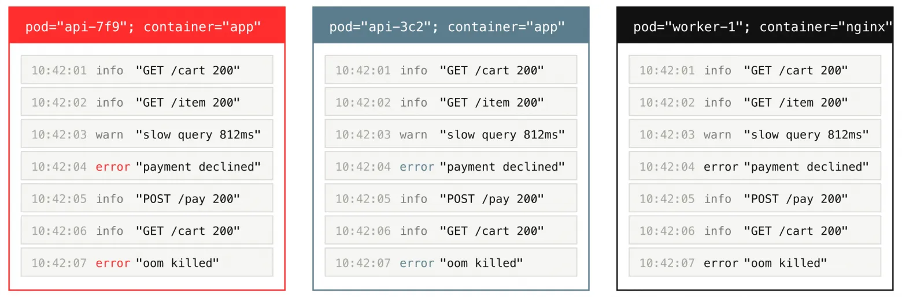

Логи с одинаковыми полями потока образуют один поток.

Практическое правило для администратора: поля потока должны быть стабильными и низкокардинальными, то есть иметь небольшое число разных значений, например `host`, `app`, `pod` или `container`. Высококардинальные значения с большим числом уникальных вариантов, такие как `trace_id` и `user_id`, оставляйте обычными полями, а не полями потока.

После приёма и нормализации VictoriaLogs тоже не обрабатывает записи по одной. Он накапливает их в буфере в памяти и примерно раз в секунду — либо раньше, если буфер заполнится, — превращает всю пачку в небольшой доступный для поиска фрагмент, который пока остаётся в ОЗУ: **сегмент в памяти** (`in-memory part`).

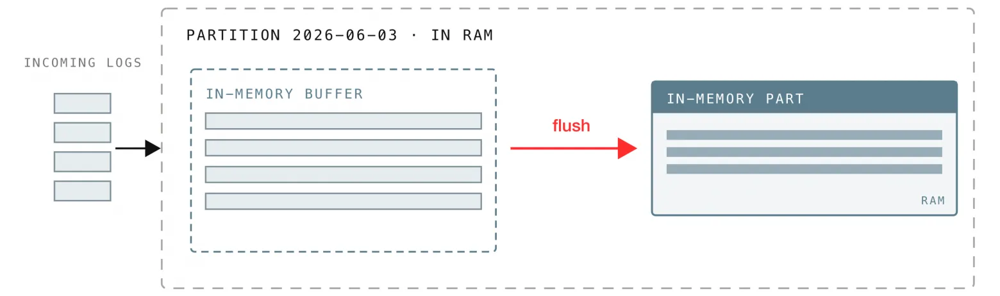

Буферизованная пачка сбрасывается в один сегмент в памяти.

Этот буфер — не одна общая очередь. Если бы все входящие пачки записывались через один буфер, они конкурировали бы за него. Поэтому VictoriaLogs делит буфер на шарды — по одному на ядро процессора — и циклически распределяет между ними входящие пачки.

На машине с тремя ядрами процессора параллельно заполняются три шарда буфера. Каждый из них сбрасывается независимо и примерно раз в секунду превращает накопленную пачку в новый сегмент в памяти:

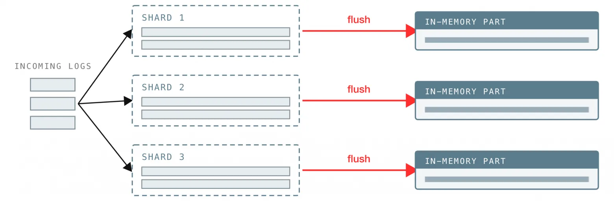

Буфер разделён на шарды по числу ядер процессора, и каждый создаёт собственный сегмент в памяти.

Буфер разделён на шарды по числу ядер процессора, и каждый создаёт собственный сегмент в памяти.

**Сегмент данных** (`part`, далее — **сегмент**) — одна из основных структур данных VictoriaLogs и других продуктов VictoriaMetrics: самодостаточный набор данных, по которому можно выполнять запросы.

> **Важно:** сегмент — это отдельная единица хранения и поиска, а не просто произвольный фрагмент данных. Суточный раздел содержит несколько сегментов, а каждый сегмент — множество блоков.

Обычно буферизованная пачка превращается в сегмент в памяти. Но в редких случаях, когда пачка превышает допустимый для ОЗУ размер, сегмент сразу записывается на диск как _малый_ или _большой_.

> **Метрика** `vl_insert_flush_duration_seconds`: время преобразования буферизованной пачки в сегмент в памяти.

### 2. Суточные разделы

При сбросе пачки VictoriaLogs направляет каждую запись в **раздел**, соответствующий одному календарному дню по всемирному координированному времени (UTC). День определяется по метке времени записи.

Иными словами, логи разбиты по датам. На диске это выглядит как один каталог на день:

```
$ tree victoria-logs-data/

victoria-logs-data/
└── partitions/
    ├── 20260109
    ├── 20260110
    ├── 20260111
    └── 20260112
```

Такая разбивка по дням — не просто деталь реализации: благодаря ей дёшево выполняются две обычные операции:

-   **Удаление по сроку хранения** сводится к удалению каталогов целых дней. Когда логи выходят за пределы `-retentionPeriod` (по умолчанию 7 дней) либо срабатывает ограничение по объёму диска, VictoriaLogs удаляет каталоги дней целиком, а не ищет отдельные записи.
    
-   **Запросы почти всегда ограничены по времени** (`_time:1h`, `_time:5m`), поэтому VictoriaLogs открывает только разделы дней, пересекающиеся с заданным диапазоном, и игнорирует остальные.
    

Раздел — не только каталог на диске. Он включает данные на диске — уже записанные сегменты — и состояние в памяти: шарды буфера и упомянутые сегменты в памяти.

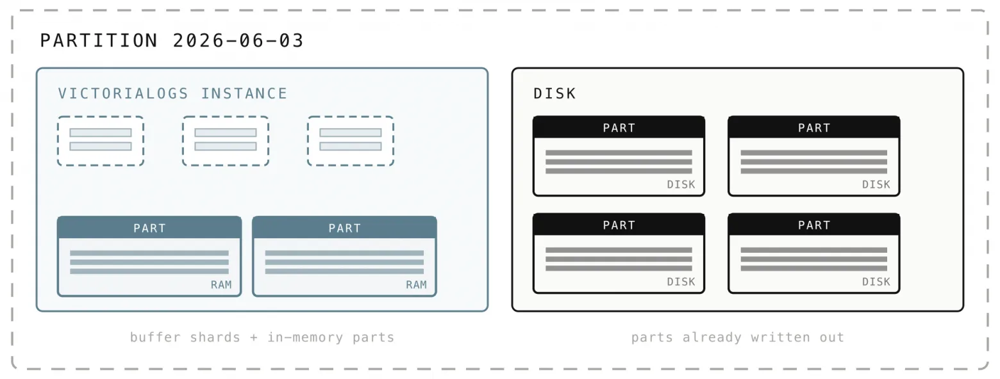

Раздел содержит данные и в памяти, и на диске.

При запросе данных за день VictoriaLogs одновременно обращается к обеим составляющим раздела и читает дисковые сегменты только при необходимости.

> **Метрика** `vl_storage_parts` показывает число сегментов с разбивкой по месту хранения: `{type="storage/inmemory"}` — сегменты в памяти, `{type="storage/small"}` и `{type="storage/big"}` — сегменты на диске. Метрика `vl_pending_rows{type="storage"}` показывает число строк, которые ещё находятся в буфере и не превратились в сегмент.

### 3. Сегменты — единицы хранения VictoriaLogs

С сегментами мы познакомились в разделе 1: это самодостаточные наборы логов, доступные для поиска, которые создаются при сбросе буфера. Важно, что сегменты бывают трёх типов — это одни и те же данные на разных стадиях жизненного цикла:

-   **Сегменты в памяти** создаются первыми, поэтому только что принятые логи становятся доступны для запросов почти сразу, без ожидания записи на диск.
    
-   **Малые сегменты** — сегменты в памяти, записанные на диск для надёжного хранения.
    
-   **Большие сегменты** образуются при последующем объединении малых сегментов.
    

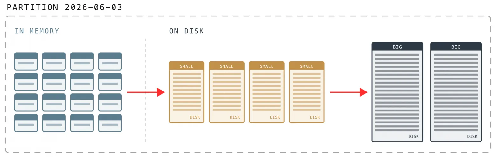

Сегменты в памяти объединяются сначала в малые, затем в большие.

Данные из буфера сначала сбрасываются в сегменты в памяти, ещё до первого обращения к диску — это делает приём логов недорогим.

На диск сегменты записываются сравнительно редко и крупными порциями, а малые сегменты при слиянии объединяются в памяти в более крупные. Поэтому VictoriaLogs выполняет значительно меньше операций чтения и записи. Именно так он может принимать около 1 ГиБ логов в секунду даже на медленных жёстких дисках с небольшим числом операций ввода-вывода в секунду (IOPS).

У сегментов в памяти есть очевидный недостаток: логи становятся доступны для запросов за секунды, но ещё не сохранены на диске. VictoriaLogs ограничивает этот риск, гарантируя запись через короткие интервалы. Интервал задаёт флаг `-inmemoryDataFlushInterval` (по умолчанию `5s`): он определяет, как часто данные из памяти гарантированно попадают на диск.

На диске каждый сегмент представляет собой каталог с 16-символьным шестнадцатеричным именем — это всего лишь идентификатор — внутри каталога `datadb` раздела. Отдельный каталог `indexdb` содержит перечень потоков за этот день:

```
$ tree victoria-logs-data/partitions/20260109/

victoria-logs-data/
└── partitions/
    └── 20260109/
        ├── indexdb/
        └── datadb/
            ├── 1882C35B4CE64498/
            ├── 1882C35B4CE664F8/
            ├── 1882C35B4CE66BDB/
            └── parts.json
```

Файл `parts.json` содержит список активных сегментов. По нему VictoriaLogs при запуске определяет, какие каталоги нужно читать:

```
$ cat victoria-logs-data/partitions/20260109/datadb/parts.json

["1882C35B4CE64498", "1882C35B4CE664F8", "1882C35B4CE66BDB"]
```

Сегмент **неизменяем**: после записи его файлы больше не меняются. Поэтому снимки и резервные копии создавать безопасно и дёшево.

Чем же малые сегменты отличаются от больших?

Разница определяется тем, как сегменты используют **кэш страниц** ОС. Проще говоря, это область ОЗУ, где операционная система хранит недавно прочитанные данные файлов: при повторном обращении те же байты читаются из памяти, а не с диска. Чем больше ОЗУ у машины, тем больше этот кэш и тем большая доля логов читается непосредственно из памяти.

Малые сегменты записываются через кэш страниц и намеренно имеют небольшой размер, поэтому обычно остаются в ОЗУ и быстро читаются повторно. Их предельный размер зависит от объёма памяти, который VictoriaLogs оставляет операционной системе для кэширования (не менее 10 МБ); всё, что превышает этот предел, записывается как большой сегмент. Большие сегменты могут вырасти примерно до 1 ТБ. При записи они обходят кэш страниц, поэтому крупное слияние не вытесняет горячие данные, необходимые недавним запросам.

Рядом с рассмотренным каталогом `datadb` находится `indexdb`. В `datadb` лежат сегменты, то есть сами логи; `indexdb` содержит каталог потоков за день: какие потоки существуют и какие поля в них встречаются. При запросе VictoriaLogs сначала проверяет этот каталог, определяет потенциально подходящие потоки и не читает логи из заведомо неподходящих. Эта тема заслуживает отдельной статьи, поэтому здесь на ней останавливаться не будем.

### 4. Упрощённая модель структуры данных VictoriaLogs

Прежде чем перейти к реальным файлам, полезно представить, как устроен сегмент. Основная идея проста: VictoriaLogs раскладывает данные так, чтобы при чтении затрагивать как можно меньший объём. Эту задачу в основном решают два приёма.

#### 4.1 Логи группируются в блоки по потоку и времени

Внутри сегмента логи упакованы в **блоки**. Блок содержит строки одного потока, а сегмент — множество блоков. Блоки упорядочены сначала по потоку, затем по времени; строки внутри каждого блока также отсортированы по метке времени.

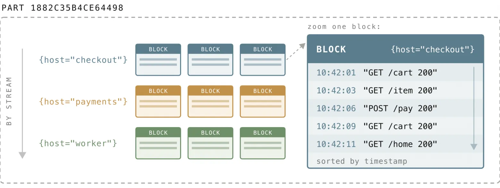

Блоки сегмента, сгруппированные по потоку.

Объём несжатых данных блока ограничен примерно 2 МиБ (при объединении сегментов он может увеличиться почти до 4 МиБ). У каждого блока есть небольшой фрагмент метаданных — **заголовок блока**, который хранится отдельно от самих логов (в `index.bin`, рассматриваемом в разделе 5.8). В нём указаны:

-   поток, которому принадлежит блок;
    
-   число строк;
    
-   минимальная и максимальная метки времени блока.
    

Заголовки малы и хранятся отдельно от данных логов, поэтому VictoriaLogs может быстро просмотреть их и решить, какие блоки стоит читать, не обращаясь ни к одной записи в пропускаемых блоках.

Поэтому запросы с фильтрами требуют меньше чтения. Когда запрос выбирает один поток за последний час, VictoriaLogs сразу переходит к блокам этого потока и по минимальной и максимальной меткам времени в заголовках отбрасывает блоки, чей временной диапазон не пересекается с запросом. Несвязанные потоки и блоки вне диапазона вообще не читаются.

#### 4.2 Каждое поле хранится в отдельной колонке, поэтому запрос читает только нужные данные

Логи обычно представляют построчно: одна запись — одна строка, в которой все поля расположены рядом.


Три лога: одна запись на строку.

Внутри блока VictoriaLogs разворачивает это представление: вместо совместного хранения всех полей записи он помещает каждое поле в собственную **колонку**, сохраняя соответствие значений строкам.

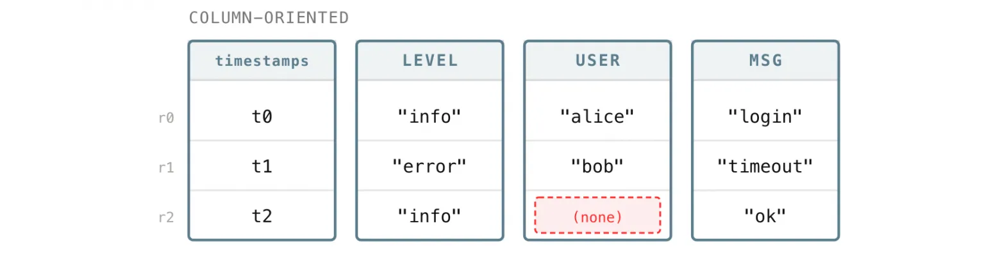

Те же логи, хранимые по колонкам.

Когда поле хранится в собственной колонке, VictoriaLogs читает только колонки, которые действительно нужны запросу, а не все поля каждой строки. Чем больше полей в записи, тем существеннее выигрыш. Это одна из причин, по которой VictoriaLogs уверенно обрабатывает широкие логи с множеством полей и уникальных значений.

Поэтому оператор `fields` в LogsQL позволяет ускорить запрос с минимальными затратами. По умолчанию запрос возвращает все поля и, следовательно, читает все колонки. Добавление `| fields ...` либо его синонима `| keep ...` указывает VictoriaLogs прочитать только названные колонки:

```
_time:5m error | fields _time, host, _msg
```

Здесь VictoriaLogs читает только колонки `_time_`_,_ `_host_` _и_ `msg`, а не извлекает с диска все поля каждой подходящей строки. В широких логах с десятками полей сокращение результата до нескольких нужных полей может радикально уменьшить объём данных, читаемых запросом.

Хранение значений одного поля рядом даёт и другое преимущество — хорошее сжатие. Значения одного поля обычно имеют одинаковую природу:

-   `level` всегда содержит одно из немногих слов, например `info` или `error`;
    
-   `status` всегда является числом;
    
-   `timestamp` всегда является временем.
    

Когда все значения колонки имеют сходную форму или тип, они очень хорошо сжимаются. VictoriaLogs использует это, выбирая для каждой колонки подходящий формат хранения: для числа, метки времени, IP-адреса и т. д.

Кроме того, логи одного потока обычно похожи друг на друга, поэтому соседние значения колонки часто повторяются и сжимаются ещё сильнее. Поэтому VictoriaLogs способен сжать несколько ТиБ исходных логов до всего нескольких сотен ГиБ на диске, а иногда и меньше.

### 5. Файлы внутри сегмента

Упрощённая модель готова. Теперь откроем сегмент и разберём реальные файлы: для чего нужен каждый из них и как он поддерживает описанное устройство.

Сегмент — это каталог с файлами. Его содержимое выглядит примерно так:

```
1882C35B4CE64498/
  ├── metadata.json
  ├── index.bin, metaindex.bin
  ├── timestamps.bin
  ├── values.bin0, values.bin1, ...
  ├── bloom.bin0, bloom.bin1, ...
  ├── message_values.bin, message_bloom.bin
  └── column_names.bin, column_idxs.bin, columns_header.bin, columns_header_index.bin
```

Запоминать их не нужно. Большинство файлов относится к нескольким группам, и почти каждый помогает VictoriaLogs исключить ненужную работу ещё до чтения самих данных.

#### 5.1 metadata.json: сводка по сегменту

В каждом сегменте есть ровно один удобочитаемый файл `metadata.json`. По нему VictoriaLogs почти мгновенно определяет, стоит ли вообще открывать сегмент:

```
{  "FormatVersion": 3,  "CompressedSizeBytes": 537919490,  "UncompressedSizeBytes": 6024698288,  "RowsCount": 4240299,  "BlocksCount": 1915,  "MinTimestamp": 1767916800890319297,  "MaxTimestamp": 1767946621349903397,  "BloomValuesShardsCount": 60}
```

Только по этому файлу VictoriaLogs узнаёт, что сегмент содержит около 4,24 млн строк (`"RowsCount": 4240299`) в 1915 блоках (`"BlocksCount": 1915`), занимает около 513 МиБ на диске (`"CompressedSizeBytes": 537919490`) вместо примерно 5,6 ГиБ исходных логов и охватывает определённый временной диапазон (`MinTimestamp` и `MaxTimestamp`). Если временной диапазон запроса с ним не пересекается, весь сегмент пропускается без чтения остальных файлов.

#### 5.2 timestamps.bin: время каждой строки

У каждого лога есть метка времени, а `timestamps.bin` — выделенная колонка, содержащая `_time` каждой строки. Она отделена от остальных колонок, поскольку почти каждый запрос фильтрует или сортирует по времени и все метки выгодно хранить вместе в компактном виде.

Данные хранятся компактно: VictoriaLogs сохраняет первую метку времени полностью как базовую, а для каждой следующей — только небольшую разницу с предыдущей. Серия логов с интервалом в несколько миллисекунд превращается в ряд небольших чисел, который сжимается почти до нуля.

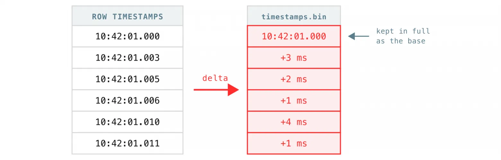

Метки времени хранятся как одно полное значение и последовательность небольших дельт.

На схеме показаны метки времени только одного блока. Во всём файле они организованы так же, как логи: сначала блоки упорядочены по потоку, затем по времени, а строки внутри блока также отсортированы по времени.

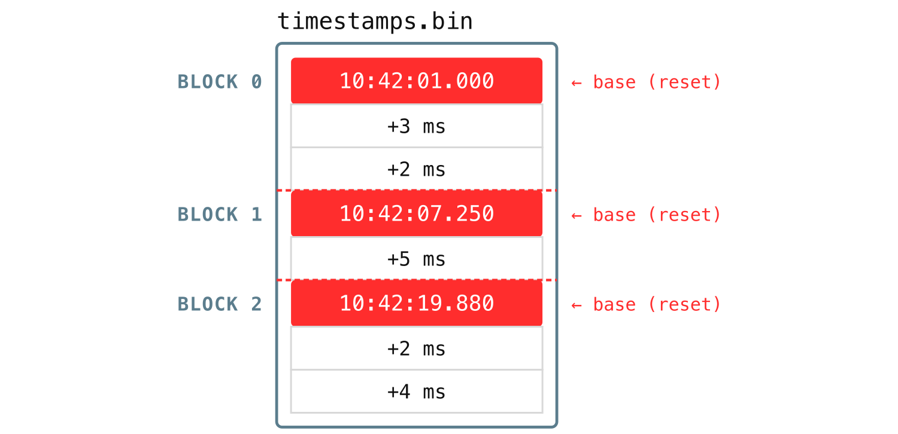

Файл содержит по одной последовательности дельт на блок.

Следующие несколько файлов вместе хранят значения каждого поля и позволяют быстро их находить. В разделе 4.2 мы сказали, что каждое поле — отдельная колонка, но на диске такая колонка не лежит целиком в одном файле. Проще всего понять связь между файлами, проследив путь одного поля, например `pod`.

#### 5.3 column_names.bin: короткие идентификаторы имён колонок

Имена полей часто длинны и повторяются. Вспомните [`kubernetes.pod.name`](http://kubernetes.pod.name) или [`kubernetes.labels.app`](http://kubernetes.labels.app): один сегмент может содержать тысячи или миллионы блоков. Если бы метаданные каждого блока хранили полные имена, одни и те же длинные строки дублировались бы снова и снова: сегмент разрастался бы, а чтение замедлялось.

Поэтому VictoriaLogs присваивает каждому уникальному имени поля в сегменте короткий числовой **идентификатор колонки**. Файл `column_names.bin` содержит упорядоченный список всех имён полей сегмента, кроме `_msg`, для которого предусмотрен отдельный файл. Позиция имени в списке и есть его идентификатор.

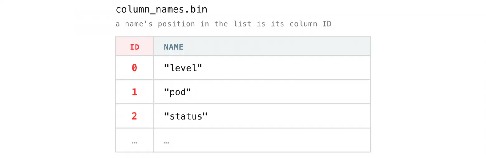

Позиция имени в списке является идентификатором колонки.

После этого другим структурам сегмента не нужно повторять полное имя. Блоки и заголовки их колонок ссылаются на колонки по идентификатору: [`kubernetes.pod.name`](http://kubernetes.pod.name) записывается здесь один раз, а далее заменяется небольшим целым числом.

#### 5.4 column_idxs.bin: в каком шарде находится колонка

Следующий вопрос — где именно находятся данные колонки. VictoriaLogs не складывает значения всех полей в один огромный файл. Вместо этого он делит их на **шарды**. Каждый шард — пара файлов:

-   `values.binN` со значениями;
    
-   `bloom.binN` с фильтром Блума (о нём чуть ниже).
    

Значения одной колонки всегда остаются в одном шарде, но разные колонки распределяются по разным шардам. Поэтому в сегменте с множеством полей данные колонок лежат в нескольких файлах шардов, а не собраны в одном.

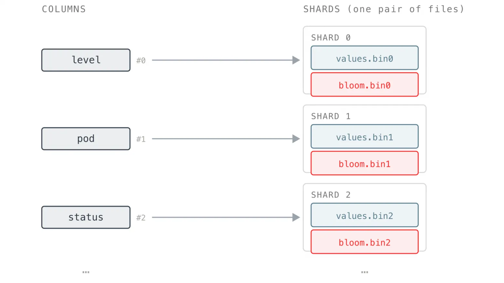

Данные каждой колонки попадают в шард — пару файлов `values.binN` и `bloom.binN`.

Для каждого уникального имени поля VictoriaLogs выбирает номер шарда и записывает соответствие «колонка — шард» в `column_idxs.bin`. Назначение неизменно в пределах сегмента, поэтому одно поле всегда попадает в один шард.

Если `pod` назначен шарду 1, значения `pod` из каждого блока попадают в `values.bin1`, причём данные каждого блока располагаются по своему смещению в файле.

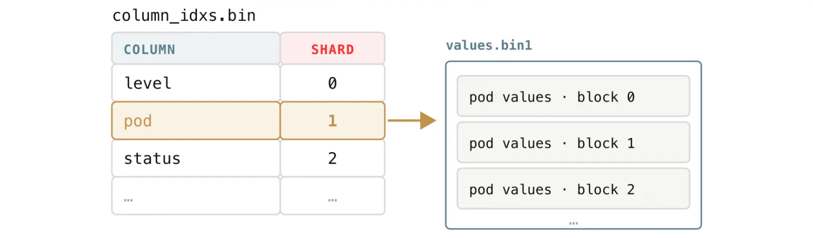

Каждой колонке назначается постоянный шард: `pod` попадает в `values.bin1` блок за блоком.

В сегменте может быть до 128 шардов (`values.bin0` — `values.bin127` и соответствующие `bloom.bin0` — `bloom.bin127`). Они создаются при появлении новых имён полей, поэтому в небольшом сегменте их может быть лишь несколько. Если уникальных полей больше 128, нумерация шардов снова начинается с 0: 129-е поле попадёт в `values.bin0` рядом с первым, 130-е — в `values.bin1` и т. д. После 128 полей некоторые поля просто используют общий шард.

Точное число шардов — это уже встречавшийся в `metadata.json` параметр `BloomValuesShardsCount`:

```
{  "FormatVersion": 3,  "CompressedSizeBytes": 537919490,  "UncompressedSizeBytes": 6024698288,  "RowsCount": 4240299,  "BlocksCount": 1915,  "MinTimestamp": 1767916800890319297,  "MaxTimestamp": 1767946621349903397,  "BloomValuesShardsCount": 60}
```

Поле `BloomValuesShardsCount` содержит число шардов сегмента. Значение `60` означает, что VictoriaLogs создал 60 пар: `values.bin0` — `values.bin59`, каждой из которых соответствует `bloom.bin0` — `bloom.bin59`. Это число уникальных имён полей, встречающихся в сегменте: первое поле попадает в шард 0, второе — в шард 1 и т. д.

Такое распределение не позволяет одному файлу стать узким местом и даёт VictoriaLogs возможность читать разные поля параллельно: они часто находятся в разных файлах шардов.

#### 5.5 values.binN и message_values.bin: значения полей

Наконец, здесь находятся сами данные логов. Для каждой пары «блок, поле» VictoriaLogs кодирует значения в один **блоб** — непрерывный участок байтов — и дописывает его в файл шарда этого поля.

Поскольку шард фиксирован для поля, один `values.binN` содержит много небольших блобов: по одному на блок для каждого поля, сопоставленного с этим шардом.

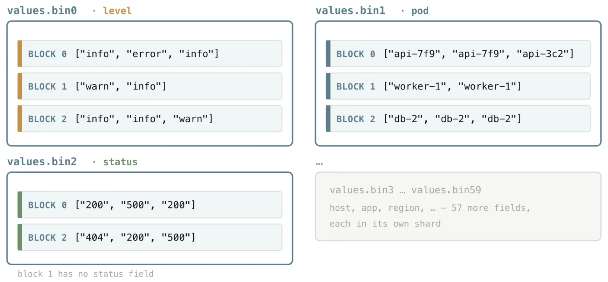

Независимые файлы шардов: блок может писать в несколько шардов и не иметь колонки в отдельном шарде.

Внутри блоба хранятся значения колонки блока — по одному на строку, упакованные способом, подходящим для их содержимого, как описано в разделе 4.2.

-   Колонка с повторяющимися словами хранится как небольшой словарь и ссылки на него;
    
-   числа хранятся как числа;
    
-   одинаковые значения представляются одной константой;
    
-   для меток времени, IP-адресов и других типов применяются собственные компактные представления.
    

Сейчас важен лишь принцип: для каждого типа значений выбирается подходящий способ уплотнения, поэтому подробно разбирать все форматы не будем.

Поле сообщения — особый случай. Внутри VictoriaLogs считает `_msg_` _«главной колонкой» (её имя фактически является пустой строкой, хотя в запросах оно показано как_ `msg`) и хранит данные сообщений в отдельном `message_values.bin`, а не в общих шардах.

Сообщения обычно являются самым большим и наиболее часто читаемым полем. Отдельный файл позволяет читать и декодировать их независимо от остальных, обычно более компактных полей.

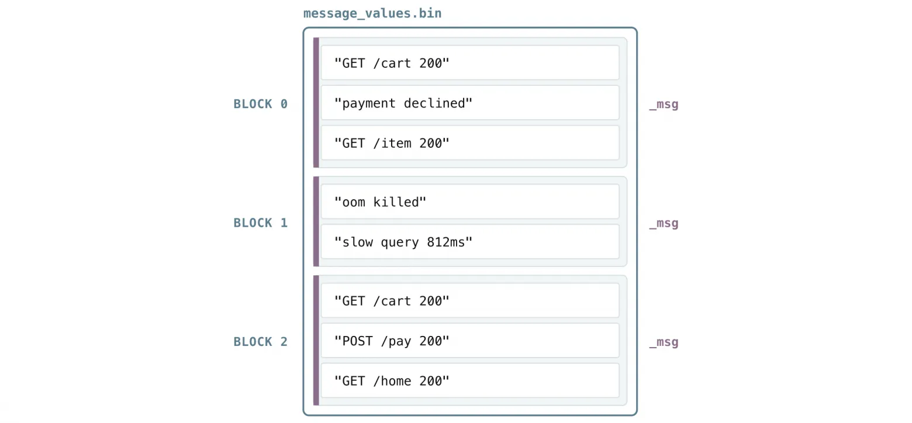

Колонка `_msg` находится в собственном файле: один блоб на блок.

#### 5.6 Фильтры Блума: bloom.bin и message_bloom.bin

Рядом со значениями находятся фильтры Блума, разбитые на шарды тем же образом: `bloom.binN` образует пару с `values.binN`, а `message_bloom.bin` относится к колонке сообщений. Это дешёвый **предварительный фильтр**: быстрая проверка «да/нет» выполняется до чтения самих значений, поэтому большинство блоков можно отбросить, не читая их данные.

**Фильтр Блума** — компактный отпечаток всех слов, или токенов, одной колонки блока. Он не хранит сами слова, а содержит лишь достаточно битов, чтобы ответить на вопрос: «может ли это слово быть в блоке?»

Возможны два ответа: **«точно нет»** или **«возможно»**. Фильтр может:

-   иногда ответить «возможно», хотя слова на самом деле нет;
    
-   но никогда не ответит «нет», если слово есть.
    

Именно такая односторонняя гарантия нужна фильтру. При поиске `error` VictoriaLogs сначала проверяет фильтр Блума каждого блока, пропускает все блоки с ответом «точно нет» и лишь затем читает сами значения в нескольких блоках с ответом «возможно».

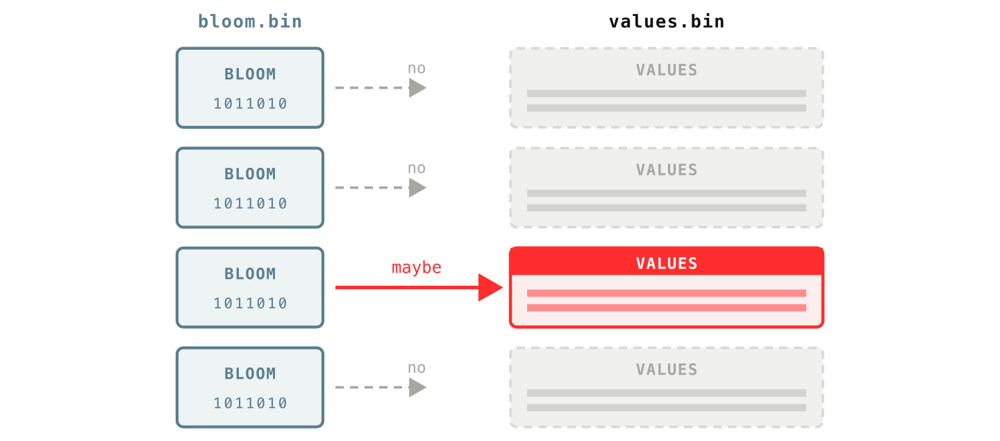

Сначала проверяется фильтр Блума блока; к его значениям ведёт только ответ «возможно».

Для построения фильтра VictoriaLogs берёт одну колонку блока, например `_msg`, и разбивает каждое её значение на **токены** — последовательности букв, цифр или символов подчёркивания.

В сообщениях `GET /cart 200` и `POST /pay 200` токенами будут `GET`, `cart`, `200`, `POST`, `pay` и т. д. Затем VictoriaLogs записывает уникальные токены всей колонки в фильтр Блума этого блока. При последующем поиске `error` запрос разбивается на токены тем же способом, и система спрашивает фильтр: «есть ли здесь эти токены?»

На каждый уникальный токен требуется около 2 байтов, поэтому размер легко оценить: для колонки блока с 1000 уникальных слов нужен фильтр Блума примерно 2 КБ, а для 20 000 уникальных токенов — около 40 КБ. Поэтому полнотекстовый поиск по очень многословным логам остаётся недорогим.

Это можно измерить на своих данных. Число уникальных слов в сообщениях (дорогой запрос):

```
* | unpack_words as words drop_duplicates | unroll words | stats count_uniq(words) as unique_words
```

Число слов в сообщении на уровне 99-го перцентиля (более дешёвый запрос):

```
* | unpack_words as words drop_duplicates | json_array_len(words) as words_count | stats quantile(0.99, words_count) as p99_words_per_msg
```

_Оба запроса можно выполнить прямо сейчас в_ [_песочнице VictoriaLogs_](https://play-vmlogs.victoriametrics.com/select/vmui/?#/?step=5s&query=%5C*+%7C+unpack_words+as+words+drop_duplicates+%7C+unroll+words+%7C+stats+count_uniq(words)+as+unique_words&g0.range_input=5m&g0.end_input=2026-06-05T10%3A12%3A55&g0.relative_time=last_5_minutes)_._

Фильтр Блума разделён так же, как значения: на каждую пару «блок, колонка» приходится один блоб фильтра — отпечаток всей этой колонки в данном блоке.

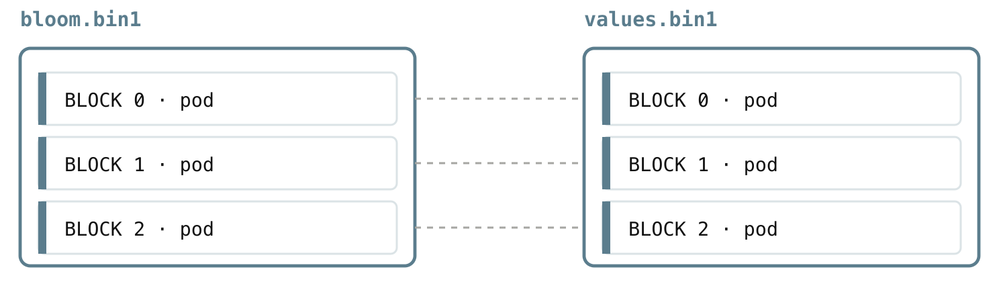

Каждому блобу фильтра Блума точно соответствует блоб значений той же пары «блок, колонка».

Эти файлы образуют однозначные пары: `bloom.binN` и `values.binN` имеют одинаковый номер шарда. Как только фильтр блока отвечает «возможно», соответствующий блоб значений можно прочитать из парного файла.

#### 5.7 columns_header.bin и columns_header_index.bin: поиск колонки в блоке

Теперь есть почти всё, кроме последнего звена. У нас есть короткие идентификаторы имён полей (5.3), известен шард поля (5.4), а его значения и фильтр Блума лежат как парные блобы в `values.binN` и `bloom.binN` (5.5 и 5.6).

Остаётся вопрос: один `values.binN` содержит много блобов подряд. Где именно начинается блоб `pod` конкретного блока и сколько байтов он занимает? Указать этот диапазон байтов, чтобы VictoriaLogs прочитал его без сканирования всего файла, — задача **заголовка колонки**.

Заголовок колонки — небольшая служебная запись, описывающая одно поле в одном блоке; на каждую пару «блок, колонка» приходится один такой заголовок. Это не сами данные: запись содержит ровно столько информации, чтобы найти и декодировать колонку без последовательного просмотра файла:

-   **тип значений** — строка, словарь, число, метка времени, IP и т. д.; он говорит VictoriaLogs, как читать байты;
    
-   необязательные **минимальное и максимальное значения** для числовых колонок, меток времени и IP, чтобы фильтр по диапазону мог отбросить блок без обращения к данным;
    
-   **смещение в байтах и размер** блоба значений, а также смещение и размер блоба фильтра Блума.
    

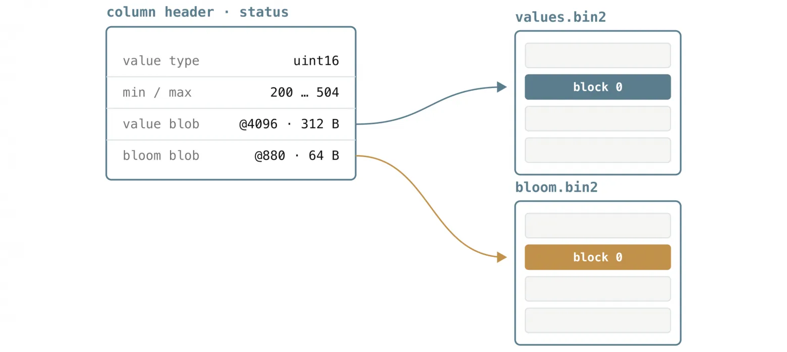

Заголовок колонки — небольшая карта файлов значений и фильтра Блума.

На схеме выше показан такой заголовок колонки `status` одного блока. Он сообщает:

-   значения — небольшие беззнаковые целые числа (тип `uint16`);
    
-   их диапазон: от `200` до `504`;
    
-   блоб значений начинается со смещения `4096` и занимает `312` байтов в `values.bin2`;
    
-   блоб фильтра Блума начинается со смещения `880` и занимает `64` байта в `bloom.bin2`.
    

Этого достаточно, чтобы VictoriaLogs либо отбросил блок, если диапазон значений не подходит, либо сразу перешёл к этим двум диапазонам байтов и больше ничего не читал.

В блоке обычно много колонок, поэтому все их заголовки упаковываются в один блоб и записываются в `columns_header.bin` — по одному блобу на блок. Файл упорядочен по блокам; поскольку набор полей может различаться, каждый блоб содержит заголовки только тех колонок, которые есть в соответствующем блоке.

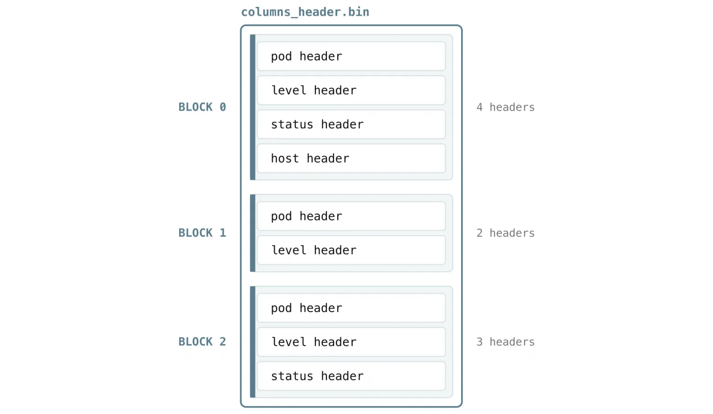

В `columns_header.bin` один блоб на блок содержит заголовки его колонок.

Такая упаковка создаёт небольшую проблему. Допустим, нужен только `status` из блока 0, где по порядку хранятся `pod`, `level`, `status`, `host`. При ручном поиске пришлось бы начать с первого заголовка, прочитать длину `pod`, чтобы найти начало `level`, затем прочитать `level`, чтобы найти `status`, и так далее — прочитав все заголовки, предшествующие нужному.

`columns_header_index.bin` избавляет от такого прохода. Для каждого блока он хранит небольшую таблицу соответствий между идентификаторами колонок и точными смещениями их заголовков внутри блоба. Вместо сканирования VictoriaLogs читает таблицу, видит, что `status` (колонка 2) находится по смещению 96, и сразу переходит к нему.

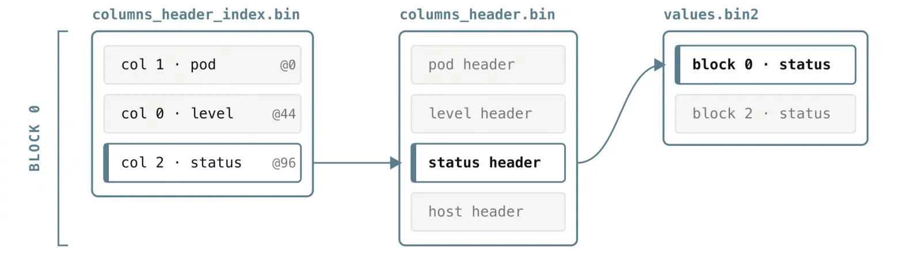

Индекс для блока сразу находит заголовок колонки, который указывает на данные в файле значений.

Таким образом, чтение `status` одного блока проходит по короткой прямой цепочке: найти смещение `status` в записи этого блока в `columns_header_index.bin`, прочитать только один заголовок из `columns_header.bin`, затем по его смещению и размеру обратиться прямо к `values.bin2`. Осталось объяснить лишь, как VictoriaLogs узнаёт расположение блоба заголовков заданного блока. За это отвечает последний файл.

#### 5.8 index.bin и metaindex.bin: индекс для поиска блоков

Всё выше предполагает, что VictoriaLogs уже знает, какие блоки ему нужны. За их выбор отвечает индекс. Напомним из раздела 4.1: у каждого блока есть небольшой **заголовок блока** — поток, временной диапазон, число строк и ссылки на расположение меток времени и заголовков колонок блока.

В `index.bin` находятся заголовки всех блоков сегмента: по одному заголовку на блок. Они сгруппированы в фрагменты — **блоки индекса**.

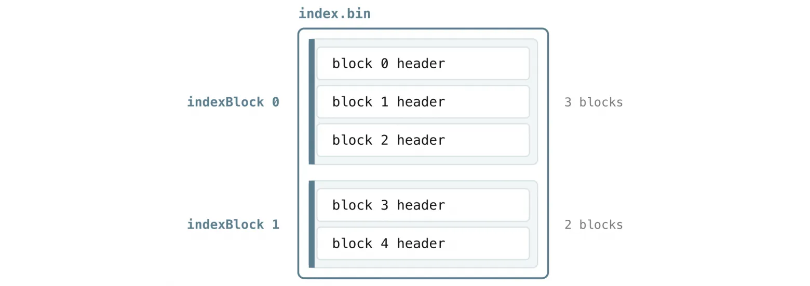

Заголовки блоков сгруппированы в фрагменты, называемые блоками индекса.

Но это ещё не последний уровень. Вероятно, вы уже заметили приём, который VictoriaLogs, как и другие продукты VictoriaMetrics, использует снова и снова: не сканировать крупную структуру, если меньшая может сначала указать точное место.

Блоки индекса в `index.bin` — не исключение. Сканирование каждого заголовка блока в поисках нескольких подходящих было бы медленным для крупного сегмента с тысячами блоков. Поэтому есть ещё один слой: индекс поверх индекса — `metaindex.bin`.

В `metaindex.bin` хранится по одной небольшой записи на блок индекса: расположение этого блока в `index.bin` и сводка о потоках и временном диапазоне, которые он покрывает. Весь файл достаточно мал, чтобы VictoriaLogs держал его в памяти.

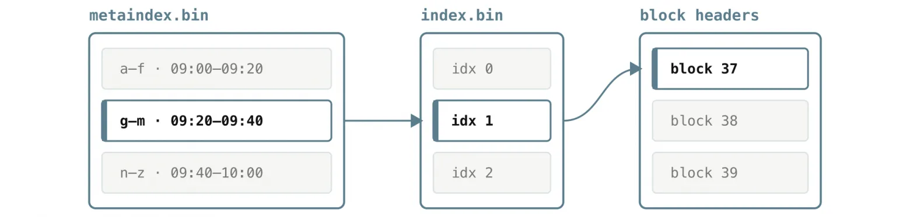

Два уровня сужают поиск ещё до чтения заголовков блоков.

Благодаря этой двухуровневой структуре VictoriaLogs с самого начала читает только потенциально подходящие данные. Сначала он просматривает находящийся в памяти `metaindex.bin`, где каждая запись содержит диапазон потоков, временной диапазон и ссылку в `index.bin`:

```
metaindex.bin
  потоки    диапазон времени    смещение index.bin    размер
  a–f       09:00 – 09:20       0                     4096
  g–m       09:20 – 09:40       4096                  4096
  n–z       09:40 – 10:00       8192                  3072
```

Из записей `metaindex.bin` VictoriaLogs отбирает только те блоки индекса, чьи потоки и временной диапазон могут пересекаться с запросом. Затем он читает из `index.bin` только их, получает нужные заголовки блоков и по ссылкам проходит уже знакомый путь: к меткам времени, фильтрам Блума и заголовкам колонок, вплоть до конкретных байтов. Каждый файл сегмента нужен для того, чтобы этот путь оставался коротким.

### Что важно запомнить

VictoriaLogs можно эффективно эксплуатировать и без знания подробностей хранения в файлов, но эта модель полезна при настройке и поиске неполадок. Каждый файл сегмента существует по одной причине: прочитать малую структуру и пропустить большой объём данных, чтобы запрос обращался только к действительно нужным байтам.

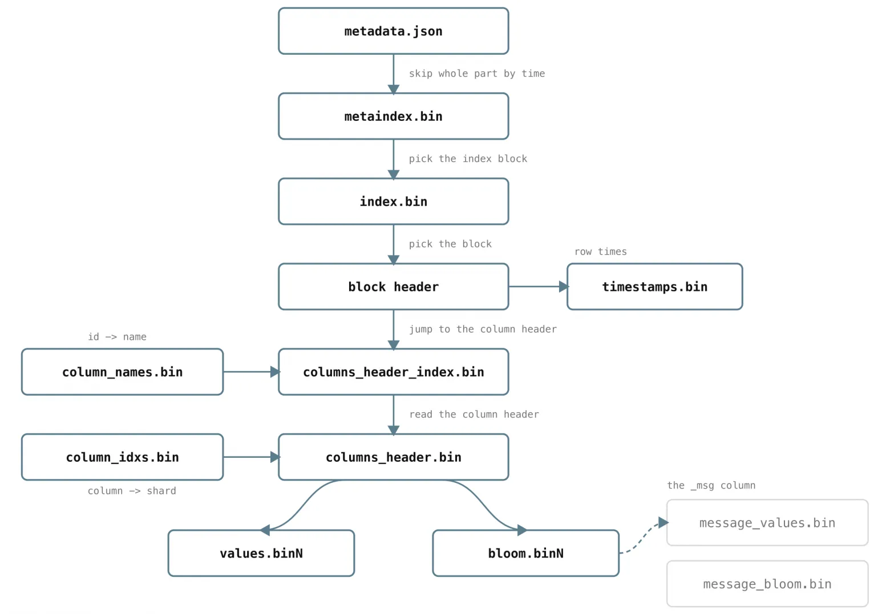

Каждый файл сегмента указывает на следующий: запрос сужается от всего сегмента до нескольких байтов.

-   Логи группируются в **потоки**, затем хранятся в **суточных разделах**. Поля потока должны быть стабильными и низкокардинальными.
    
-   Удаление по сроку хранения удаляет целые дни, а запросы обращаются только к дням своего временного диапазона, поэтому ограниченные по времени запросы недороги.
    
-   Суточный раздел состоит из **неизменяемых сегментов**; несколько сегментов на один день — нормальная ситуация.
    
-   Запросы быстры, потому что VictoriaLogs исключает ненужную работу на каждом уровне: сегменты — по времени, блоки — по потоку и времени, колонки — по используемым в запросе полям, ключевые слова — по фильтру Блума.
